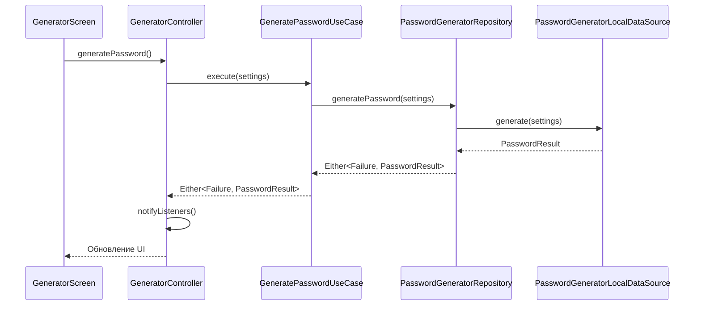
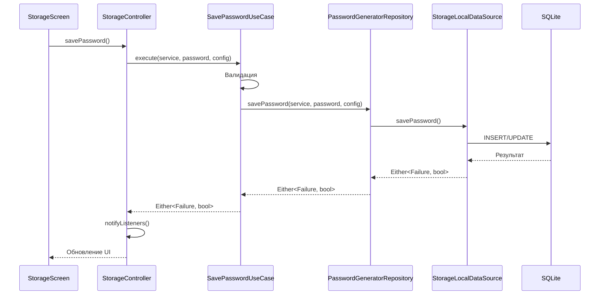

# 🏗️ Архитектура PassGen

> ⚠️ **УСТАРЕЛО**: Этот документ устарел. Актуальная документация находится в [DEVELOPER.md](DEVELOPER.md).

**Версия:** 1.0
**Дата:** 8 марта 2026
**Проект:** PassGen — кроссплатформенный менеджер паролей

---

## 1. ОБЗОР

PassGen использует архитектуру **Clean Architecture** с разделением на слои для обеспечения:
- ✅ Независимости от фреймворков
- ✅ Тестируемости бизнес-логики
- ✅ Независимости от UI
- ✅ Независимости от баз данных
- ✅ Масштабируемости

---

## 2. СТРУКТУРА ПРОЕКТА

```
lib/
├── app/                          # 📱 Точка входа и DI
│   ├── app.dart                  # Основной виджет и настройка Provider
│   └── theme.dart                # Темы приложения
│
├── core/                         # 🔧 Общепроектные компоненты
│   ├── constants/                # Константы приложения
│   │   ├── app_constants.dart    # Константы приложения
│   │   ├── breakpoints.dart      # Брейкпоинты для адаптивности
│   │   ├── event_types.dart      # Типы событий для логирования
│   │   └── spacing.dart          # Отступы
│   ├── errors/                   # Базовые классы ошибок
│   │   └── failures.dart         # Failure классы для Either
│   └── utils/                    # Утилиты
│       └── crypto_utils.dart     # Криптографические утилиты
│
├── domain/                       # 🏢 Бизнес-логика (НЕ зависит от других слоёв)
│   ├── entities/                 # Бизнес-объекты
│   │   ├── character_set.dart    # Набор символов
│   │   ├── auth_state.dart       # Состояние аутентификации
│   │   ├── category.dart         # Категория паролей
│   │   ├── password_config.dart  # Конфигурация пароля
│   │   ├── password_entry.dart   # Запись пароля
│   │   ├── password_generation_settings.dart  # Настройки генератора
│   │   ├── password_result.dart  # Результат генерации
│   │   └── security_log.dart     # Лог безопасности
│   │
│   ├── repositories/             # Интерфейсы репозиториев
│   │   ├── auth_repository.dart
│   │   ├── category_repository.dart
│   │   ├── encryptor_repository.dart
│   │   ├── password_data_repository.dart  # Импорт/экспорт (объединённый)
│   │   ├── password_generator_repository.dart
│   │   ├── security_log_repository.dart
│   │   ├── settings_repository.dart
│   │   └── storage_repository.dart
│   │
│   ├── usecases/                 # Бизнес-правила (Use Cases)
│   │   ├── auth/                 # Аутентификация
│   │   ├── category/             # Категории
│   │   ├── encryptor/            # Шифрование
│   │   ├── generator/            # Генератор паролей
│   │   ├── log/                  # Логирование
│   │   ├── password/             # Пароли
│   │   └── settings/             # Настройки
│   │
│   └── validators/               # Валидаторы
│       └── password_settings_validator.dart
│
├── data/                         # 💾 Слой данных (зависит от domain)
│   ├── database/                 # SQLite база данных
│   │   ├── database_helper.dart  # Помощник БД
│   │   ├── database_migrations.dart  # Миграции
│   │   └── database_schema.dart  # Схема БД
│   │
│   ├── datasources/              # Источники данных
│   │   ├── auth_local_datasource.dart
│   │   ├── encryptor_local_datasource.dart
│   │   ├── password_generator_local_datasource.dart
│   │   └── storage_local_datasource.dart
│   │
│   ├── formats/                  # Форматы данных
│   │   └── passgen_format.dart   # Формат .passgen
│   │
│   ├── models/                   # Модели данных (расширяют Entities)
│   │   ├── app_settings_model.dart
│   │   ├── category_model.dart
│   │   ├── password_config_model.dart
│   │   ├── password_entry_model.dart
│   │   └── security_log_model.dart
│   │
│   └── repositories/             # Реализации репозиториев
│       ├── auth_repository_impl.dart
│       ├── category_repository_impl.dart
│       ├── encryptor_repository_impl.dart
│       ├── password_data_repository_impl.dart  # Объединённая реализация
│       ├── password_generator_repository_impl.dart
│       ├── security_log_repository_impl.dart
│       ├── settings_repository_impl.dart
│       └── storage_repository_impl.dart
│
├── presentation/                 # 🎨 UI слой (зависит от domain)
│   ├── features/                 # Экраны приложения
│   │   ├── about/                # О приложении
│   │   ├── auth/                 # Аутентификация
│   │   ├── categories/           # Категории
│   │   ├── encryptor/            # Шифратор
│   │   ├── generator/            # Генератор
│   │   ├── logs/                 # Логи
│   │   ├── settings/             # Настройки
│   │   └── storage/              # Хранилище
│   │
│   └── widgets/                  # Переиспользуемые виджеты
│       ├── app_button.dart
│       ├── app_dialogs.dart
│       ├── app_switch.dart
│       ├── app_text_field.dart
│       ├── character_set_display.dart
│       ├── copyable_password.dart
│       ├── lottie_animations.dart
│       └── shimmer_effect.dart
│
└── shared/                       # 🔀 Общие компоненты
    ├── dialog.dart               # Диалоги
    └── interface.dart            # Интерфейсы
```

---

## 3. СЛОИ АРХИТЕКТУРЫ

### 3.1 Domain Layer (Бизнес-логика)

**Зависимости:** Нет зависимостей от других слоёв

**Компоненты:**
- **Entities** — бизнес-объекты с бизнес-правилами
- **Repositories** — интерфейсы для работы с данными
- **Use Cases** — бизнес-правила и сценарии использования

**Пример:**
```dart
// Entity
class PasswordEntry {
  final int id;
  final String service;
  final String login;
  final String password;
  // ...
}

// Repository Interface
abstract class StorageRepository {
  Future<Either<StorageFailure, List<PasswordEntry>>> getPasswords();
  Future<Either<StorageFailure, bool>> savePasswords(List<PasswordEntry> passwords);
}

// Use Case
class GetPasswordsUseCase {
  final StorageRepository repository;
  
  Future<Either<StorageFailure, List<PasswordEntry>>> execute() async {
    return await repository.getPasswords();
  }
}
```

---

### 3.2 Data Layer (Слой данных)

**Зависимости:** Domain Layer

**Компоненты:**
- **Models** — модели данных (расширяют Entities)
- **DataSources** — работа с источниками данных (SQLite, SharedPreferences)
- **Repository Implementations** — реализации интерфейсов

**Пример:**
```dart
// Model
class PasswordEntryModel extends PasswordEntry {
  factory PasswordEntryModel.fromEntity(PasswordEntry entity) {
    return PasswordEntryModel(
      id: entity.id,
      service: entity.service,
      // ...
    );
  }
  
  PasswordEntry toEntity() {
    return PasswordEntry(
      id: id,
      service: service,
      // ...
    );
  }
}

// Repository Implementation
class StorageRepositoryImpl implements StorageRepository {
  final StorageLocalDataSource dataSource;
  
  @override
  Future<Either<StorageFailure, List<PasswordEntry>>> getPasswords() async {
    try {
      final models = await dataSource.getPasswords();
      return Right(models.map((m) => m.toEntity()).toList());
    } catch (e) {
      return Left(StorageFailure(message: 'Ошибка: $e'));
    }
  }
}
```

---

### 3.3 Presentation Layer (UI)

**Зависимости:** Domain Layer

**Компоненты:**
- **Controllers** — управление состоянием UI (ChangeNotifier)
- **Screens** — экраны приложения
- **Widgets** — переиспользуемые компоненты

**Пример:**
```dart
// Controller
class GeneratorController extends ChangeNotifier {
  final GeneratePasswordUseCase generatePasswordUseCase;
  final SavePasswordUseCase savePasswordUseCase;
  
  PasswordGenerationSettings _settings = const PasswordGenerationSettings();
  
  Future<void> generatePassword() async {
    final result = await generatePasswordUseCase.execute(_settings);
    result.fold(
      (failure) => _error = failure.message,
      (password) => _lastResult = password,
    );
    notifyListeners();
  }
}

// Screen
class GeneratorScreen extends StatelessWidget {
  @override
  Widget build(BuildContext context) {
    return ChangeNotifierProvider(
      create: (_) => GeneratorController(
        generatePasswordUseCase: context.read(),
        savePasswordUseCase: context.read(),
      ),
      child: const _GeneratorScreenContent(),
    );
  }
}
```

---

## 4. ПОТОК ДАННЫХ

### 4.1 Генерация пароля



### 4.2 Сохранение пароля



---

## 5. ПРИНЦИПЫ

### 5.1 Clean Architecture

```
Presentation → Domain ← Data
     ↓
  (не зависит от Data)
```

**Правило:** Зависимости направлены только внутрь (к Domain)

### 5.2 SOLID

| Принцип | Применение |
|---|---|
| **S**RP | Каждый Use Case — одна операция |
| **O**CP | Расширение через новые Use Cases |
| **L**SP | Реализации заменяют интерфейсы |
| **I**SP | Узкие интерфейсы репозиториев |
| **D**IP | Зависимость от абстракций (Repository) |

---

## 6. DEPENDENCY INJECTION

### 6.1 Provider

Используется **Provider** для DI:

```dart
MultiProvider(
  providers: [
    // Data Sources
    Provider(create: (_) => AuthLocalDataSource()),
    
    // Repositories
    Provider(create: (ctx) => AuthRepositoryImpl(ctx.read())),
    
    // Use Cases
    Provider(create: (ctx) => VerifyPinUseCase(ctx.read())),
    
    // Controllers
    ChangeNotifierProxyProvider4<...>(...),
  ],
  child: const PassGenApp(),
)
```

### 6.2 Порядок инициализации

1. Data Sources
2. Repositories
3. Use Cases
4. Controllers

---

## 7. МОДЕЛИ ДАННЫХ

### 7.1 Схема базы данных

```
┌─────────────────────────────────────────┐
│ password_entries                        │
├─────────────────────────────────────────┤
│ id INTEGER PRIMARY KEY                  │
│ service TEXT                            │
│ login TEXT                              │
│ password TEXT (encrypted)               │
│ config TEXT (encrypted)                 │
│ category_id INTEGER                     │
│ created_at INTEGER                      │
│ updated_at INTEGER                      │
└─────────────────────────────────────────┘

┌─────────────────────────────────────────┐
│ categories                              │
├─────────────────────────────────────────┤
│ id INTEGER PRIMARY KEY                  │
│ name TEXT                               │
│ icon TEXT                               │
│ color INTEGER                           │
└─────────────────────────────────────────┘

┌─────────────────────────────────────────┐
│ app_settings                            │
├─────────────────────────────────────────┤
│ key TEXT PRIMARY KEY                    │
│ value TEXT                              │
└─────────────────────────────────────────┘

┌─────────────────────────────────────────┐
│ security_logs                           │
├─────────────────────────────────────────┤
│ id INTEGER PRIMARY KEY                  │
│ action_type TEXT                        │
│ timestamp INTEGER                       │
│ details TEXT                            │
└─────────────────────────────────────────┘

┌─────────────────────────────────────────┐
│ auth_state                              │
├─────────────────────────────────────────┤
│ id INTEGER PRIMARY KEY                  │
│ pin_hash TEXT                           │
│ salt TEXT                               │
│ is_locked INTEGER                       │
│ lockout_until INTEGER                   │
└─────────────────────────────────────────┘
```

---

## 8. БЕЗОПАСНОСТЬ

### 8.1 Аутентификация

- **PBKDF2** для хеширования PIN
- **Соль** (CSPRNG) для каждого пользователя
- **Блокировка** после 5 неудачных попыток

### 8.2 Шифрование

- **ChaCha20-Poly1305** для шифрования паролей
- **CSPRNG** для генерации nonce
- **Мастер-ключ** не хранится в БД

### 8.3 Хранение

- **SQLite** с шифрованием данных
- **SharedPreferences** только для настроек
- **Буфер обмена** очищается через 60 сек

---

## 9. МАСШТАБИРОВАНИЕ

### 9.1 Добавление новой функции

1. Создать Entity в `domain/entities/`
2. Создать Repository interface в `domain/repositories/`
3. Создать Use Case в `domain/usecases/`
4. Создать Model в `data/models/`
5. Создать DataSource в `data/datasources/`
6. Создать Repository implementation в `data/repositories/`
7. Создать Controller в `presentation/features/`
8. Создать Screen в `presentation/features/`

### 9.2 Добавление экрана

1. Создать папку в `presentation/features/`
2. Создать Controller
3. Создать Screen
4. Добавить роутинг в app.dart
5. Добавить в навигацию

---

## 10. ТЕСТРОВАНИЕ

### 10.1 Уровни тестирования

```
┌─────────────────────────────────┐
│ E2E Tests (integration_test/)   │
├─────────────────────────────────│
│ Widget Tests (test/widgets/)    │
├─────────────────────────────────│
│ Unit Tests (test/usecases/)     │
└─────────────────────────────────┘
```

### 10.2 Mocking

Используется **mockito** для создания моков:

```dart
@GenerateMocks([AuthRepository])
void main() {
  group('VerifyPinUseCase Tests', () {
    late VerifyPinUseCase useCase;
    late MockAuthRepository repository;
    
    setUp(() {
      repository = MockAuthRepository();
      useCase = VerifyPinUseCase(repository);
    });
    
    test('возвращает true при успешной проверке', () async {
      when(repository.verifyPin('1234'))
        .thenAnswer((_) async => Right(true));
      
      final result = await useCase.execute('1234');
      expect(result.isRight(), true);
    });
  });
}
```

---

## 11. СТАТИСТИКА

| Метрика | Значение |
|---|---|
| **Всего файлов** | 119 |
| **Строк кода** | ~13,000 |
| **Entities** | 9 |
| **Repository интерфейсов** | 9 |
| **Use Cases** | 25 |
| **Controllers** | 7 |
| **Экранов** | 9 |
| **Виджетов** | 11 |

---

**Документ утверждён:** 8 марта 2026  
**Версия:** 1.0  
**Статус:** ✅ Актуально
