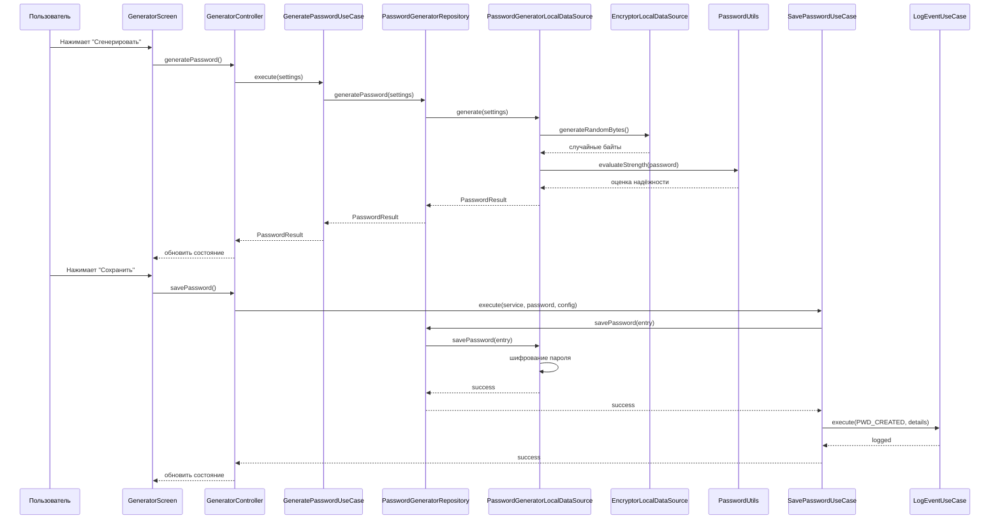
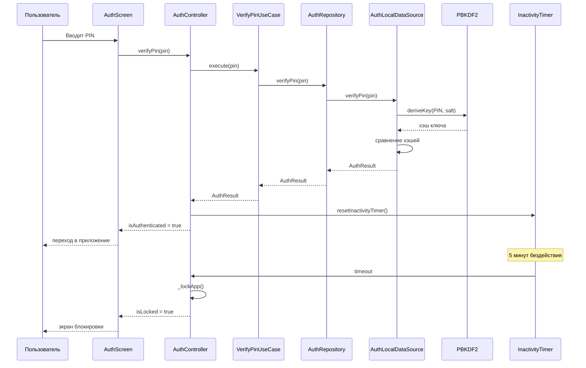
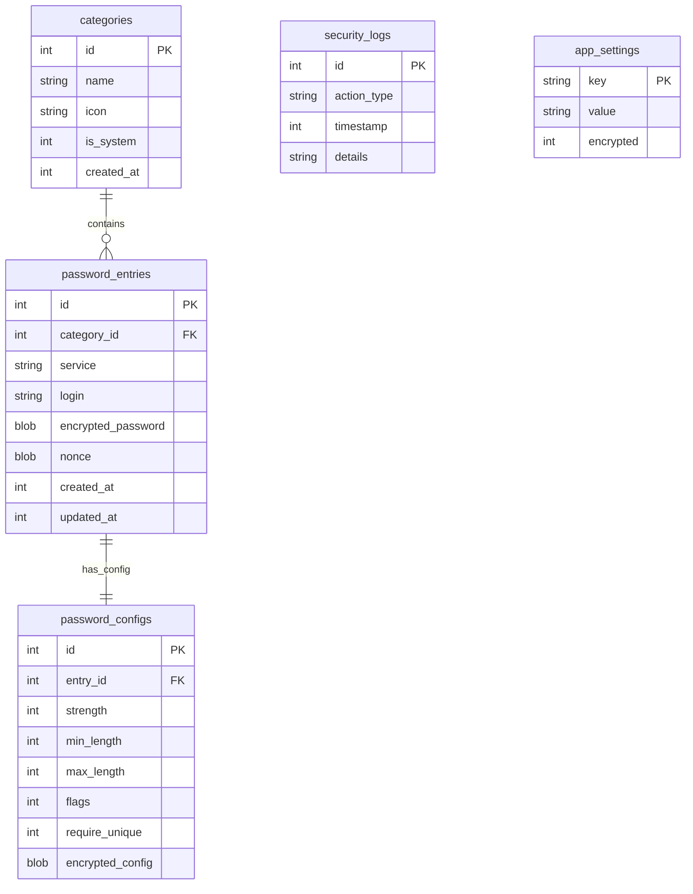

# PassGen — Техническая документация

> ⚠️ **УСТАРЕЛО**: Этот документ устарел. Актуальная документация находится в [DEVELOPER.md](../../../DEVELOPER.md).

**Версия:** 0.5.0
**Последнее обновление:** 10 марта 2026

---

## 📖 Оглавление

1. [Обзор архитектуры](#обзор-архитектуры)
2. [Диаграммы](#диаграммы)
3. [API Reference](#api-reference)
4. [База данных](#база-данных)
5. [Криптография](#криптография)
6. [Примеры кода](#примеры-кода)
7. [Тестирование](#тестирование)
8. [Сборка и развёртывание](#сборка-и-развёртывание)

---

## Обзор архитектуры

### Clean Architecture

Проект реализует паттерн **Clean Architecture** с разделением на 5 слоёв:

```
┌─────────────────────────────────────────────────────────┐
│                    App Layer                            │
│            (DI, Navigation, Theme)                      │
├─────────────────────────────────────────────────────────┤
│               Presentation Layer                        │
│         (UI, Controllers, Widgets)                      │
├─────────────────────────────────────────────────────────┤
│                 Domain Layer                            │
│    (Entities, Use Cases, Repository Interfaces)         │
├─────────────────────────────────────────────────────────┤
│                  Data Layer                             │
│   (Repository Implementations, Data Sources, SQLite)    │
├─────────────────────────────────────────────────────────┤
│                  Core Layer                             │
│        (Utils, Constants, Errors)                       │
└─────────────────────────────────────────────────────────┘
```

### Структура проекта

```
lib/
├── app/                          # Точка входа, DI, навигация
│   └── app.dart
├── core/                         # Утилиты, константы, ошибки
│   ├── constants/
│   │   ├── app_constants.dart
│   │   └── event_types.dart
│   ├── errors/
│   │   └── failures.dart
│   └── utils/
│       ├── crypto_utils.dart
│       └── password_utils.dart
├── domain/                       # Бизнес-логика
│   ├── entities/                 # 8 сущностей
│   ├── repositories/             # 7 интерфейсов
│   └── usecases/                 # 25+ сценариев
├── data/                         # Слой данных
│   ├── database/
│   │   ├── database_helper.dart
│   │   ├── database_schema.dart
│   │   └── database_migrations.dart
│   ├── datasources/              # 4 источника данных
│   ├── formats/
│   │   └── passgen_format.dart
│   ├── models/                   # 5 моделей
│   └── repositories/             # 7 реализаций
├── presentation/                 # UI слой
│   ├── features/                 # 9 экранов
│   └── widgets/                  # 12 виджетов
├── shared/                       # Общие UI функции
│   └── shared.dart
└── main.dart                     # Entry point
```

**Статистика проекта (v0.5.0):**
- Файлов Dart: 110+
- Строк кода: ~9500+
- Покрытие тестами: ~82%

---

## Диаграммы

### Диаграмма вариантов использования (Use Case Diagram)

```mermaid
usecaseDiagram
    actor Пользователь
    
    usecase "Аутентификация по PIN" as UC1
    usecase "Установка PIN" as UC2
    usecase "Смена PIN" as UC3
    usecase "Удаление PIN" as UC4
    
    usecase "Генерация пароля" as UC5
    usecase "Настройка сложности" as UC6
    usecase "Сохранение пароля" as UC7
    
    usecase "Просмотр паролей" as UC8
    usecase "Поиск и фильтрация" as UC9
    usecase "Удаление пароля" as UC10
    
    usecase "Шифрование сообщения" as UC11
    usecase "Дешифрование сообщения" as UC12
    
    usecase "Экспорт (JSON)" as UC13
    usecase "Экспорт (.passgen)" as UC14
    usecase "Импорт (JSON)" as UC15
    usecase "Импорт (.passgen)" as UC16
    
    usecase "Управление категориями" as UC17
    usecase "Просмотр логов" as UC18
    
    Пользователь --> UC1
    Пользователь --> UC2
    Пользователь --> UC3
    Пользователь --> UC4
    Пользователь --> UC5
    Пользователь --> UC6
    Пользователь --> UC7
    Пользователь --> UC8
    Пользователь --> UC9
    Пользователь --> UC10
    Пользователь --> UC11
    Пользователь --> UC12
    Пользователь --> UC13
    Пользователь --> UC14
    Пользователь --> UC15
    Пользователь --> UC16
    Пользователь --> UC17
    Пользователь --> UC18
```

### Диаграмма последовательности: Генерация и сохранение пароля



### Диаграмма последовательности: Аутентификация



### Диаграмма компонентов

```mermaid
componentDiagram
    component "App Layer" as App {
        component "app.dart" as app_dart
        component "Provider" as provider
    }
    
    component "Presentation Layer" as Presentation {
        component "AuthController" as auth_ctrl
        component "GeneratorController" as gen_ctrl
        component "StorageController" as stor_ctrl
        component "EncryptorController" as enc_ctrl
        component "Screens" as screens
    }
    
    component "Domain Layer" as Domain {
        component "Entities" as entities
        component "Use Cases" as usecases
        component "Repository Interfaces" as repo_interfaces
    }
    
    component "Data Layer" as Data {
        component "Repositories" as repositories
        component "Data Sources" as datasources
        component "SQLite" as sqlite
    }
    
    component "Core Layer" as Core {
        component "Utils" as utils
        component "Constants" as constants
        component "Errors" as errors
    }
    
    App --> Presentation
    Presentation --> Domain
    Domain --> Data
    Data --> Core
    Presentation ..> Core : использует
    Domain ..> Core : использует
```

### Диаграмма развёртывания

```mermaid
deploymentDiagram
    node "Мобильное устройство (Android)" as android {
        artifact "PassGen APK" as apk
        artifact "SQLite Database" as sqlite_android
        artifact "SharedPreferences" as prefs_android
    }
    
    node "Десктоп (Windows/Linux)" as desktop {
        artifact "PassGen Executable" as exe
        artifact "SQLite Database" as sqlite_desktop
        artifact "SharedPreferences" as prefs_desktop
    }
    
    apk -- sqlite_android : запись/чтение
    apk -- prefs_android : конфигурация
    exe -- sqlite_desktop : запись/чтение
    exe -- prefs_desktop : конфигурация
```

### ER-диаграмма базы данных



---

## API Reference

### Domain Entities

#### AuthState

```dart
class AuthState {
  final bool isAuthenticated;
  final bool isPinSetup;
  final bool isLocked;
  final int? remainingAttempts;
  final DateTime? lockoutUntil;
  
  AuthState copyWith({
    bool? isAuthenticated,
    bool? isPinSetup,
    bool? isLocked,
    int? remainingAttempts,
    DateTime? lockoutUntil,
  });
}
```

#### PasswordEntry

```dart
class PasswordEntry {
  final int? id;
  final int categoryId;
  final String service;
  final String? login;
  final String password; // decrypted
  final PasswordConfig? config;
  final DateTime createdAt;
  final DateTime updatedAt;
  
  static List<PasswordEntry> decodeList(String jsonString);
  static String encodeList(List<PasswordEntry> entries);
  
  PasswordEntry copyWith({...});
}
```

#### PasswordResult

```dart
class PasswordResult {
  final String password;
  final int strength; // 0-4
  final PasswordConfig? config;
  final String? error;
  
  bool hasError();
}
```

### Use Cases

#### Аутентификация

| Use Case | Вход | Выход |
|----------|------|-------|
| `SetupPinUseCase` | `String pin` | `Either<AuthFailure, bool>` |
| `VerifyPinUseCase` | `String pin` | `Either<AuthFailure, AuthResult>` |
| `ChangePinUseCase` | `String oldPin, String newPin` | `Either<AuthFailure, bool>` |
| `RemovePinUseCase` | `String pin` | `Either<AuthFailure, bool>` |
| `GetAuthStateUseCase` | — | `Either<AuthFailure, AuthState>` |

#### Генерация паролей

| Use Case | Вход | Выход |
|----------|------|-------|
| `GeneratePasswordUseCase` | `PasswordGenerationSettings` | `Either<Failure, PasswordResult>` |
| `SavePasswordUseCase` | `service, password, config, categoryId, login` | `Either<Failure, Map>` |

#### Хранилище

| Use Case | Вход | Выход |
|----------|------|-------|
| `GetPasswordsUseCase` | — | `Either<Failure, List<PasswordEntry>>` |
| `DeletePasswordUseCase` | `int index` | `Either<Failure, bool>` |
| `ExportPasswordsUseCase` | — | `Either<Failure, String>` |
| `ImportPasswordsUseCase` | `String jsonString` | `Either<Failure, bool>` |
| `ExportPassgenUseCase` | `String masterPassword` | `Either<Failure, String>` |
| `ImportPassgenUseCase` | `String data, String masterPassword` | `Either<Failure, bool>` |

#### Шифрование

| Use Case | Вход | Выход |
|----------|------|-------|
| `EncryptMessageUseCase` | `String message, String password` | `Either<Failure, String>` |
| `DecryptMessageUseCase` | `String encryptedData, String password` | `Either<Failure, String>` |

---

## База данных

### Схема БД (5 таблиц)

#### categories

```sql
CREATE TABLE categories (
  id INTEGER PRIMARY KEY AUTOINCREMENT,
  name TEXT NOT NULL,
  icon TEXT,
  is_system INTEGER DEFAULT 0,
  created_at INTEGER NOT NULL
);
```

#### password_entries

```sql
CREATE TABLE password_entries (
  id INTEGER PRIMARY KEY AUTOINCREMENT,
  category_id INTEGER REFERENCES categories(id),
  service TEXT NOT NULL,
  login TEXT,
  encrypted_password BLOB NOT NULL,
  nonce BLOB NOT NULL,
  created_at INTEGER NOT NULL,
  updated_at INTEGER NOT NULL
);

CREATE INDEX idx_password_entries_category ON password_entries(category_id);
CREATE INDEX idx_password_entries_service ON password_entries(service);
```

#### password_configs

```sql
CREATE TABLE password_configs (
  id INTEGER PRIMARY KEY AUTOINCREMENT,
  entry_id INTEGER UNIQUE REFERENCES password_entries(id),
  strength INTEGER,
  min_length INTEGER,
  max_length INTEGER,
  flags INTEGER,
  require_unique INTEGER DEFAULT 0,
  encrypted_config BLOB
);
```

#### security_logs

```sql
CREATE TABLE security_logs (
  id INTEGER PRIMARY KEY AUTOINCREMENT,
  action_type TEXT NOT NULL,
  timestamp INTEGER NOT NULL,
  details TEXT
);

CREATE INDEX idx_security_logs_timestamp ON security_logs(timestamp);
```

#### app_settings

```sql
CREATE TABLE app_settings (
  key TEXT PRIMARY KEY,
  value TEXT NOT NULL,
  encrypted INTEGER DEFAULT 0
);
```

### Миграции

Миграции управляются классом `DatabaseMigrations`. Каждая миграция имеет версию и функцию применения.

---

## Криптография

### Алгоритмы

| Алгоритм | Назначение | Параметры |
|----------|------------|-----------|
| **ChaCha20-Poly1305** | Шифрование данных | AEAD, 256-bit ключ |
| **PBKDF2-HMAC-SHA256** | Деривация ключа из PIN | 10 000 итераций, 256-bit |
| **CSPRNG** | Генерация случайных чисел | `Random.secure()` |

### Формат .passgen

```
┌─────────────────────────────────────┐
│ HEADER: "PASSGEN_V1" (10 байт)      │
├─────────────────────────────────────┤
│ VERSION: 1 (1 байт)                 │
├─────────────────────────────────────┤
│ FLAGS: 0 (1 байт)                   │
├─────────────────────────────────────┤
│ NONCE: случайные 32 байта           │
├─────────────────────────────────────┤
│ DATA_LENGTH: длина (4 байта)        │
├─────────────────────────────────────┤
│ DATA: зашифрованный JSON            │
├─────────────────────────────────────┤
│ MAC: authentication tag (16 байт)   │
└─────────────────────────────────────┘
```

### Структура зашифрованной записи

```dart
class EncryptedEntry {
  final Uint8List ciphertext;   // Зашифрованные данные
  final Uint8List nonce;        // Уникальный номер (12 байт)
  final Uint8List mac;          // Authentication tag (16 байт)
}
```

---

## Примеры кода

### Генерация пароля

```dart
import 'package:pass_gen/domain/usecases/password/generate_password_usecase.dart';
import 'package:pass_gen/domain/entities/password_generation_settings.dart';

final settings = PasswordGenerationSettings(
  strength: 3, // Высокая сложность
  lengthRange: (12, 16),
  flags: 0b1111, // Все наборы символов
  requireUnique: false,
);

final result = await generatePasswordUseCase.execute(settings);

result.fold(
  (failure) => print('Ошибка: $failure'),
  (passwordResult) => print('Пароль: ${passwordResult.password}'),
);
```

### Шифрование сообщения

```dart
import 'package:pass_gen/domain/usecases/encryptor/encrypt_message_usecase.dart';

final encrypted = await encryptMessageUseCase.execute(
  message: 'Секретное сообщение',
  password: 'надёжный-пароль',
);

encrypted.fold(
  (failure) => print('Ошибка шифрования: $failure'),
  (data) => print('Зашифровано: $data'),
);
```

### Сохранение пароля в хранилище

```dart
import 'package:pass_gen/domain/usecases/storage/save_password_usecase.dart';

final result = await savePasswordUseCase.execute(
  service: 'Gmail',
  login: 'user@gmail.com',
  password: 'xY9@mKp3$7Qw',
  categoryId: 1,
  config: passwordConfig,
);

result.fold(
  (failure) => print('Ошибка сохранения: $failure'),
  (data) => print('Сохранено с ID: ${data['id']}'),
);
```

### Работа с категориями

```dart
import 'package:pass_gen/domain/usecases/category/get_categories_usecase.dart';
import 'package:pass_gen/domain/usecases/category/create_category_usecase.dart';

// Получить все категории
final categories = await getCategoriesUseCase.execute();

// Создать новую категорию
final newCategory = Category(
  name: 'Новая категория',
  icon: 'folder',
  isSystem: false,
  createdAt: DateTime.now(),
);

await createCategoryUseCase.execute(newCategory);
```

---

## Тестирование

### Запуск тестов

```bash
# Все тесты
flutter test

# Конкретный тест
flutter test tests/sqlite_test.dart

# С покрытием
flutter test --coverage
```

### Структура тестов

```
tests/
├── sqlite_test.dart           # Тесты базы данных
├── generator_test.dart        # Тесты генератора
├── encryptor_test.dart        # Тесты шифрования
├── auth_test.dart             # Тесты аутентификации
└── import_export_test.dart    # Тесты импорта/экспорта
```

### Пример теста

```dart
import 'package:flutter_test/flutter_test.dart';
import 'package:pass_gen/domain/usecases/password/generate_password_usecase.dart';

void main() {
  group('GeneratePasswordUseCase', () {
    test('должен генерировать пароль заданной длины', () async {
      final settings = PasswordGenerationSettings(
        strength: 2,
        lengthRange: (12, 12),
        flags: 0b1111,
      );
      
      final result = await useCase.execute(settings);
      
      result.fold(
        (failure) => fail('Генерация не удалась'),
        (passwordResult) {
          expect(passwordResult.password.length, 12);
          expect(passwordResult.strength, greaterThanOrEqualTo(0));
          expect(passwordResult.strength, lessThanOrEqualTo(4));
        },
      );
    });
  });
}
```

---

## Сборка и развёртывание

### Требования

| Компонент | Версия |
|-----------|--------|
| Flutter SDK | ^3.9.0 |
| Dart SDK | ^3.9.0 |

### Сборка

```bash
# Windows
flutter build windows

# Linux
flutter build linux

# Android APK
flutter build apk

# Android App Bundle
flutter build appbundle
```

### Установка зависимостей

```bash
flutter pub get
```

### Генерация иконок

```bash
flutter pub run flutter_launcher_icons
```

---

**PassGen v0.4.0** | [MIT License](../../LICENSE)
