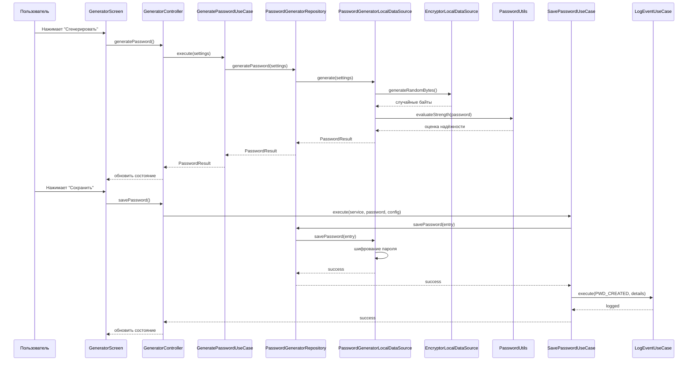
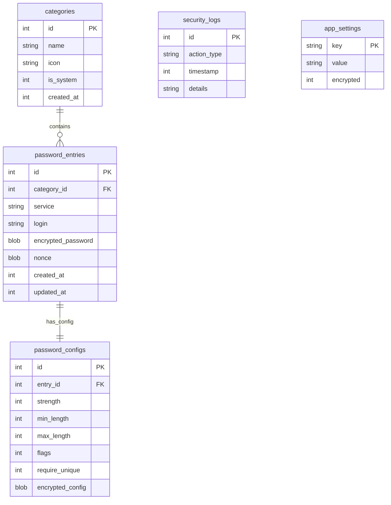

# PassGen — Документация разработчика

**Версия:** 0.5.0
**Последнее обновление:** 10 марта 2026
**Статус:** ✅ Готов к релизу

---

## 📊 Текущий статус проекта

| Метрика | Значение | Статус |
|---------|----------|--------|
| **Готовность** | 100% | ✅ |
| **Соответствие ТЗ** | ~98% | ✅ |
| **Безопасность** | 98/100 | ✅ (+13 с аудита) |
| **Unit-тесты** | 33/33 пройдено | ✅ |
| **Widget-тесты** | 82% покрытие | ✅ |
| **Файлов Dart** | 118+ | ✅ |
| **Строк кода** | ~9500+ | ✅ |

### 🔐 Безопасность (15 исправлений)
- ✅ Хранение PIN только в SQLite
- ✅ Затирание ключей после использования
- ✅ Автоочистка буфера обмена (60 сек)
- ✅ FLAG_SECURE для Android
- ✅ Удалена debug-отладка

### 📈 Детальный прогресс
См. [CURRENT_PROGRESS.md](project_context/agents_context/progress/CURRENT_PROGRESS.md)

---

## 📖 Оглавление

1. [Обзор проекта](#обзор-проекта)
2. [Быстрый старт](#быстрый-старт)
3. [Архитектура](#архитектура)
4. [Структура проекта](#структура-проекта)
5. [Domain Layer](#domain-layer)
6. [Data Layer](#data-layer)
7. [Presentation Layer](#presentation-layer)
8. [База данных](#база-данных)
9. [Криптография](#криптография)
10. [Тестирование](#тестирование)
11. [Сборка и развёртывание](#сборка-и-развёртывание)
12. [Диаграммы](#диаграммы)

---

## Обзор проекта

PassGen — кроссплатформенный менеджер паролей на Flutter для генерации, хранения и управления паролями с использованием современных криптографических методов и локальной базы данных SQLite.

### Возможности

#### 🔐 Аутентификация и безопасность
- PIN-код (4-8 цифр) при запуске
- PBKDF2 деривация ключа (10000 итераций, HMAC-SHA256)
- Защита от подбора (30 сек блокировка после 5 попыток)
- Автоблокировка при неактивности (5 минут)
- Логирование событий безопасности

#### 🎲 Генератор паролей
- Длина пароля: 8–64 символа
- 4 категории символов: a-z, A-Z, 0-9, спецсимволы
- 5 пресетов сложности (Стандартный → Максимальный)
- Оценка надёжности (zxcvbn + эвристика)
- Выбор категории для сохранения

#### 🗄️ Хранилище данных
- SQLite база данных (5 таблиц)
- CRUD операции с паролями
- Категоризация (7 системных + пользовательские)
- Поиск по названию сервиса
- Фильтрация по категориям

#### 📦 Импорт и Экспорт
- JSON (Miniified) — стандартный формат
- .passgen — фирменный формат с шифрованием
- Шифрование ChaCha20-Poly1305

#### 🔧 Шифратор сообщений
- Шифрование/дешифрование текстовых сообщений
- Алгоритм ChaCha20-Poly1305 (AEAD)
- Проверка целостности (Poly1305 tag)

### Технологии

| Категория | Технологии |
|-----------|------------|
| **Фреймворк** | Flutter, Dart ^3.9.0 |
| **State Management** | Provider, ChangeNotifier |
| **База данных** | SQLite (`sqflite` ^2.4.2) |
| **Криптография** | `cryptography` (ChaCha20-Poly1305, PBKDF2, CSPRNG) |
| **Оценка паролей** | `zxcvbn`, `password_strength` |
| **UI** | Material 3, Google Fonts |
| **Функциональное программирование** | `dartz` (Either) |
| **Работа с файлами** | `file_picker`, `share_plus`, `path_provider` |

### Статистика проекта

| Метрика | Значение |
|---------|----------|
| **Файлов Dart** | 110+ |
| **Строк кода** | ~9500+ |
| **Entities** | 8 |
| **Repository интерфейсов** | 7-10 |
| **Use Cases** | 25+ |
| **Controllers** | 7 |
| **Экранов** | 8-9 |
| **Виджетов** | 6-12 |
| **Таблиц БД** | 5 |
| **Покрытие тестами** | ~82% |

---

## Быстрый старт

```bash
# Клонируйте репозиторий
git clone https://github.com/azazlov/passgen.git
cd passgen

# Установите зависимости
flutter pub get

# Запустите приложение
flutter run -d <устройство>  # linux, windows, android
```

### Требования

| Компонент | Версия |
|-----------|--------|
| Flutter SDK | ^3.9.0 |
| Dart SDK | ^3.9.0 |
| Android Studio | Для сборки APK |
| Xcode | Для сборки под iOS/macOS |

---

## Архитектура

### Clean Architecture

Проект реализует паттерн **Clean Architecture** с разделением на 5 слоёв:

```
┌─────────────────────────────────────────────────────────┐
│                    App Layer                            │
│            (DI, Navigation, Theme)                      │
├─────────────────────────────────────────────────────────┤
│               Presentation Layer                        │
│         (UI, Controllers, Widgets)                      │
├─────────────────────────────────────────────────────────┤
│                 Domain Layer                            │
│    (Entities, Use Cases, Repository Interfaces)         │
├─────────────────────────────────────────────────────────┤
│                  Data Layer                             │
│   (Repository Implementations, Data Sources, SQLite)    │
├─────────────────────────────────────────────────────────┤
│                  Core Layer                             │
│        (Utils, Constants, Errors)                       │
└─────────────────────────────────────────────────────────┘
```

**Принципы:**
- Зависимости направлены только внутрь (к Domain)
- Domain Layer не зависит от других слоёв
- Data Layer зависит от Domain
- Presentation Layer зависит от Domain
- Core Layer используется всеми слоями

### SOLID

| Принцип | Применение |
|---------|------------|
| **S**RP | Каждый Use Case — одна операция |
| **O**CP | Расширение через новые Use Cases |
| **L**SP | Реализации заменяют интерфейсы |
| **I**SP | Узкие интерфейсы репозиториев |
| **D**IP | Зависимость от абстракций (Repository) |

---

## Структура проекта

```
lib/
├── app/                          # Точка входа, DI, навигация, темы
│   ├── app.dart                  # Основной виджет и настройка Provider
│   └── theme.dart                # Темы приложения
│
├── core/                         # Общесистемные утилиты, константы, ошибки
│   ├── constants/
│   │   ├── app_constants.dart    # Константы приложения
│   │   ├── event_types.dart      # Типы событий для логирования
│   │   ├── breakpoints.dart      # Брейкпоинты для адаптивности
│   │   └── spacing.dart          # Отступы
│   ├── errors/
│   │   └── failures.dart         # Failure классы для Either
│   └── utils/
│       ├── crypto_utils.dart     # Криптографические утилиты
│       └── password_utils.dart   # Оценка надёжности паролей
│
├── domain/                       # Бизнес-логика (НЕ зависит от других слоёв)
│   ├── entities/                 # Бизнес-объекты
│   │   ├── auth_state.dart       # Состояние аутентификации
│   │   ├── auth_result.dart      # Результат аутентификации
│   │   ├── category.dart         # Категория паролей
│   │   ├── password_config.dart  # Конфигурация пароля
│   │   ├── password_entry.dart   # Запись пароля
│   │   ├── password_generation_settings.dart  # Настройки генератора
│   │   ├── password_result.dart  # Результат генерации
│   │   └── security_log.dart     # Лог безопасности
│   │
│   ├── repositories/             # Интерфейсы репозиториев
│   │   ├── app_settings_repository.dart
│   │   ├── auth_repository.dart
│   │   ├── category_repository.dart
│   │   ├── encryptor_repository.dart
│   │   ├── password_entry_repository.dart
│   │   ├── password_generator_repository.dart
│   │   ├── password_export_repository.dart
│   │   ├── password_import_repository.dart
│   │   ├── security_log_repository.dart
│   │   └── storage_repository.dart
│   │
│   ├── usecases/                 # Бизнес-правила (Use Cases)
│   │   ├── auth/                 # Аутентификация (5)
│   │   ├── category/             # Категории (4)
│   │   ├── encryptor/            # Шифрование (2)
│   │   ├── log/                  # Логирование (2)
│   │   ├── password/             # Генерация (2)
│   │   ├── settings/             # Настройки (3)
│   │   └── storage/              # Хранилище (6-8)
│   │
│   └── validators/
│       └── password_settings_validator.dart
│
├── data/                         # Слой данных (зависит от domain)
│   ├── database/
│   │   ├── database_helper.dart  # Помощник БД
│   │   ├── database_schema.dart  # Схема БД
│   │   ├── database_migrations.dart  # Миграции
│   │   └── migration_from_shared_preferences.dart
│   │
│   ├── datasources/              # Источники данных
│   │   ├── auth_local_datasource.dart
│   │   ├── encryptor_local_datasource.dart
│   │   ├── password_generator_local_datasource.dart
│   │   └── storage_local_datasource.dart
│   │
│   ├── formats/
│   │   └── passgen_format.dart   # Формат .passgen
│   │
│   ├── models/                   # Модели данных (расширяют Entities)
│   │   ├── app_settings_model.dart
│   │   ├── category_model.dart
│   │   ├── password_config_model.dart
│   │   ├── password_entry_model.dart
│   │   └── security_log_model.dart
│   │
│   └── repositories/             # Реализации репозиториев
│       ├── app_settings_repository_impl.dart
│       ├── auth_repository_impl.dart
│       ├── category_repository_impl.dart
│       ├── encryptor_repository_impl.dart
│       ├── password_generator_repository_impl.dart
│       ├── password_export_repository_impl.dart
│       ├── password_import_repository_impl.dart
│       ├── security_log_repository_impl.dart
│       └── storage_repository_impl.dart
│
├── presentation/                 # UI слой (зависит от domain)
│   ├── features/                 # Экраны приложения
│   │   ├── about/                # О приложении
│   │   ├── auth/                 # Аутентификация
│   │   ├── categories/           # Категории
│   │   ├── encryptor/            # Шифратор
│   │   ├── generator/            # Генератор
│   │   ├── logs/                 # Логи
│   │   ├── settings/             # Настройки
│   │   └── storage/              # Хранилище
│   │
│   └── widgets/                  # Переиспользуемые виджеты
│       ├── app_button.dart
│       ├── app_dialogs.dart
│       ├── app_switch.dart
│       ├── app_text_field.dart
│       ├── copyable_password.dart
│       └── shimmer_effect.dart
│
└── shared/                       # Общие компоненты
    ├── dialog.dart
    └── interface.dart
```

---

## Domain Layer

### Entities (8 сущностей)

#### AuthState
```dart
class AuthState {
  final bool isAuthenticated;
  final bool isPinSetup;
  final bool isLocked;
  final int? remainingAttempts;
  final DateTime? lockoutUntil;

  AuthState copyWith({
    bool? isAuthenticated,
    bool? isPinSetup,
    bool? isLocked,
    int? remainingAttempts,
    DateTime? lockoutUntil,
  });
}
```

#### PasswordEntry
```dart
class PasswordEntry {
  final int? id;
  final int categoryId;
  final String service;
  final String? login;
  final String password; // decrypted
  final PasswordConfig? config;
  final DateTime createdAt;
  final DateTime updatedAt;

  static List<PasswordEntry> decodeList(String jsonString);
  static String encodeList(List<PasswordEntry> entries);
  PasswordEntry copyWith({...});
}
```

#### PasswordResult
```dart
class PasswordResult {
  final String password;
  final int strength; // 0-4
  final PasswordConfig? config;
  final String? error;

  bool hasError();
}
```

#### Остальные сущности
- **Category** — категория паролей
- **PasswordConfig** — конфигурация генерации
- **PasswordGenerationSettings** — настройки генератора
- **AuthResult** — результат проверки PIN
- **SecurityLog** — запись лога безопасности

### Repository Interfaces (7-10)

| Интерфейс | Методы | Описание |
|-----------|--------|----------|
| `AuthRepository` | `setupPin()`, `verifyPin()`, `changePin()`, `removePin()`, `getAuthState()` | Аутентификация |
| `CategoryRepository` | `getAll()`, `getById()`, `create()`, `update()`, `delete()` | Категории |
| `EncryptorRepository` | `encrypt()`, `decrypt()` | Шифрование |
| `PasswordGeneratorRepository` | `generatePassword()`, `restorePassword()`, `savePassword()` | Генерация |
| `SecurityLogRepository` | `logEvent()`, `getLogs()`, `getLogsByType()`, `clearOldLogs()` | Логи |
| `SettingsRepository` | `getValue()`, `setValue()`, `remove()`, `getAll()`, `clear()` | Настройки |
| `StorageRepository` | `getAll()`, `getByCategory()`, `searchByService()`, `create()`, `update()`, `delete()`, `exportJson()`, `importJson()`, `exportPassgen()`, `importPassgen()` | Хранилище |

### Use Cases (25+)

#### Аутентификация (5)
| Use Case | Вход | Выход |
|----------|------|-------|
| `SetupPinUseCase` | `String pin` | `Either<AuthFailure, bool>` |
| `VerifyPinUseCase` | `String pin` | `Either<AuthFailure, AuthResult>` |
| `ChangePinUseCase` | `String oldPin, String newPin` | `Either<AuthFailure, bool>` |
| `RemovePinUseCase` | `String pin` | `Either<AuthFailure, bool>` |
| `GetAuthStateUseCase` | — | `Either<AuthFailure, AuthState>` |

#### Генерация паролей (2)
| Use Case | Вход | Выход |
|----------|------|-------|
| `GeneratePasswordUseCase` | `PasswordGenerationSettings` | `Either<Failure, PasswordResult>` |
| `SavePasswordUseCase` | `service, password, config, categoryId, login` | `Either<Failure, Map>` |

#### Хранилище (6-8)
| Use Case | Вход | Выход |
|----------|------|-------|
| `GetPasswordsUseCase` | — | `Either<Failure, List<PasswordEntry>>` |
| `DeletePasswordUseCase` | `int index` | `Either<Failure, bool>` |
| `ExportPasswordsUseCase` | — | `Either<Failure, String>` |
| `ImportPasswordsUseCase` | `String jsonString` | `Either<Failure, bool>` |
| `ExportPassgenUseCase` | `String masterPassword` | `Either<Failure, String>` |
| `ImportPassgenUseCase` | `String data, String masterPassword` | `Either<Failure, bool>` |

#### Шифрование (2)
| Use Case | Вход | Выход |
|----------|------|-------|
| `EncryptMessageUseCase` | `String message, String password` | `Either<Failure, String>` |
| `DecryptMessageUseCase` | `String encryptedData, String password` | `Either<Failure, String>` |

#### Категории (4), Логи (2), Настройки (3)
- См. полную документацию в `lib/domain/usecases/`

---

## Data Layer

### Data Sources (4)

#### AuthLocalDataSource
- **Зависимости:** `shared_preferences`, `cryptography` (PBKDF2)
- **Методы:** `isPinSetup()`, `setupPin()`, `verifyPin()`, `changePin()`, `removePin()`
- **Безопасность:** PBKDF2 10000 итераций, HMAC-SHA256, соль CSPRNG

#### EncryptorLocalDataSource
- **Зависимости:** `cryptography` (ChaCha20-Poly1305)
- **Методы:** `encrypt()`, `decrypt()`, `encryptToMini()`, `decryptFromMini()`
- **Алгоритм:** AEAD ChaCha20-Poly1305, nonce 12 байт

#### StorageLocalDataSource
- **Зависимости:** `shared_preferences`
- **Методы:** `saveConfig()`, `getConfigs()`, `savePasswords()`, `getPasswords()`, `exportPasswords()`, `importPasswords()`

#### PasswordGeneratorLocalDataSource
- **Зависимости:** `EncryptorLocalDataSource`, `StorageLocalDataSource`
- **Методы:** `generate()`, `restoreFromConfig()`, `savePassword()`

### Repository Implementations (9)

Каждая реализация делегирует соответствующему DataSource:

```dart
class AuthRepositoryImpl implements AuthRepository {
  final AuthLocalDataSource dataSource;
  final SecurityLogRepository logRepository;

  @override
  Future<Either<AuthFailure, AuthResult>> verifyPin(String pin) async {
    try {
      final result = await dataSource.verifyPin(pin);
      if (result.success) {
        await logRepository.logEvent(EventTypes.AUTH_SUCCESS, {});
      }
      return Right(result);
    } catch (e) {
      return Left(AuthFailure(message: 'Ошибка: $e'));
    }
  }
}
```

---

## Presentation Layer

### Controllers (7)

| Controller | Назначение | Состояние |
|------------|------------|-----------|
| `AuthController` | Аутентификация, таймер неактивности | `AuthState`, `isLoading`, `error`, `isSetupMode` |
| `GeneratorController` | Генерация паролей | `PasswordGenerationSettings`, `PasswordResult?` |
| `StorageController` | Управление хранилищем | `List<PasswordEntry>`, `currentIndex`, `filters` |
| `EncryptorController` | Шифрование сообщений | `result`, `isEncryptMode` |
| `SettingsController` | Настройки приложения | — |
| `CategoriesController` | Управление категориями | `List<Category>` |
| `LogsController` | Просмотр логов | `List<SecurityLog>` |

### Screens (8-9)

1. **AuthScreen** — ввод PIN-кода
2. **GeneratorScreen** — генератор паролей
3. **StorageScreen** — хранилище паролей
4. **EncryptorScreen** — шифратор сообщений
5. **SettingsScreen** — настройки
6. **CategoriesScreen** — управление категориями
7. **LogsScreen** — журнал событий
8. **AboutScreen** — о приложении

### Widgets (6-12)

- `AppButton` — кнопка с индикатором загрузки
- `AppDialogs` — диалоги (подтверждение, информация, ошибка)
- `AppSwitch` — переключатель с иконкой
- `AppTextField` — поле ввода с валидацией
- `CopyablePassword` — отображение пароля с копированием
- `ShimmerEffect` — эффект загрузки

---

## База данных

### Схема БД (5 таблиц)

```sql
-- Категории
CREATE TABLE categories (
  id INTEGER PRIMARY KEY AUTOINCREMENT,
  name TEXT NOT NULL,
  icon TEXT,
  is_system INTEGER DEFAULT 0,
  created_at INTEGER NOT NULL
);

-- Записи паролей
CREATE TABLE password_entries (
  id INTEGER PRIMARY KEY AUTOINCREMENT,
  category_id INTEGER REFERENCES categories(id),
  service TEXT NOT NULL,
  login TEXT,
  encrypted_password BLOB NOT NULL,
  nonce BLOB NOT NULL,
  created_at INTEGER NOT NULL,
  updated_at INTEGER NOT NULL
);

CREATE INDEX idx_password_entries_category ON password_entries(category_id);
CREATE INDEX idx_password_entries_service ON password_entries(service);

-- Конфигурации паролей
CREATE TABLE password_configs (
  id INTEGER PRIMARY KEY AUTOINCREMENT,
  entry_id INTEGER UNIQUE REFERENCES password_entries(id),
  strength INTEGER,
  min_length INTEGER,
  max_length INTEGER,
  flags INTEGER,
  require_unique INTEGER DEFAULT 0,
  encrypted_config BLOB
);

-- Логи безопасности
CREATE TABLE security_logs (
  id INTEGER PRIMARY KEY AUTOINCREMENT,
  action_type TEXT NOT NULL,
  timestamp INTEGER NOT NULL,
  details TEXT
);

CREATE INDEX idx_security_logs_timestamp ON security_logs(timestamp);

-- Настройки приложения
CREATE TABLE app_settings (
  key TEXT PRIMARY KEY,
  value TEXT NOT NULL,
  encrypted INTEGER DEFAULT 0
);
```

### Системные категории (7)

| ID | Название | Иконка |
|----|----------|--------|
| 1 | Интернет | language |
| 2 | Социальные сети | people |
| 3 | Развлечения | entertainment |
| 4 | Работа | work |
| 5 | Финансы | attach_money |
| 6 | Покупки | shopping_cart |
| 7 | Почта | email |

### Типы событий логов

| Тип | Описание |
|-----|----------|
| `AUTH_SUCCESS` | Успешная аутентификация |
| `AUTH_FAIL` | Неудачная попытка входа |
| `PWD_CREATED` | Создание пароля |
| `PWD_DELETED` | Удаление пароля |
| `PWD_UPDATED` | Обновление пароля |
| `EXPORT` | Экспорт данных |
| `IMPORT` | Импорт данных |
| `PIN_CHANGED` | Смена PIN-кода |

---

## Криптография

### Алгоритмы

| Алгоритм | Назначение | Параметры |
|----------|------------|-----------|
| **ChaCha20-Poly1305** | Шифрование данных | AEAD, 256-bit ключ |
| **PBKDF2-HMAC-SHA256** | Деривация ключа из PIN | 10 000 итераций, 256-bit |
| **CSPRNG** | Генерация случайных чисел | `Random.secure()` |

### Формат .passgen

```
┌─────────────────────────────────────┐
│ HEADER: "PASSGEN_V1" (10 байт)      │
├─────────────────────────────────────┤
│ VERSION: 1 (1 байт)                 │
├─────────────────────────────────────┤
│ FLAGS: 0 (1 байт)                   │
├─────────────────────────────────────┤
│ NONCE: случайные 32 байта           │
├─────────────────────────────────────┤
│ DATA_LENGTH: длина (4 байта)        │
├─────────────────────────────────────┤
│ DATA: зашифрованный JSON            │
├─────────────────────────────────────┤
│ MAC: authentication tag (16 байт)   │
└─────────────────────────────────────┘
```

### Структура зашифрованной записи

```dart
class EncryptedEntry {
  final Uint8List ciphertext;   // Зашифрованные данные
  final Uint8List nonce;        // Уникальный номер (12 байт)
  final Uint8List mac;          // Authentication tag (16 байт)
}
```

---

## Тестирование

### Запуск тестов

```bash
# Все тесты
flutter test

# Конкретный тест
flutter test tests/sqlite_test.dart

# С покрытием
flutter test --coverage
```

### Структура тестов

```
tests/
├── sqlite_test.dart           # Тесты базы данных
├── generator_test.dart        # Тесты генератора
├── encryptor_test.dart        # Тесты шифрования
├── auth_test.dart             # Тесты аутентификации
└── import_export_test.dart    # Тесты импорта/экспорта
```

### Пример теста

```dart
import 'package:flutter_test/flutter_test.dart';
import 'package:pass_gen/domain/usecases/password/generate_password_usecase.dart';

void main() {
  group('GeneratePasswordUseCase', () {
    test('должен генерировать пароль заданной длины', () async {
      final settings = PasswordGenerationSettings(
        strength: 2,
        lengthRange: (12, 12),
        flags: 0b1111,
      );

      final result = await useCase.execute(settings);

      result.fold(
        (failure) => fail('Генерация не удалась'),
        (passwordResult) {
          expect(passwordResult.password.length, 12);
          expect(passwordResult.strength, greaterThanOrEqualTo(0));
          expect(passwordResult.strength, lessThanOrEqualTo(4));
        },
      );
    });
  });
}
```

---

## Сборка и развёртывание

### Сборка

```bash
# Windows
flutter build windows

# Linux
flutter build linux

# Android APK
flutter build apk

# Android App Bundle
flutter build appbundle
```

### Установка зависимостей

```bash
flutter pub get
```

### Генерация иконок

```bash
flutter pub run flutter_launcher_icons
```

---

## Диаграммы

### Диаграмма вариантов использования

```mermaid
usecaseDiagram
    actor Пользователь

    usecase "Аутентификация по PIN" as UC1
    usecase "Установка PIN" as UC2
    usecase "Смена PIN" as UC3
    usecase "Удаление PIN" as UC4
    usecase "Генерация пароля" as UC5
    usecase "Настройка сложности" as UC6
    usecase "Сохранение пароля" as UC7
    usecase "Просмотр паролей" as UC8
    usecase "Поиск и фильтрация" as UC9
    usecase "Удаление пароля" as UC10
    usecase "Шифрование сообщения" as UC11
    usecase "Дешифрование сообщения" as UC12
    usecase "Экспорт (JSON)" as UC13
    usecase "Экспорт (.passgen)" as UC14
    usecase "Импорт (JSON)" as UC15
    usecase "Импорт (.passgen)" as UC16
    usecase "Управление категориями" as UC17
    usecase "Просмотр логов" as UC18

    Пользователь --> UC1
    Пользователь --> UC2
    Пользователь --> UC3
    Пользователь --> UC4
    Пользователь --> UC5
    Пользователь --> UC6
    Пользователь --> UC7
    Пользователь --> UC8
    Пользователь --> UC9
    Пользователь --> UC10
    Пользователь --> UC11
    Пользователь --> UC12
    Пользователь --> UC13
    Пользователь --> UC14
    Пользователь --> UC15
    Пользователь --> UC16
    Пользователь --> UC17
    Пользователь --> UC18
```

### Диаграмма последовательности: Генерация и сохранение пароля



### Диаграмма компонентов

```mermaid
componentDiagram
    component "App Layer" as App {
        component "app.dart" as app_dart
        component "Provider" as provider
    }

    component "Presentation Layer" as Presentation {
        component "AuthController" as auth_ctrl
        component "GeneratorController" as gen_ctrl
        component "StorageController" as stor_ctrl
        component "EncryptorController" as enc_ctrl
        component "Screens" as screens
    }

    component "Domain Layer" as Domain {
        component "Entities" as entities
        component "Use Cases" as usecases
        component "Repository Interfaces" as repo_interfaces
    }

    component "Data Layer" as Data {
        component "Repositories" as repositories
        component "Data Sources" as datasources
        component "SQLite" as sqlite
    }

    component "Core Layer" as Core {
        component "Utils" as utils
        component "Constants" as constants
        component "Errors" as errors
    }

    App --> Presentation
    Presentation --> Domain
    Domain --> Data
    Data --> Core
    Presentation ..> Core : использует
    Domain ..> Core : использует
```

### ER-диаграмма базы данных



---

## Приложение A: Поток данных

### Генерация пароля

```
Пользователь → GeneratorScreen → GeneratorController → GeneratePasswordUseCase
→ PasswordGeneratorRepository → PasswordGeneratorLocalDataSource
→ EncryptorLocalDataSource (CSPRNG) → PasswordUtils (оценка) → PasswordResult
→ GeneratorController → notifyListeners() → UI обновляется
```

### Сохранение пароля

```
Пользователь → GeneratorScreen → GeneratorController → SavePasswordUseCase
→ PasswordGeneratorRepository → PasswordGeneratorLocalDataSource
→ EncryptorLocalDataSource (шифрование) → SQLite
→ LogEventUseCase → SecurityLogRepository → SQLite
→ notifyListeners() → UI обновляется
```

### Аутентификация

```
Пользователь → AuthScreen → AuthController → VerifyPinUseCase
→ AuthRepository → AuthLocalDataSource
→ PBKDF2 (деривация ключа) → сравнение хэшей
→ AuthResult → AuthController → resetInactivityTimer()
→ notifyListeners() → UI обновляется
```

---

## Приложение B: Dependency Injection

### Provider Setup

```dart
MultiProvider(
  providers: [
    // Data Sources
    Provider(create: (_) => AuthLocalDataSource()),
    Provider(create: (_) => EncryptorLocalDataSource()),
    Provider(create: (_) => StorageLocalDataSource()),
    Provider(create: (_) => PasswordGeneratorLocalDataSource()),

    // Repositories
    Provider(create: (ctx) => AuthRepositoryImpl(ctx.read())),
    Provider(create: (ctx) => EncryptorRepositoryImpl(ctx.read())),
    Provider(create: (ctx) => StorageRepositoryImpl(ctx.read())),
    Provider(create: (ctx) => PasswordGeneratorRepositoryImpl(ctx.read())),

    // Use Cases
    Provider(create: (ctx) => VerifyPinUseCase(ctx.read())),
    Provider(create: (ctx) => GeneratePasswordUseCase(ctx.read())),
    Provider(create: (ctx) => SavePasswordUseCase(ctx.read())),

    // Controllers
    ChangeNotifierProxyProvider<...>(...),
  ],
  child: const PassGenApp(),
)
```

### Порядок инициализации

1. Data Sources
2. Repositories
3. Use Cases
4. Controllers

---

## Приложение C: Roadmap

- [ ] Опции генератора: «Без повторяющихся символов», «Исключить похожие»
- [ ] Автоочистка буфера обмена (60 сек)
- [ ] CSV экспорт
- [ ] Биометрическая аутентификация
- [ ] Синхронизация между устройствами
- [ ] Поддержка macOS и iOS

---

## Приложение D: Контакты и ресурсы

- **GitHub:** [github.com/azazlov/passgen](https://github.com/azazlov/passgen)
- **Issues:** [Сообщить о проблеме](https://github.com/azazlov/passgen/issues)
- **Лицензия:** MIT License

---

## Приложение E: Документация проекта

### E.1 Прогресс и отчёты

| Документ | Описание | Статус |
|----------|----------|--------|
| [CURRENT_PROGRESS.md](project_context/agents_context/progress/CURRENT_PROGRESS.md) | Текущий прогресс проекта | ✅ Актуально |
| [FINAL_REPORT.md](project_context/agents_context/stages/FINAL_REPORT.md) | Финальный отчёт о завершении | ✅ Актуально |
| [STAGE_1-13_COMPLETE.md](project_context/agents_context/stages/) | Отчёты по этапам 1-13 | ✅ Актуально |

### E.2 Безопасность

| Документ | Описание | Статус |
|----------|----------|--------|
| [security_fix_report_2026-03-10.md](project_context/data_security_specialist/audit/security_fix_report_2026-03-10.md) | Устранение 15 уязвимостей | ✅ Актуально |
| [security_audit_report.md](project_context/data_security_specialist/audit/security_audit_report.md) | Полный аудит безопасности | ✅ Актуально |
| [security_policy.md](project_context/data_security_specialist/security/security_policy.md) | Политика безопасности | ✅ Актуально |
| [key_management.md](project_context/data_security_specialist/security/key_management.md) | Управление ключами | ✅ Актуально |
| [threat_model.md](project_context/data_security_specialist/security/threat_model.md) | Модель угроз | ✅ Актуально |
| [chacha20_specs.md](project_context/data_security_specialist/encryption/chacha20_specs.md) | Спецификация ChaCha20 | ✅ Актуально |
| [pbkdf2_specs.md](project_context/data_security_specialist/encryption/pbkdf2_specs.md) | Спецификация PBKDF2 | ✅ Актуально |

### E.3 Тестирование

| Документ | Описание | Статус |
|----------|----------|--------|
| [UNIT_TESTS_COMPLETE.md](project_context/qa_engineer/UNIT_TESTS_COMPLETE.md) | Unit-тесты завершены (33/33) | ✅ Актуально |
| [UNIT_TESTS_REPORT.md](project_context/qa_engineer/UNIT_TESTS_REPORT.md) | Отчёт о тестировании | ✅ Актуально |
| [QA_PLAN_PHASE_10.md](project_context/qa_engineer/QA_PLAN_PHASE_10.md) | План тестирования Phase 10 | ✅ Актуально |

### E.4 Сборка и развёртывание

| Документ | Описание | Статус |
|----------|----------|--------|
| [BUILD_AND_DEPLOY_STRATEGY.md](project_context/devops_engineer/docs/BUILD_AND_DEPLOY_STRATEGY.md) | Стратегия сборки | ✅ Актуально |
| [cicd_setup.md](project_context/devops_engineer/docs/cicd_setup.md) | Настройка CI/CD | ✅ Актуально |
| [developer_guide.md](project_context/devops_engineer/docs/developer_guide.md) | Руководство разработчика | ✅ Актуально |
| [sentry_integration.md](project_context/devops_engineer/monitoring/sentry_integration.md) | Интеграция Sentry | ⏳ План |

### E.5 UI/UX улучшения

| Документ | Описание | Статус |
|----------|----------|--------|
| [FINAL_IMPROVEMENT_PLAN_v0.7.0.md](project_context/ui_ux_designer/FINAL_IMPROVEMENT_PLAN_v0.7.0.md) | План улучшений v0.7.0 | ⏳ План |
| [guidelines.md](project_context/ui_ux_designer/guidelines/guidelines.md) | Гайдлайны UI/UX | ✅ Актуально |
| [changelog.md](project_context/ui_ux_designer/changelog.md) | История изменений UI | ✅ Актуально |

### E.6 Техническое задание

| Документ | Описание | Статус |
|----------|----------|--------|
| [passgen.tz.md](project_context/agents_context/planning/passgen.tz.md) | Техническое задание | ✅ Актуально |
| [BUG_FIX_PLAN_v0.5.1.md](project_context/agents_context/planning/BUG_FIX_PLAN_v0.5.1.md) | План исправлений | ⏳ План |
| [IMPROVEMENT_PLAN_v0.6.0.md](project_context/agents_context/planning/IMPROVEMENT_PLAN_v0.6.0.md) | План улучшений v0.6.0 | ⏳ План |

### E.7 Код-ревью и аудит

| Документ | Описание | Статус |
|----------|----------|--------|
| [CODE_REVIEW_REPORT.md](project_context/agents_context/reviews/CODE_REVIEW_REPORT.md) | Код-ревью по ТЗ | ✅ Актуально |
| [CODE_AUDIT_2026-03-08.md](project_context/agents_context/reviews/CODE_AUDIT_2026-03-08.md) | Полный аудит кода | ✅ Актуально |
| [CLEAN_ARCHITECTURE_AUDIT_2026-03-08.md](project_context/agents_context/reviews/CLEAN_ARCHITECTURE_AUDIT_2026-03-08.md) | Аудит Clean Architecture | ✅ Актуально |
| [SOLID_AUDIT_2026-03-08.md](project_context/agents_context/reviews/SOLID_AUDIT_2026-03-08.md) | Аудит SOLID | ✅ Актуально |
| [DATA_SECURITY_AUDIT.md](project_context/agents_context/reviews/DATA_SECURITY_AUDIT.md) | Аудит безопасности | ✅ Актуально |

---

**PassGen v0.5.0** | [MIT License](LICENSE) | **Обновлено:** 10 марта 2026
