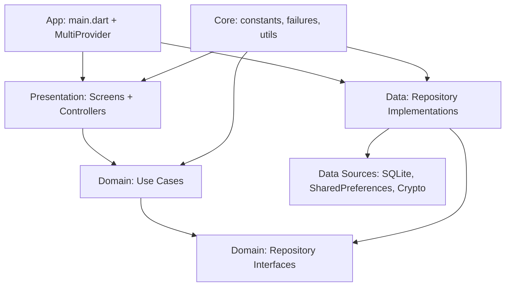

# PassGen

PassGen - кроссплатформенное Flutter-приложение для генерации, локального
хранения, импорта, экспорта и шифрования паролей. Проект построен вокруг
локальной модели данных: секреты не передаются на сервер, а криптографические
операции выполняются на устройстве пользователя.

Документ актуализирован по состоянию кода на 7 мая 2026 года и может
использоваться как краткая техническая база для дипломной работы. Подробное
описание архитектуры, потоков данных и ограничений находится в
[docs/DEVELOPER.md](docs/DEVELOPER.md).

## Фактическое состояние проекта

| Параметр | Значение |
| --- | --- |
| Версия в `pubspec.yaml` | `0.5.2+3` |
| Версия приложения в `AppConstants` | `0.5.2` |
| Версия схемы SQLite | `4` |
| Версия схемы в комментариях БД | `0.6.0` |
| Flutter SDK | `^3.24.0` |
| Dart SDK | `^3.9.0` |
| Основные платформы проекта | Android, iOS, macOS, Windows, Linux, Web |
| Dart-файлов в `lib/` | 142 |
| Тестовых файлов `*_test.dart` | 26 |
| Последний запуск `flutter test` | 7 мая 2026: 182 теста, все пройдены |

В коде присутствуют заготовки версии `0.6.0`: профили, биометрия, QR-передача,
история паролей и бенчмарки криптографии. При этом публичный пользовательский
интерфейс сейчас раскрывает не все эти возможности. Поэтому в документации
ниже отдельно разделены реализованные пользовательские сценарии и внутренние
модули, которые уже есть в кодовой базе, но требуют завершения UI-интеграции.

## Назначение приложения

PassGen решает следующие задачи:

- генерация паролей с настраиваемой длиной, наборами символов и уровнем сложности;
- сохранение сгенерированных паролей в локальном хранилище;
- защита входа в приложение PIN-кодом;
- шифрование паролей и произвольных текстовых сообщений;
- импорт и экспорт данных в JSON и фирменном `.passgen` формате;
- категоризация записей, поиск и фильтрация;
- ведение журнала событий безопасности.

## Доступные пользовательские сценарии

### Аутентификация

При запуске приложение показывает экран PIN-кода. PIN содержит от 4 до 8 цифр.
Для хранения PIN используется таблица `auth_data` SQLite: сохраняется не сам
PIN, а результат PBKDF2-HMAC-SHA256 с солью. Текущая версия параметров
шифрования использует 600 000 итераций и 256-битный ключ.

После успешного входа PIN временно хранится в `MasterPasswordSession` только в
памяти процесса и используется как мастер-пароль для шифрования сохраняемых
паролей. Сессия очищается при автоблокировке через 5 минут неактивности или при
уничтожении `AuthController`.

Защита от подбора реализована прогрессивной блокировкой: после 5 неверных
попыток включается блокировка на 30 секунд, затем задержка растёт с
коэффициентом 6 и ограничивается 7 сутками.

### Генератор паролей

Экран генератора позволяет выбрать один из пяти режимов:

- `PIN`;
- `Свой+`;
- `Стандартный`;
- `Надёжный`;
- `Максимальный`.

Пользователь может управлять длиной пароля, обязательностью строчных букв,
заглавных букв, цифр и спецсимволов, а также включать режимы "без повторяющихся
символов" и "исключить похожие символы". Генерация использует
`Random.secure()` через `EncryptorLocalDataSource`, а оценка стойкости
выполняется через `PasswordUtils` и библиотеку `zxcvbn`.

Контроллер генератора содержит ограничение частоты: не больше 60 генераций в
минуту.

### Хранилище паролей

В текущей реализации основной список сохранённых паролей хранится в
`SharedPreferences` под ключом `saved_passwords` как JSON-массив объектов
`PasswordEntry`. Сами секреты внутри записей сохраняются в зашифрованном
мини-формате, а открытый пароль не записывается в JSON.

SQLite-база `passgen.db` уже содержит таблицы `password_entries` и
`password_configs`, но текущие `StorageLocalDataSource` и `StorageRepositoryImpl`
используют `SharedPreferences`. Это важное архитектурное состояние проекта:
хранилище частично подготовлено к миграции на SQLite, но пользовательский поток
сохранения и чтения паролей ещё работает через JSON в `SharedPreferences`.

Экран хранилища поддерживает:

- загрузку списка сохранённых записей;
- поиск по названию сервиса;
- фильтрацию по категориям;
- адаптивный двухпанельный вид для широких экранов;
- импорт и экспорт JSON;
- импорт и экспорт `.passgen`;
- удаление выбранной записи.

Текущее ограничение: для новых зашифрованных записей обратная расшифровка
пароля в UI не вынесена в отдельный репозиторий. Поэтому `PasswordEntry`
предоставляет `displayPassword`, который при отсутствии открытого пароля может
вернуть зашифрованный payload. Это место требует доработки перед финальной
версией приложения.

### Импорт и экспорт

Поддерживаются два формата:

- JSON: список `PasswordEntry`, где секреты уже находятся в зашифрованном виде;
- `.passgen`: Base64-представление бинарного контейнера с заголовком
  `PASSGEN_V1`, метаданными шифрования, PBKDF2 nonce, ChaCha20-Poly1305 nonce,
  ciphertext и MAC.

При импорте выполняется проверка дубликатов по паре `service + login`.
Дубликаты пропускаются, новые записи добавляются в локальное хранилище.

### Шифратор сообщений

Экран шифратора работает отдельно от хранилища паролей. Он использует
ChaCha20-Poly1305 и PBKDF2-HMAC-SHA256 для шифрования и дешифрования
произвольного текста по пользовательскому паролю.

### Категории, настройки и журнал

Категории, настройки и журнал событий хранятся в SQLite. Пользователь может
управлять категориями, менять или удалять PIN-код и просматривать журнал
событий безопасности.

## Архитектура

Проект следует идее Clean Architecture с практической Flutter-реализацией:

```text
lib/
├── main.dart                         # Инициализация Flutter, SQLite, миграций и DI
├── app/
│   └── app.dart                      # MultiProvider, MaterialApp, навигационный каркас
├── core/                             # Общие константы, ошибки, сервисы и утилиты
├── domain/                           # Entities, repository interfaces, use cases, services
├── data/                             # Data sources, SQLite schema, repositories, formats
├── presentation/                     # Экраны, контроллеры ChangeNotifier, виджеты
└── shared/                           # Общие компоненты ранней версии проекта
```

Зависимости в основном направлены от внешних слоёв к домену:



`main.dart` является точкой композиции: он инициализирует `DatabaseHelper`,
открывает SQLite, запускает миграцию из `SharedPreferences`, создаёт основные
data source и repository объекты, затем передаёт их в `PasswordGeneratorApp`.
Внутри `PasswordGeneratorApp` зависимости публикуются через `provider`, а UI
обновляется через `ChangeNotifier`.

## Схема данных

SQLite-схема версии 4 включает 8 таблиц:

- `profiles` - профили пользователей;
- `auth_data` - PIN-хэши, соли, счётчики ошибок, блокировки и флаг биометрии;
- `categories` - системные и пользовательские категории;
- `password_entries` - подготовленная таблица записей паролей;
- `password_configs` - подготовленная таблица конфигураций генерации;
- `password_history` - подготовленная таблица истории изменений;
- `security_logs` - журнал событий безопасности;
- `app_settings` - настройки приложения.

Фактическое основное хранилище записей паролей сейчас гибридное:

```text
PIN, категории, настройки, логи, профили  -> SQLite passgen.db
Список PasswordEntry                      -> SharedPreferences: saved_passwords
Секрет внутри PasswordEntry               -> encrypted mini format
```

## Криптография

| Механизм | Реализация |
| --- | --- |
| Деривация ключа текущей версии | PBKDF2-HMAC-SHA256, 600 000 итераций, 256 бит |
| Legacy-деривация | PBKDF2-HMAC-SHA256, 10 000 итераций |
| Шифрование | ChaCha20-Poly1305 AEAD |
| Генерация случайных данных | `Random.secure()` |
| Сравнение PIN-хэшей | constant-time сравнение Base64 |
| Очистка секретов | `CryptoUtils.secureWipeData()` и `secureWipeKey()` там, где данные представлены изменяемыми байтовыми массивами |

## Быстрый старт

```bash
flutter pub get
flutter run -d <device>
```

Примеры устройств: `android`, `ios`, `macos`, `windows`, `linux`, `chrome`.

## Тестирование

```bash
flutter test
```

Фактический результат последней проверки:

```text
Дата: 7 мая 2026
Команда: flutter test
Результат: 182 passed, 0 failures
```

Ранее тесты логирования не компилировались из-за устаревших Mockito mocks после
добавления `profileId` в `SecurityLogRepository`. Mocks регенерированы через
`flutter pub run build_runner build --delete-conflicting-outputs`.

## Сборка

```bash
flutter build apk
flutter build appbundle
flutter build macos
flutter build windows
flutter build linux
flutter build web
```

Для macOS в проекте настроены entitlements для доступа к файлам, выбранным
пользователем, что необходимо для импорта и экспорта.

## Документация

- [docs/DEVELOPER.md](docs/DEVELOPER.md) - подробная архитектура и схема работы;
- [docs/README.md](docs/README.md) - индекс документации;
- [docs/diploma/](docs/diploma/) - материалы для дипломной работы;
- [docs/chronology/](docs/chronology/) - хронология разработки.

## Лицензия

MIT License. См. [LICENSE](LICENSE).
