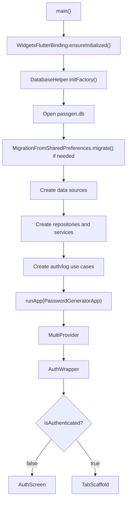
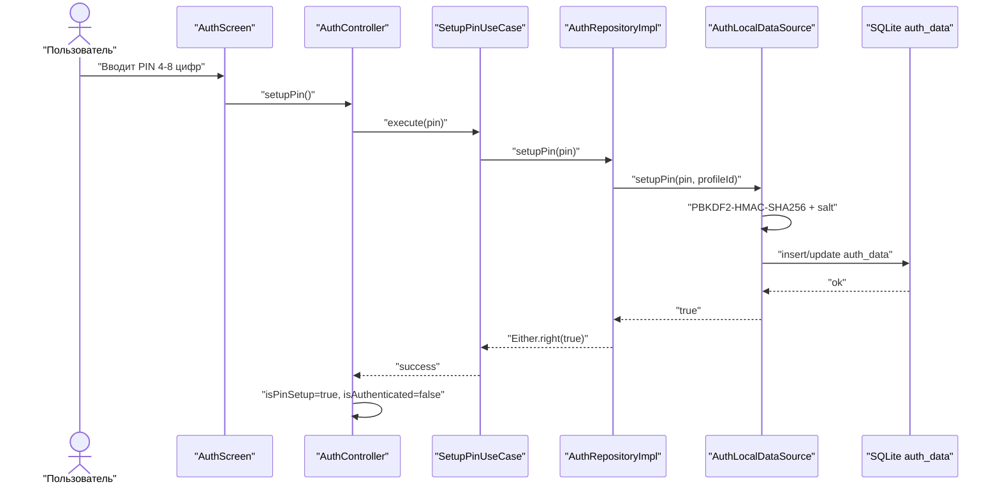
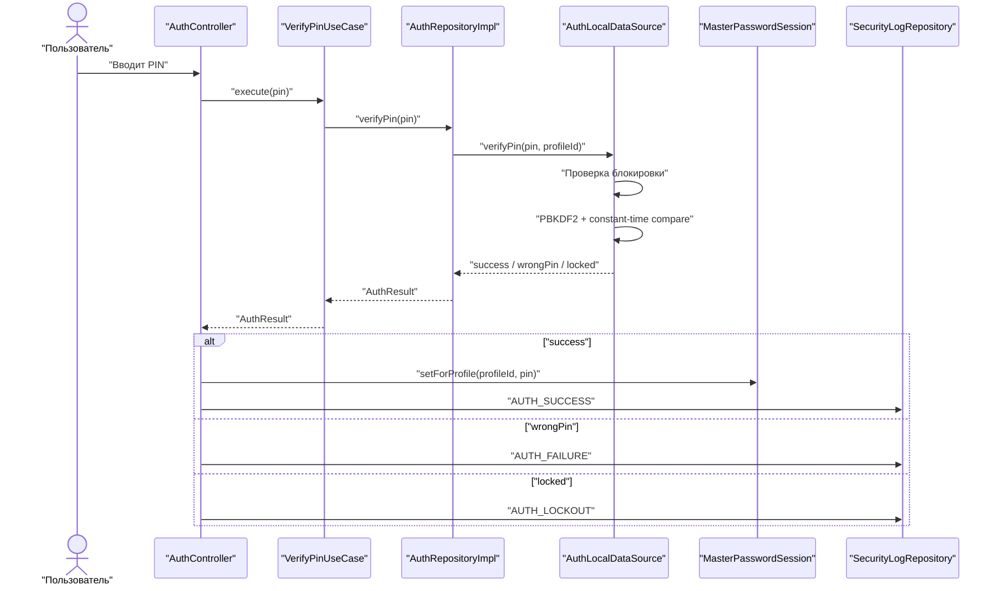
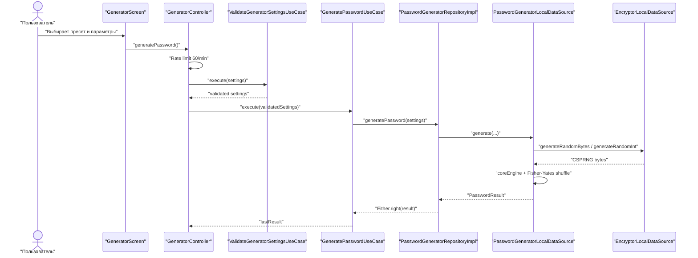
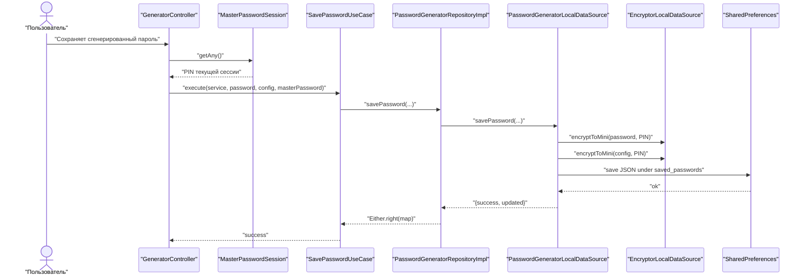

# PassGen - документация разработчика

Документ описывает фактическую архитектуру и схему работы приложения по
состоянию кода на 7 мая 2026 года. Он предназначен для разработки и для
использования в дипломной работе как техническое основание: здесь зафиксированы
не только реализованные возможности, но и текущие архитектурные ограничения.

## 1. Краткое резюме

PassGen - Flutter-приложение для локальной генерации, хранения, импорта,
экспорта и шифрования паролей. Проект использует Clean Architecture в
практической форме: бизнес-сущности и use cases вынесены в `domain`, доступ к
данным инкапсулирован в `data`, а интерфейс построен на `presentation` с
`ChangeNotifier` и `provider`.

Фактическая версия проекта неоднородна:

- `pubspec.yaml` указывает версию приложения `0.5.2+3`;
- `AppConstants.appVersion` содержит `0.5.2`;
- `DatabaseSchema.version` равен `4`, а комментарии схемы называют её `v0.6.0`;
- в коде уже присутствуют профили, биометрия, QR-передача и история паролей;
- пользовательский UI пока раскрывает только часть этих модулей.

Главный вывод для диплома: проект находится в состоянии функционального
локального менеджера паролей с гибридным слоем хранения. SQLite используется
для PIN, профилей, категорий, настроек, логов и истории, но основной список
`PasswordEntry` в текущем пользовательском потоке хранится в
`SharedPreferences`.

## 2. Инвентаризация проекта

| Объект | Фактическое значение |
| --- | --- |
| Dart-файлов в `lib/` | 142 |
| Строк Dart-кода в `lib/` | около 17 346 |
| Domain entities | 16 |
| Repository interfaces | 12 |
| Use cases | 27 |
| Data sources | 6 |
| Repository implementations | 12 |
| Основных UI-контроллеров | 7 |
| Основных экранов | 8 |
| SQLite tables | 8 |
| Тестовых файлов `*_test.dart` | 26 |
| Последний запуск тестов | 172 passed, 2 load failures |

## 3. Слои архитектуры

```text
lib/
├── main.dart
├── app/
│   └── app.dart
├── core/
│   ├── constants/
│   ├── errors/
│   ├── security/
│   ├── services/
│   └── utils/
├── domain/
│   ├── entities/
│   ├── repositories/
│   ├── services/
│   ├── usecases/
│   └── validators/
├── data/
│   ├── database/
│   ├── datasources/
│   ├── formats/
│   ├── models/
│   └── repositories/
├── presentation/
│   ├── features/
│   └── widgets/
└── shared/
```

### 3.1 App layer

Файлы:

- `lib/main.dart`;
- `lib/app/app.dart`.

Назначение:

- инициализация Flutter binding;
- настройка SQLite factory для desktop-платформ через `sqflite_common_ffi`;
- открытие базы `passgen.db`;
- миграция старых данных из `SharedPreferences`;
- создание ключевых data sources, repositories, services и use cases;
- регистрация зависимостей через `MultiProvider`;
- настройка `MaterialApp`, темы и навигационного каркаса.

Последовательность запуска:



### 3.2 Core layer

`core` содержит общие механизмы, которые используются несколькими слоями:

- `constants/app_constants.dart` - версия приложения, пресеты генерации,
  диапазоны длин, флаги наборов символов;
- `constants/event_types.dart` - типы событий журнала безопасности;
- `errors/failures.dart` - типизированные failures для `Either`;
- `security/master_password_session.dart` - неперсистентное хранение PIN в RAM
  на время активной сессии;
- `services/navigation_service.dart` - централизованное переключение вкладок;
- `utils/crypto_utils.dart` - Base64, CSPRNG, constant-time сравнение, очистка
  байтовых массивов;
- `utils/encryption_versioning.dart` - версии параметров шифрования;
- `utils/lockout_calculator.dart` - расчёт прогрессивной блокировки PIN;
- `utils/qr_payload_codec.dart` - кодирование QR-payload;
- `utils/password_utils.dart` - оценка стойкости паролей.

### 3.3 Domain layer

Domain layer содержит бизнес-модель без Flutter UI. Он задаёт контракты
репозиториев и сценарии приложения.

Entities:

- `AuthResult`;
- `AuthState`;
- `BiometricType`;
- `Category`;
- `CharacterSet`;
- `GlitchResult`;
- `GlitchRule`;
- `Notification`;
- `PasswordConfig`;
- `PasswordEntry`;
- `PasswordGenerationSettings`;
- `PasswordHistoryEntry`;
- `PasswordResult`;
- `Profile`;
- `QrTransferPayload`;
- `SecurityLog`.

Repository interfaces:

- `AppSettingsRepository`;
- `AuthRepository`;
- `BiometricRepository`;
- `CategoryRepository`;
- `EncryptorRepository`;
- `PasswordDataRepository`;
- `PasswordGeneratorRepository`;
- `PasswordHistoryRepository`;
- `ProfileRepository`;
- `QrTransferRepository`;
- `SecurityLogRepository`;
- `StorageRepository`.

Use cases:

| Группа | Количество | Сценарии |
| --- | ---: | --- |
| Auth | 5 | setup, verify, change, remove PIN, get auth state |
| Category | 4 | create, get, update, delete categories |
| Encryptor | 2 | encrypt/decrypt message |
| Generator | 1 | validate generator settings |
| Log | 2 | log event, get logs |
| Password | 4 | generate, save, save history, get history |
| Settings | 3 | get, set, remove setting |
| Storage | 6 | get, delete, import/export JSON, import/export `.passgen` |

### 3.4 Data layer

Data layer реализует доступ к SQLite, `SharedPreferences`, secure storage,
формату `.passgen` и криптографии.

Data sources:

- `AuthLocalDataSource` - PIN, PBKDF2, блокировки, `auth_data`;
- `BiometricLocalDataSource` - `local_auth` и `flutter_secure_storage`;
- `EncryptorLocalDataSource` - ChaCha20-Poly1305 и PBKDF2;
- `PasswordGeneratorLocalDataSource` - генерация, восстановление и сохранение
  паролей;
- `ProfileLocalDataSource` - CRUD профилей в SQLite;
- `StorageLocalDataSource` - JSON-список `PasswordEntry` в `SharedPreferences`.

Repository implementations:

- `AppSettingsRepositoryImpl`;
- `AuthRepositoryImpl`;
- `BiometricRepositoryImpl`;
- `CategoryRepositoryImpl`;
- `EncryptorRepositoryImpl`;
- `PasswordDataRepositoryImpl`;
- `PasswordGeneratorRepositoryImpl`;
- `PasswordHistoryRepositoryImpl`;
- `ProfileRepositoryImpl`;
- `QrTransferRepositoryImpl`;
- `SecurityLogRepositoryImpl`;
- `StorageRepositoryImpl`.

### 3.5 Presentation layer

Presentation layer состоит из экранов, контроллеров и переиспользуемых
виджетов. State management реализован через `provider` и `ChangeNotifier`.

Основные контроллеры:

- `AuthController`;
- `GeneratorController`;
- `StorageController`;
- `EncryptorController`;
- `SettingsController`;
- `CategoriesController`;
- `LogsController`.

Основные экраны:

- `AuthScreen`;
- `GeneratorScreen`;
- `EncryptorScreen`;
- `StorageScreen`;
- `SettingsScreen`;
- `CategoriesScreen`;
- `LogsScreen`;
- `AboutScreen`.

Навигация после входа строится через `TabScaffold`:

- на мобильных ширинах используется `BottomNavigationBar`;
- на планшетах и desktop используется `NavigationRail`;
- вкладки: генератор, шифратор, хранилище, настройки, о приложении.

## 4. Основные потоки работы

### 4.1 Первый запуск и установка PIN



PIN не хранится в открытом виде. В БД записываются `pin_hash`, `pin_salt`,
счётчики неудачных попыток, индекс серии блокировки и `lockout_until`.

### 4.2 Вход по PIN



После успешного входа PIN находится только в памяти. Он нужен, потому что
сохранение пароля использует PIN как мастер-пароль для шифрования.

### 4.3 Генерация пароля



`PasswordGeneratorLocalDataSource` строит пароль из включённых наборов символов:
цифры, строчные буквы, заглавные буквы и спецсимволы. Дополнительно могут
исключаться похожие символы `1lI0Oo`, а режим `allUnique` запрещает повторение
символов.

### 4.4 Сохранение пароля



Текущее поведение при совпадении сервиса: `PasswordGeneratorLocalDataSource`
ищет существующую запись по `service.toLowerCase()` и обновляет её. При импорте
дубликаты определяются точнее: по паре `service + login`.

### 4.5 Импорт и экспорт

JSON-экспорт возвращает список `PasswordEntry.toJson()`. В JSON не сохраняется
открытый пароль, но сохраняются `encrypted_password`, `config`, `category_id`,
`login`, даты создания и обновления.

`.passgen` экспорт шифрует JSON-список через `PassgenFormat`:

```text
HEADER            "PASSGEN_V1"                      10 bytes
VERSION           formatVersion = 1                  1 byte
FLAGS             flagsNone = 0                      1 byte
METADATA_LENGTH   little-endian uint16               2 bytes
METADATA          EncryptionMetadata JSON             variable
PBKDF2_NONCE      random bytes                        32 bytes
CHACHA_NONCE      SecretBox nonce                     12 bytes
DATA_LENGTH       little-endian uint32                4 bytes
CIPHERTEXT        encrypted JSON                      variable
MAC               Poly1305 authentication tag         16 bytes
```

Метаданные шифрования записывают версию параметров. Текущая версия -
`EncryptionVersion.currentVersion == 2`, то есть PBKDF2-HMAC-SHA256 с
600 000 итераций. Legacy `v1` с 10 000 итераций остаётся поддержанным для
обратной совместимости.

## 5. Хранение данных

### 5.1 SQLite

Файл базы создаётся через `sqflite`/`sqflite_common_ffi` с именем `passgen.db`.
Актуальная версия схемы:

```dart
static const int version = 4;
static const String appVersion = '0.6.0';
```

Таблицы:

```sql
CREATE TABLE profiles (
  id INTEGER PRIMARY KEY AUTOINCREMENT,
  name TEXT NOT NULL,
  avatar_emoji TEXT,
  created_at INTEGER NOT NULL,
  last_accessed_at INTEGER
);

CREATE TABLE categories (
  id INTEGER PRIMARY KEY AUTOINCREMENT,
  profile_id INTEGER REFERENCES profiles(id),
  name TEXT NOT NULL,
  icon TEXT,
  is_system INTEGER DEFAULT 0,
  created_at INTEGER NOT NULL
);

CREATE TABLE password_entries (
  id INTEGER PRIMARY KEY AUTOINCREMENT,
  profile_id INTEGER REFERENCES profiles(id),
  category_id INTEGER REFERENCES categories(id),
  service TEXT NOT NULL,
  login TEXT,
  encrypted_password BLOB NOT NULL,
  nonce BLOB NOT NULL,
  created_at INTEGER NOT NULL,
  updated_at INTEGER NOT NULL
);

CREATE TABLE password_configs (
  id INTEGER PRIMARY KEY AUTOINCREMENT,
  profile_id INTEGER REFERENCES profiles(id),
  entry_id INTEGER UNIQUE REFERENCES password_entries(id),
  strength INTEGER,
  min_length INTEGER,
  max_length INTEGER,
  flags INTEGER,
  require_unique INTEGER DEFAULT 0,
  encrypted_config BLOB
);

CREATE TABLE security_logs (
  id INTEGER PRIMARY KEY AUTOINCREMENT,
  profile_id INTEGER REFERENCES profiles(id),
  action_type TEXT NOT NULL,
  timestamp INTEGER NOT NULL,
  details TEXT
);

CREATE TABLE app_settings (
  key TEXT PRIMARY KEY,
  value TEXT NOT NULL,
  encrypted INTEGER DEFAULT 0
);

CREATE TABLE auth_data (
  profile_id INTEGER NOT NULL PRIMARY KEY REFERENCES profiles(id),
  pin_hash TEXT NOT NULL,
  pin_salt TEXT NOT NULL,
  failed_attempts INTEGER DEFAULT 0,
  series_index INTEGER DEFAULT 0,
  lockout_until INTEGER,
  biometric_enabled INTEGER DEFAULT 0,
  created_at INTEGER NOT NULL
);

CREATE TABLE password_history (
  id INTEGER PRIMARY KEY AUTOINCREMENT,
  profile_id INTEGER REFERENCES profiles(id),
  entry_id INTEGER NOT NULL REFERENCES password_entries(id) ON DELETE CASCADE,
  service TEXT NOT NULL,
  encrypted_password BLOB NOT NULL,
  nonce BLOB NOT NULL,
  config TEXT NOT NULL,
  login TEXT,
  created_at INTEGER NOT NULL,
  reason TEXT
);
```

Индексы создаются для:

- `password_entries.category_id`;
- `password_entries.service`;
- `password_entries.profile_id`;
- `security_logs.action_type`;
- `security_logs.timestamp`;
- `security_logs.profile_id`;
- `password_history.entry_id`;
- `password_history.created_at`;
- `password_history.profile_id`;
- `auth_data.profile_id`;
- `categories.profile_id`;
- `password_configs.profile_id`.

Системные категории при создании БД:

| Название | Иконка |
| --- | --- |
| Соцсети | 👥 |
| Почта | 📧 |
| Банки | 🏦 |
| Магазины | 🛒 |
| Работа | 💼 |
| Развлечения | 🎮 |
| Другое | 📁 |

### 5.2 SharedPreferences

Несмотря на наличие таблиц `password_entries` и `password_configs`, текущий
пользовательский поток хранения паролей использует:

```text
SharedPreferences key: saved_passwords
Value: JSON string with List<PasswordEntry>
```

`StorageLocalDataSource` отвечает за:

- `savePasswords(List<PasswordEntry>)`;
- `getPasswords()`;
- `removePasswordAt(index)`;
- `exportPasswords()`;
- `importPasswords(jsonString)`.

Это означает, что схема SQLite уже подготовлена шире, чем фактическое
использование в текущем UI. Для диплома это корректно описывать как этап
эволюции архитектуры: проект перешёл от раннего `SharedPreferences`-хранилища к
SQLite для системных данных и подготовил миграцию записей паролей, но не
завершил её в видимом пользовательском сценарии.

## 6. Криптографическая модель

### 6.1 Версионирование параметров

`EncryptionVersion` задаёт поддерживаемые версии:

| Версия | KDF | Итерации | Назначение |
| --- | --- | ---: | --- |
| v1 | PBKDF2-HMAC-SHA256 | 10 000 | legacy |
| v2 | PBKDF2-HMAC-SHA256 | 600 000 | текущая версия |
| v3 | Argon2id | 3 | перспективная заготовка |

Текущая версия `EncryptionVersion.currentVersion` равна `2`.

### 6.2 PIN

PIN хранится в `auth_data` как:

- `pin_hash` - Base64 от derived key;
- `pin_salt` - Base64 от 32 случайных байтов;
- `failed_attempts`;
- `series_index`;
- `lockout_until`.

Проверка PIN:

1. Извлекается строка `auth_data` для активного профиля.
2. Проверяется, не действует ли блокировка.
3. Новый derived key вычисляется через PBKDF2-HMAC-SHA256.
4. Base64-хэш сравнивается с сохранённым через constant-time сравнение.
5. При успехе счётчики сбрасываются.
6. При ошибке увеличивается счётчик попыток.
7. После 5 ошибок создаётся новая серия блокировки.

Формула задержки:

```text
delay = min(30 seconds * 6^(seriesIndex - 1), 7 days)
```

### 6.3 Шифрование записей паролей

При сохранении пароля используется `EncryptorLocalDataSource.encryptToMini()`:

```text
mini = base64(pbkdf2Nonce(32) + chachaNonce(12) + ciphertext + mac(16))
```

Входной пароль для KDF - PIN текущей сессии из `MasterPasswordSession`.
Пароль и конфигурация генерации шифруются отдельно. В JSON сохраняются
зашифрованные строки, а не открытый пароль.

Текущее ограничение: полная обратная расшифровка сохранённой записи не
интегрирована в UI-хранилище. В `PasswordEntry.decryptPassword()` прямо указано,
что дешифрование должно быть вынесено в data layer/repository.

### 6.4 Шифратор сообщений

`EncryptorLocalDataSource` также используется для отдельного экрана шифратора.
Метод `encrypt()` возвращает JSON-подобную структуру:

- `nonce` - nonce/salt для PBKDF2, 32 байта;
- `nonceBox` - nonce ChaCha20-Poly1305;
- `cipherText`;
- `mac`.

`encryptToMini()` упаковывает эти поля в компактный Base64.

### 6.5 `.passgen`

`.passgen` - фирменный экспортный формат. Он не является отдельным бинарным
файлом на диске в текущем UI: пользователь экспортирует Base64-строку в файл с
расширением `.passgen`.

Безопасность формата обеспечивается:

- PBKDF2-HMAC-SHA256 для получения ключа из мастер-пароля;
- отдельным PBKDF2 nonce 32 байта;
- отдельным ChaCha20-Poly1305 nonce 12 байт;
- Poly1305 MAC 16 байт;
- метаданными версии шифрования.

## 7. Модули версии 0.6.0 и степень готовности

| Модуль | Файлы | Состояние |
| --- | --- | --- |
| Профили | `Profile`, `ProfileRepository`, `ProfileLocalDataSource` | Есть CRUD и таблица `profiles`; полноценный UI выбора профиля отсутствует |
| Per-profile auth | `AuthLocalDataSource`, `AuthRepositoryImpl` | Реализован default profile id `1`; переключение профиля в UI не раскрыто |
| Биометрия | `BiometricRepository`, `BiometricLocalDataSource` | Data layer есть; UI-кнопки входа/настройки биометрии отсутствуют |
| QR-передача | `QrTransferRepositoryImpl`, `QrPayloadCodec` | Доменная и data-логика есть; UI-сценарий отсутствует |
| История паролей | `PasswordHistoryRepositoryImpl`, use cases | Таблица и репозиторий есть; обычное сохранение из генератора не передаёт `entryId`, поэтому история не заполняется в основном потоке |
| Бенчмарки | `PerformanceBenchmarkService` | Сервис есть; UI/CLI запуск не подключён |
| Glitch-пароль | `GlitchService` | Доменный сервис есть; UI не подключён |

Эти модули можно описывать в дипломе как перспективные или частично
интегрированные подсистемы, но не как завершённые пользовательские функции.

## 8. UI и навигация

### 8.1 AuthScreen

Функции:

- установка PIN;
- ввод PIN с экранной цифровой клавиатурой;
- ввод PIN с физической клавиатуры;
- отображение оставшихся попыток;
- отображение экрана блокировки с таймером;
- установка Android `FLAG_SECURE` через `AndroidSecurityUtils`.

### 8.2 GeneratorScreen

Функции:

- выбор пресета сложности через `FilterChip`;
- настройка длины;
- включение обязательных наборов символов;
- исключение похожих символов;
- режим уникальных символов;
- отображение текущего набора символов;
- копирование сгенерированного пароля;
- сохранение в хранилище с выбором категории.

### 8.3 StorageScreen

Функции:

- загрузка списка записей;
- поиск по сервису;
- фильтр по категории;
- адаптивный список/детальная панель;
- импорт/экспорт JSON;
- импорт/экспорт `.passgen`;
- удаление записи.

Текущее ограничение хранилища: детальная панель и копирование используют
`entry.displayPassword`, который может вернуть encrypted payload.

### 8.4 SettingsScreen

Функции:

- смена PIN;
- удаление PIN;
- переход к управлению категориями;
- просмотр журнала событий.

В UI есть пункт "Очистить логи", но обработчик содержит комментарий, что
очистка будет реализована в следующей версии. Репозиторий `clearAll()` уже
существует.

## 9. Логирование

Типы событий определены в `EventTypes`:

| Тип | Назначение |
| --- | --- |
| `AUTH_SUCCESS` | успешный вход |
| `AUTH_FAILURE` | неудачная попытка входа |
| `AUTH_LOCKOUT` | блокировка после серии ошибок |
| `PIN_SETUP` | установка PIN |
| `PIN_CHANGED` | смена PIN |
| `PIN_REMOVED` | удаление PIN |
| `PWD_CREATED` | создание пароля |
| `PWD_ACCESSED` | доступ к паролю |
| `PWD_UPDATED` | обновление пароля |
| `PWD_DELETED` | удаление пароля |
| `DATA_EXPORT` | экспорт |
| `DATA_IMPORT` | импорт |
| `DATA_IMPORT_FAILURE` | ошибка импорта |
| `SETTINGS_CHG` | изменение настроек |
| `SESSION_STARTED` | начало сессии |
| `SESSION_ENDED` | завершение сессии |
| `SESSION_TIMEOUT` | таймаут сессии |

`SecurityLogRepositoryImpl` пишет логи в SQLite и автоматически очищает старые
записи: если количество логов превышает 2000, остаются последние 1000.

## 10. Тестирование

Структура:

```text
test/
├── unit/
│   ├── crypto_utils_test.dart
│   ├── integrity_and_versioning_test.dart
│   └── usecases/
├── usecases/
│   ├── auth/
│   └── password/
└── widgets/
```

Последняя проверка:

```text
Дата: 7 мая 2026
Команда: flutter test
Результат: 172 passed, 2 load failures
```

Причина падения: сгенерированные Mockito mocks для `SecurityLogRepository`
устарели после изменения интерфейса. В интерфейсе появились named-параметры
`profileId`, а mocks в файлах ниже их не содержат:

- `test/unit/usecases/log/get_logs_usecase_test.mocks.dart`;
- `test/unit/usecases/log/log_event_usecase_test.mocks.dart`.

Ошибка компиляции относится к методам:

- `logEvent(String actionType, {Map<String, dynamic>? details, int? profileId})`;
- `getLogs({int limit = 1000, int? profileId})`;
- `getLogsByType(String actionType, {int limit = 100, int? profileId})`.

Команда для обновления generated mocks:

```bash
dart run build_runner build --delete-conflicting-outputs
```

После регенерации нужно повторить:

```bash
flutter test
```

## 11. Сборка и запуск

Установка зависимостей:

```bash
flutter pub get
```

Запуск:

```bash
flutter run -d android
flutter run -d ios
flutter run -d macos
flutter run -d windows
flutter run -d linux
flutter run -d chrome
```

Сборка:

```bash
flutter build apk
flutter build appbundle
flutter build macos
flutter build windows
flutter build linux
flutter build web
```

Генерация иконок:

```bash
flutter pub run flutter_launcher_icons
```

Для macOS импорт и экспорт требуют entitlement:

```xml
<key>com.apple.security.files.user-selected.read-write</key>
<true/>
```

## 12. Ограничения текущей реализации

1. Основной список паролей пока хранится в `SharedPreferences`, а не в таблице
   `password_entries`.
2. UI хранилища не выполняет полноценную расшифровку сохранённых паролей через
   отдельный repository/data source.
3. Таблица `password_history` и use cases истории есть, но основной поток
   сохранения из генератора не передаёт `entryId`, поэтому история не работает
   как пользовательская функция.
4. Профили реализованы на уровне данных, но пользовательский интерфейс выбора
   и изоляции профилей не завершён.
5. Биометрия подключена в data/domain слоях, но отсутствует видимый UI входа и
   настройки.
6. QR-передача есть как repository/codec, но не доступна пользователю.
7. Тесты логирования требуют регенерации Mockito mocks.
8. Версии проекта требуют выравнивания: `pubspec.yaml`, `AppConstants` и
   `DatabaseSchema.appVersion` сейчас указывают разные состояния.

## 13. Как использовать это описание в дипломе

Рекомендуемая структура технической части:

1. Обоснование выбора Flutter для кроссплатформенного локального приложения.
2. Описание Clean Architecture и разделения на `presentation`, `domain`,
   `data`, `core`, `app`.
3. Разбор модели безопасности: PIN, PBKDF2, ChaCha20-Poly1305, локальное
   хранение, автоблокировка, защита от подбора.
4. Описание гибридной модели данных и плана миграции от `SharedPreferences` к
   SQLite.
5. Диаграммы потоков: вход, генерация, сохранение, импорт/экспорт.
6. Раздел тестирования с честным указанием текущего состояния автотестов.
7. Раздел ограничений и направлений развития: профили, биометрия, QR,
   полноценная история паролей и SQLite-хранилище записей.
