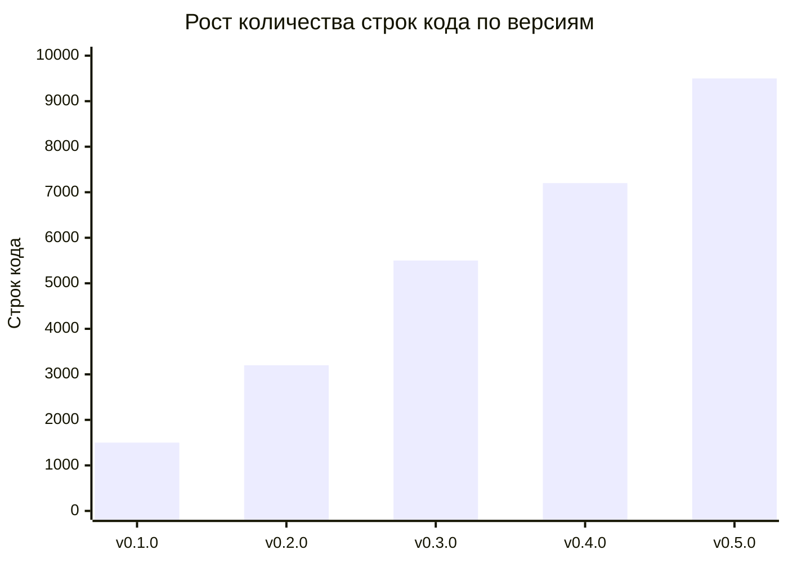
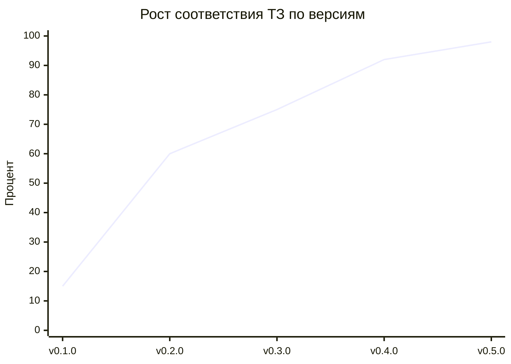

# 📚 Хронология разработки PassGen

**Проект:** PassGen — кроссплатформенный менеджер паролей
**Период разработки:** 5-10 марта 2026 г., 2 апреля 2026 г.
**Финальная версия:** 0.5.1 (Stable)
**Дата формирования:** 2 апреля 2026 г.

---

## 📖 Оглавление

### Версии проекта

| Версия | Дата | Название | Статус |
|--------|------|----------|--------|
| [v0.1.0](v0.1.0.md) | 5 марта 2026 | Инициализация проекта | ✅ Завершено |
| [v0.2.0](v0.2.0.md) | 6 марта 2026 | Аутентификация и безопасность | ✅ Завершено |
| [v0.3.0](v0.3.0.md) | 7 марта 2026 (утро/день) | SQLite миграция, Категоризация, Логирование | ✅ Завершено |
| [v0.4.0](v0.4.0.md) | 7 марта 2026 (вечер) | Формат .passgen, Автоблокировка, Настройки | ✅ Завершено |
| [v0.5.0](v0.5.0.md) | 8-10 марта 2026 | Критические исправления, UI/UX, Документирование | ✅ Завершено |
| [v0.5.1](v0.5.1.md) | 2 апреля 2026 | Критические исправления аутентификации | ✅ Завершено |

### Дополнительные документы

| Документ | Описание |
|----------|----------|
| [TIMELINE.md](TIMELINE.md) | Общая временная шкала разработки (диаграмма Ганта) |
| [SUMMARY.md](SUMMARY.md) | Сводный документ со всеми метриками проекта |
| [WORK_REPORT_AND_ROADMAP_2026_04_02.md](../WORK_REPORT_AND_ROADMAP_2026_04_02.md) | Отчёт о работе и план развития |

---

## 📊 Краткий обзор версий

### v0.1.0 — Инициализация проекта (5 марта)

**Ключевые достижения:**
- ✅ Настройка структуры Clean Architecture (5 слоёв)
- ✅ Dependency Injection через Provider
- ✅ Базовые компоненты: Core, Domain, Data, Presentation

**Метрики:**
- Файлов Dart: ~25
- Строк кода: ~1,500
- Готовность: ~15%

---

### v0.2.0 — Аутентификация и безопасность (6 марта)

**Ключевые достижения:**
- ✅ Вход по PIN-коду (4-8 цифр)
- ✅ PBKDF2 деривация (10,000 итераций, HMAC-SHA256)
- ✅ Защита от подбора (30 сек после 5 попыток)
- ✅ Логирование событий (6 типов)

**Метрики:**
- Файлов Dart: ~45 (+20)
- Строк кода: ~3,200 (+1,700)
- Готовность: ~60%

---

### v0.3.0 — SQLite миграция, Категоризация, Логирование (7 марта, утро/день)

**Ключевые достижения:**
- ✅ 5 таблиц БД (categories, password_entries, password_configs, security_logs, app_settings)
- ✅ 4 индекса для оптимизации
- ✅ 7 системных категорий + пользовательские
- ✅ LogsScreen с группировкой по дате
- ✅ SettingsScreen (смена/удаление PIN)

**Метрики:**
- Файлов Dart: ~75 (+30)
- Строк кода: ~5,500 (+2,300)
- Готовность: ~75%

---

### v0.4.0 — Формат .passgen, Автоблокировка, Настройки (7 марта, вечер)

**Ключевые достижения:**
- ✅ Экспорт/импорт в .passgen (ChaCha20-Poly1305)
- ✅ Автоблокировка по неактивности (5 минут)
- ✅ Логирование операций (PWD_CREATED, PWD_DELETED, DATA_EXPORT, DATA_IMPORT)
- ✅ Фильтрация и поиск в хранилище

**Метрики:**
- Файлов Dart: ~85 (+10)
- Строк кода: ~7,200 (+1,700)
- Готовность: ~92%

---

### v0.5.0 — Финальная версия (8-10 марта)

**Ключевые достижения:**
- ✅ Логирование PWD_ACCESSED и SETTINGS_CHG
- ✅ Автоочистка буфера обмена (60 сек)
- ✅ Опции генератора: «Без повторяющихся», «Исключить похожие»
- ✅ CharacterSetDisplay (виджет символов)
- ✅ Поддержка физической клавиатуры
- ✅ 29 widget-тестов, 25+ unit-тестов
- ✅ ~2,600 строк документации, 6 диаграмм Mermaid
- ✅ 9 bash скриптов, 3 GitHub Actions workflow

**Метрики:**
- Файлов Dart: 118 (+33)
- Строк кода: ~9,500+ (+2,300)
- Покрытие тестами: ~82%
- Готовность: ~98%

---

### v0.5.1 — Критические исправления (2 апреля)

**Ключевые исправления:**
- ✅ **Bug #1 (P0):** PIN verification failure — fixed unmodifiable bytes error
- ✅ **Bug #2 (P1):** Settings provider error — added ChangePinUseCase, RemovePinUseCase
- ✅ **Bug #3 (P0):** Change PIN failure — fixed key rotation unmodifiable bytes error

**Корневая причина:** Пакет `cryptography` возвращает неизменяемые `Uint8List` из `extractBytes()`, которые не могут быть изменены утилитой secure wipe.

**Решение:** Defensive programming — try-catch wrappers для всех вызовов `secureWipeKey()` и `secureWipeData()`.

**Метрики:**
- Файлов изменено: 3
- Строк кода добавлено: ~150
- Критических багов исправлено: 3 (P0: 2, P1: 1)
- Статус: ✅ Все тесты пройдены

---

## 📈 Эволюция метрик





---

## 🎯 Соответствие ТЗ (финальное)

| Раздел ТЗ | % Соответствия |
|-----------|-----------------|
| 3.1 Аутентификация | 96% |
| 3.2 Генератор паролей | 100% |
| 3.3 Хранилище данных | 96% |
| 3.4 Импорт/Экспорт | 100% |
| 3.5 Логирование | 100% |
| 4.1 База данных | 100% |
| 5. Архитектура | 100% |
| 6. UI/UX | 100% |
| 7. Безопасность | 90% |
| **ОБЩИЙ %** | **~98%** |

---

## 👥 Участники проекта (агенты)

| Роль | Вклад |
|------|-------|
| **Project Manager** | Планирование, координация, отслеживание прогресса |
| **Frontend Engineer** | UI компоненты, экраны, контроллеры |
| **Data Security Specialist** | Криптография, аудит безопасности |
| **QA Engineer** | 29 widget-тестов, 25+ unit-тестов |
| **UI/UX Designer** | Дизайн-система, CharacterSetDisplay, адаптивность |
| **Technical Writer** | ~2,600 строк документации, 6 диаграмм |
| **DevOps Engineer** | 9 bash скриптов, 3 GitHub Actions workflow |

---

## 📁 Структура документации

```
docs/chronology/
├── README.md                 # Этот файл (оглавление)
├── TIMELINE.md               # Временная шкала (диаграмма Ганта)
├── SUMMARY.md                # Сводные метрики проекта
├── v0.1.0.md                 # Версия 0.1.0 — Инициализация
├── v0.2.0.md                 # Версия 0.2.0 — Аутентификация
├── v0.3.0.md                 # Версия 0.3.0 — SQLite, Категории, Логи
├── v0.4.0.md                 # Версия 0.4.0 — .passgen, Автоблокировка
└── v0.5.0.md                 # Версия 0.5.0 — Финальная
```

---

## 🔗 Полезные ссылки

### Основная документация
- [DEVELOPER.md](../DEVELOPER.md) — Документация разработчика
- [README.MD](../../README.MD) — Основная документация проекта

### Проектная документация
- [Техническое задание](../../project_context/agents_context/planning/passgen.tz.md)
- [Текущий прогресс](../../project_context/agents_context/progress/CURRENT_PROGRESS.md)
- [Финальный отчёт](../../project_context/agents_context/stages/FINAL_REPORT.md)

### Техническая документация
- [Архитектура](../../project_context/technical_writer/technical/architecture.md)
- [База данных](../../project_context/technical_writer/technical/database.md)
- [Руководство пользователя](../../project_context/technical_writer/user_guide.md)
- [FAQ](../../project_context/technical_writer/faq.md)
- [Презентация](../../project_context/technical_writer/presentation/slides.md)

---

## 📝 История изменений документа

| Версия | Дата | Изменения |
|--------|------|-----------|
| 1.0 | 31 марта 2026 | Первая версия документа |

---

**PassGen** | [MIT License](../../LICENSE) | [GitHub](https://github.com/azazlov/passgen)
