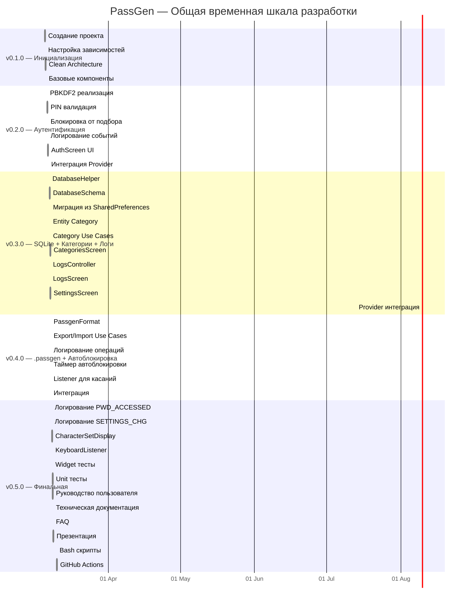
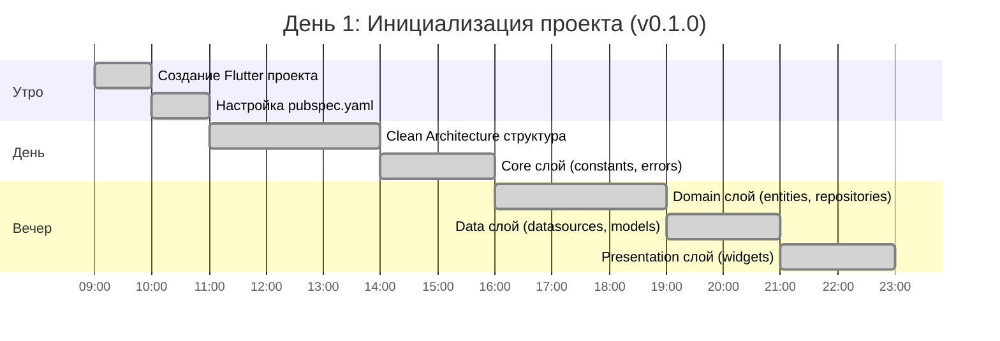
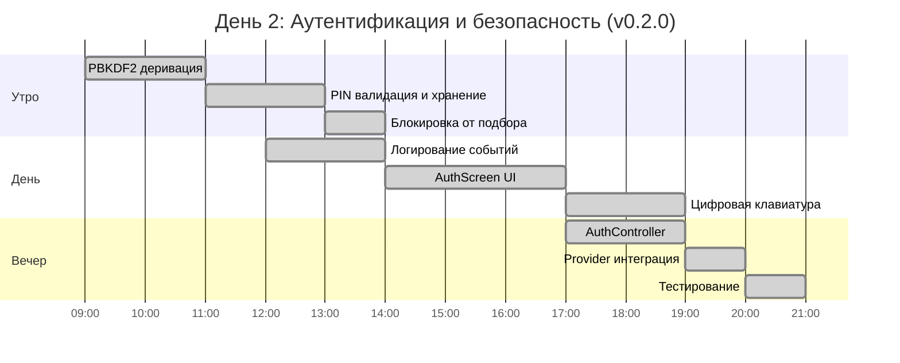
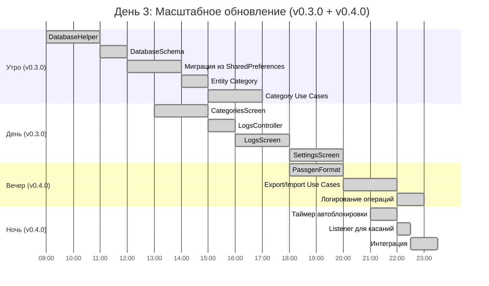
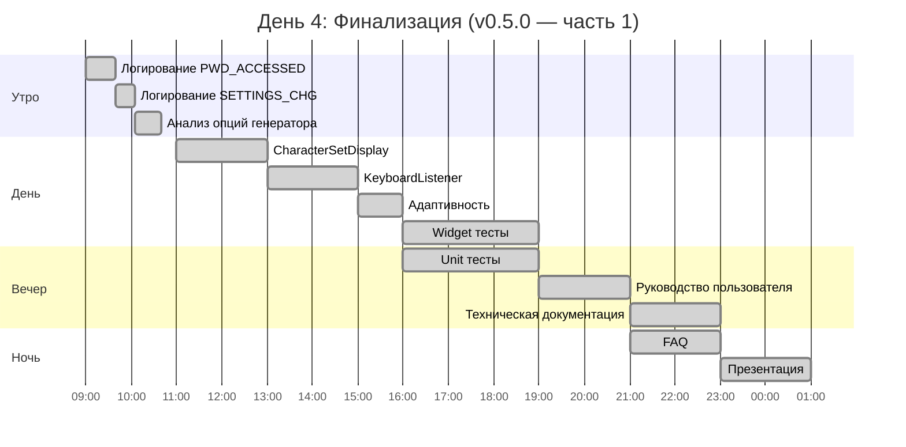
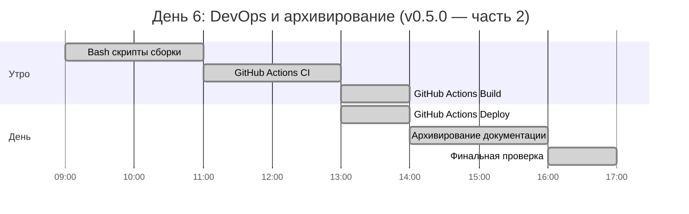
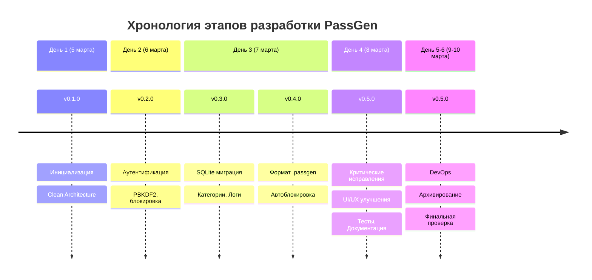
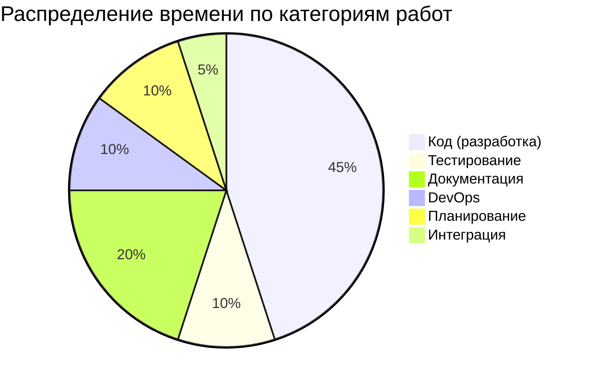

# ⏱️ Временная шкала разработки PassGen

**Проект:** PassGen — кроссплатформенный менеджер паролей  
**Период разработки:** 5-10 марта 2026 г.  
**Общая продолжительность:** 6 дней  
**Финальная версия:** 0.5.0

---

## 1. ОБЩАЯ ДИАГРАММА ГАНТА

---

## 2. ДЕТАЛЬНАЯ ХРОНОЛОГИЯ ПО ДНЯМ

### 5 марта 2026 (День 1) — Инициализация

**Итого за день:** ~16 часов  
**Создано файлов:** ~25  
**Строк кода:** ~1,500

---

### 6 марта 2026 (День 2) — Аутентификация

**Итого за день:** ~16 часов  
**Создано файлов:** ~20  
**Строк кода:** ~1,700

---

### 7 марта 2026 (День 3) — SQLite, Категории, Логи, .passgen, Автоблокировка

**Итого за день:** ~18 часов  
**Создано файлов:** ~50  
**Строк кода:** ~4,000

---

### 8 марта 2026 (День 4) — Критические исправления, UI/UX, Тесты, Документация

**Итого за день:** ~18 часов  
**Создано файлов:** ~40  
**Строк кода:** ~2,300 + ~2,600 документация

---

### 9 марта 2026 (День 5) — Резерв / Документация

**План:** Резервное время для завершения документации и тестирования

**Фактически:**
- Завершение технической документации
- Обновление README.MD
- Обновление structure.md
- Слияние веток test → main

---

### 10 марта 2026 (День 6) — DevOps, Архивирование

**Итого за день:** ~9 часов  
**Создано файлов:** ~12 (скрипты + workflow)

---

## 3. СТАТИСТИКА ПО ДНЯМ

| День | Дата | Версии | Часов работы | Файлов | Строк кода |
|------|------|--------|--------------|--------|------------|
| 1 | 5 марта | v0.1.0 | ~16 | ~25 | ~1,500 |
| 2 | 6 марта | v0.2.0 | ~16 | ~20 | ~1,700 |
| 3 | 7 марта | v0.3.0, v0.4.0 | ~18 | ~50 | ~4,000 |
| 4 | 8 марта | v0.5.0 (часть 1) | ~18 | ~40 | ~2,300 |
| 5 | 9 марта | — | ~8 | ~5 | ~500 |
| 6 | 10 марта | v0.5.0 (часть 2) | ~9 | ~12 | ~200 |
| **ИТОГО** | **5-10 марта** | **v0.1.0 - v0.5.0** | **~85** | **~152** | **~10,200** |

---

## 4. КЛЮЧЕВЫЕ ВЕХИ

| Дата | Время | Событие | Версия |
|------|-------|---------|--------|
| 5 марта | 09:00 | Начало проекта | v0.1.0 |
| 5 марта | 17:00 | Завершение инициализации | v0.1.0 ✅ |
| 6 марта | 17:00 | Аутентификация готова | v0.2.0 ✅ |
| 7 марта | 17:00 | SQLite + Категории + Логи | v0.3.0 ✅ |
| 7 марта | 23:00 | .passgen + Автоблокировка | v0.4.0 ✅ |
| 8 марта | 23:00 | Критические исправления + UI/UX | v0.5.0 ✅ |
| 8 марта | 23:00 | Документация завершена | v0.5.0 ✅ |
| 10 марта | 15:00 | DevOps завершён | v0.5.0 ✅ |
| 10 марта | 17:00 | Проект готов к релизу | v0.5.0 🎉 |

---

## 5. ВРЕМЕННАЯ ШКАЛА ЭТАПОВ

---

## 6. РАСПРЕДЕЛЕНИЕ ВРЕМЕНИ ПО КАТЕГОРИЯМ

---

## 7. ССЫЛКИ

- [README.md](README.md) — Оглавление всех версий
- [SUMMARY.md](SUMMARY.md) — Сводные метрики проекта
- [v0.1.0.md](v0.1.0.md) — Версия 0.1.0
- [v0.2.0.md](v0.2.0.md) — Версия 0.2.0
- [v0.3.0.md](v0.3.0.md) — Версия 0.3.0
- [v0.4.0.md](v0.4.0.md) — Версия 0.4.0
- [v0.5.0.md](v0.5.0.md) — Версия 0.5.0

---

**PassGen** | [MIT License](../../LICENSE) | [GitHub](https://github.com/azazlov/passgen)
