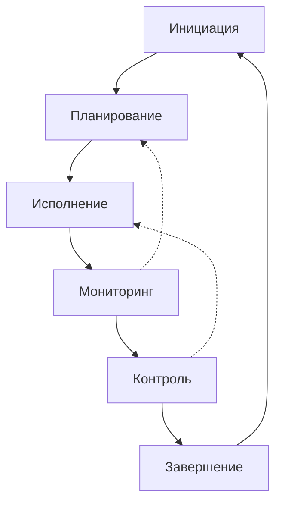
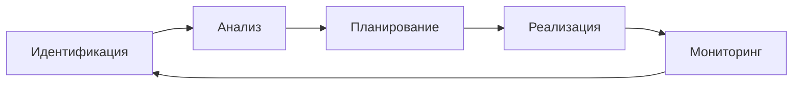

# 📋 Project Manager — Рабочее пространство

**Версия:** 1.0
**Дата:** 10 марта 2026
**Статус:** ✅ Актуально
**Проект:** PassGen — Менеджер паролей (v0.5.0)

---

## 1. ОБЗОР

Эта директория — **рабочее пространство Project Manager** для проекта PassGen. Содержит всю проектную документацию: планы, отчёты, метрики, риски и координацию между агентами.

---

## 2. СТРУКТУРА

```
project_context/agents_context/        # 📚 ОБЩИЙ КОНТЕКСТ
├── planning/                          # Планы и ТЗ
│   ├── passgen.tz.md                  # Техническое задание
│   ├── WORK_PLAN.md                   # Рабочий план (этот файл)
│   ├── COMPREHENSIVE_TASK_PLAN.md     # Сводный план
│   ├── TASK_PLAN_*.md                 # Планы задач
│   └── *.md                           # Другие планы
│
├── progress/
│   └── CURRENT_PROGRESS.md            # Текущий прогресс
│
├── stages/
│   ├── STAGE_1_COMPLETE.md            # Отчёт этапа 1
│   ├── STAGE_2_COMPLETE.md            # Отчёт этапа 2
│   ├── ...
│   └── FINAL_REPORT.md                # Финальный отчёт
│
├── reviews/
│   ├── CODE_REVIEW_*.md               # Код-ревью
│   ├── DATA_SECURITY_AUDIT.md         # Аудит безопасности
│   └── UI_UX_CODE_REVIEW.md           # UI/UX ревью
│
├── logs/
│   └── LOG_*.md                       # Логи операций
│
├── diagrams/
│   ├── *.puml                         # PlantUML диаграммы
│   ├── *.drawio                       # draw.io диаграммы
│   └── *_description.md               # Описания
│
└── instructions/
    ├── AI_AGENT_INSTRUCTIONS.md       # Общие инструкции
    ├── PLANNING_INSTRUCTIONS.md       # Планирование
    └── *_INSTRUCTIONS.md              # Инструкции агентов
```

---

## 3. ОТВЕТСТВЕННОСТЬ PROJECT MANAGER

### 3.1 Основные задачи

| Задача | Описание | Приоритет |
|---|---|---|
| **Планирование** | Создание и обновление планов разработки | 🔴 Высокий |
| **Мониторинг прогресса** | Отслеживание выполнения этапов | 🔴 Высокий |
| **Координация агентов** | Синхронизация работы ИИ-агентов | 🔴 Высокий |
| **Управление рисками** | Выявление и митигация рисков | 🟡 Средний |
| **Отчётность** | Создание отчётов о этапах и прогрессе | 🔴 Высокий |
| **Контроль ТЗ** | Соответствие требованиям ТЗ | 🔴 Высокий |
| **Релиз-менеджмент** | Подготовка и публикация релизов | 🟡 Средний |

### 3.2 Границы ответственности

**✅ Входит в ответственность:**
- Создание планов разработки (WORK_PLAN.md, TASK_PLAN_*.md)
- Мониторинг прогресса (CURRENT_PROGRESS.md)
- Отчёты о завершении этапов (STAGE_N_COMPLETE.md)
- Координация между агентами
- Управление бэклогом задач
- Подготовка релизов
- Документирование решений

**❌ Не входит в ответственность:**
- Написание кода (Frontend Engineer)
- Тестирование (QA Engineer)
- Дизайн (UI/UX Designer)
- Криптография (Data Security Specialist)
- Документация пользователя (Technical Writer)
- Сборка и CI/CD (DevOps Engineer)

---

## 4. РАБОЧИЙ ПРОЦЕСС

### 4.1 Цикл управления проектом



### 4.2 Процесс планирования

**Шаг 1: Анализ требований**
```bash
# Изучить ТЗ
cat project_context/agents_context/planning/passgen.tz.md

# Проверить текущий прогресс
cat project_context/agents_context/progress/CURRENT_PROGRESS.md

# Изучить завершённые этапы
cat project_context/agents_context/stages/STAGE_*_COMPLETE.md
```

**Шаг 2: Декомпозиция задач**
```
Этап → Задачи → Подзадачи

Пример:
Этап 8: Критические исправления ТЗ
├── 8.1 Очистка буфера обмена
├── 8.2 Логирование PWD_ACCESSED
├── 8.3 Логирование SETTINGS_CHG
├── 8.4 Опция «Без повторов»
└── 8.5 Опция «Исключить похожие»
```

**Шаг 3: Оценка и приоритизация**
```markdown
| Задача | Оценка | Приоритет | Зависимости |
|---|---|---|---|
| 8.1 | 2 часа | 🔴 | Нет |
| 8.2 | 1 час | 🔴 | Нет |
| 8.3 | 1 час | 🔴 | 8.2 |
| 8.4 | 4 часа | 🟡 | Нет |
| 8.5 | 4 часа | 🟡 | 8.4 |
```

**Шаг 4: Документирование плана**
```bash
# Создать файл плана
touch project_context/agents_context/planning/TASK_PLAN_$(date +%Y-%m-%d).md

# Или обновить WORK_PLAN.md
```

**Шаг 5: Назначение исполнителей**
```
Frontend Engineer → Реализация функций
QA Engineer → Тестирование
Technical Writer → Документирование
DevOps Engineer → Сборка и публикация
```

---

### 4.3 Процесс мониторинга

**Ежедневная проверка:**
```markdown
## Статус на YYYY-MM-DD

### Выполнено
- [x] Задача 1

### В работе
- [ ] Задача 2 (50%)

### Проблемы
- Проблема 1
- Решение: [описание]

### План на сегодня
- Задача 3
- Задача 4
```

**Еженедельный отчёт:**
```markdown
## Неделя N (YYYY-MM-DD — YYYY-MM-DD)

### Прогресс
[Диаграмма/GANTT]

### Метрики
| Метрика | Значение |
|---|---|
| Выполнено задач | 8/10 |
| Отклонение от плана | -1 день |

### Риски
| Риск | Статус |
|---|---|
| Риск 1 | Митигирован |

### План на следующую неделю
- Задача 1
- Задача 2
```

---

### 4.4 Процесс завершения этапа

**Чек-лист завершения:**
```markdown
## Критерии завершения этапа

- [ ] Все критические задачи выполнены
- [ ] Важные задачи выполнены на 80%+
- [ ] Создан отчёт об этапе (STAGE_N_COMPLETE.md)
- [ ] Проведено код-ревью
- [ ] Обновлён CURRENT_PROGRESS.md
- [ ] Обновлён WORK_PLAN.md
- [ ] За коммичены изменения
```

**Финальные действия:**
1. Создать `STAGE_N_COMPLETE.md`
2. Обновить `CURRENT_PROGRESS.md`
3. Обновить `WORK_PLAN.md`
4. Создать код-ревью (если требуется)
5. За коммитить изменения

---

## 5. ПЛАНЫ И ОТЧЁТЫ

### 5.1 Типы планов

| Тип | Файл | Назначение |
|---|---|---|
| **Стратегический** | `WORK_PLAN.md` | Долгосрочное планирование (все этапы) |
| **Тактический** | `TASK_PLAN_N.md` | Детальное планирование этапа N |
| **Оперативный** | `TASK_PLAN_YYYY-MM-DD.md` | План задачи на день |
| **Спринт** | `SPRINT_PLAN_N.md` | Планирование спринта (1-7 дней) |

### 5.2 Типы отчётов

| Тип | Файл | Назначение |
|---|---|---|
| **Этап** | `STAGE_N_COMPLETE.md` | Отчёт о завершении этапа N |
| **Прогресс** | `CURRENT_PROGRESS.md` | Текущее состояние проекта |
| **Недельный** | `WEEKLY_REPORT_YYYY-WW.md` | Итоги недели |
| **Финальный** | `FINAL_REPORT.md` | Итоговый отчёт по проекту |
| **Релиз** | `RELEASE_NOTES_X.X.X.md` | Описание релиза |

### 5.3 Шаблоны

#### Шаблон плана этапа
```markdown
# 📋 План Этапа N: [Название]

**Дата создания:** YYYY-MM-DD
**Версия:** 1.0
**Статус:** Черновик/В работе/Завершено

## 1. Цель этапа
[Описание цели]

## 2. Задачи

### 2.1 Критические (🔴)
- [ ] Задача 1
- [ ] Задача 2

### 2.2 Важные (🟡)
- [ ] Задача 3

### 2.3 Желательные (🟢)
- [ ] Задача 4

## 3. Сроки
- Начало: YYYY-MM-DD
- Окончание: YYYY-MM-DD
- Дедлайн: YYYY-MM-DD

## 4. Ресурсы
- Файлы для создания
- Файлы для обновления
- Зависимости

## 5. Критерии успеха
[Как поймём что этап завершён]

## 6. Риски
| Риск | Вероятность | Влияние | Митигация |
|---|---|---|---|
| Риск 1 | Средняя | Высокое | План Б |

## История изменений
| Версия | Дата | Изменения |
|---|---|---|
| 1.0 | YYYY-MM-DD | Первая версия |
```

#### Шаблон отчёта об этапе
```markdown
# 📋 Отчёт о завершении Этапа N: [Название]

**Дата завершения:** YYYY-MM-DD
**Статус:** ✅ ЗАВЕРШЕНО

## 1. Реализованный функционал
| Функция | Статус | Примечания |
|---|---|---|
| Функция 1 | ✅ | Реализовано полностью |
| Функция 2 | ⚠️ | Частично |

## 2. Созданные файлы
```
[Список файлов]
```

## 3. Обновлённые файлы
```
[Список файлов]
```

## 4. Проверка работоспособности
- [ ] Сборка без ошибок
- [ ] Тесты пройдены
- [ ] Соответствие ТЗ

## 5. Метрики
| Метрика | Значение |
|---|---|
| Зада выполнено | 8/10 |
| Время выполнения | 8 часов |

## 6. Выводы
[Готовность в %]
[Рекомендации]
```

---

## 6. УПРАВЛЕНИЕ ЗАДАЧАМИ

### 6.1 Приоритизация (MoSCoW)

| Приоритет | Описание | Пример |
|---|---|---|
| **Must have** (🔴) | Критично для релиза | Аутентификация, шифрование |
| **Should have** (🟡) | Важно, но можно отложить | Двухпанельный макет |
| **Could have** (🟢) | Желательно | CSV экспорт |
| **Won't have** (⚪) | Отложено на будущее | Биометрия |

### 6.2 Оценка сложности

| Оценка | Время | Описание | Пример |
|---|---|---|---|
| **XS** | < 1 часа | Очень маленькая | Добавить константу |
| **S** | 1-4 часа | Маленькая | Логирование события |
| **M** | 4-8 часов | Средняя | Новая опция генератора |
| **L** | 1-2 дня | Большая | Двухпанельный макет |
| **XL** | 2-5 дней | Очень большая | Биометрическая аутентификация |
| **XXL** | > 5 дней | Критически большая | Синхронизация |

**Важно:** Задачи XXL разбивать на более мелкие!

### 6.3 Матрица Эйзенхауэра

```
┌─────────────────┬─────────────────┐
│   СРОЧНО        │   НЕ СРОЧНО     │
│   ВАЖНО         │   ВАЖНО         │
├─────────────────┼─────────────────┤
│ 🔴 ДЕЛАТЬ       │ 🟡 ПЛАНИРОВАТЬ  │
│                 │                 │
│ • Критические   │ • Улучшения     │
│   баги          │ • Рефакторинг   │
│ • Блокирующие   │ • Документация  │
│   задачи        │ • Тесты         │
│                 │                 │
└─────────────────┴─────────────────┘
┌─────────────────┬─────────────────┐
│   СРОЧНО        │   НЕ СРОЧНО     │
│   НЕ ВАЖНО      │   НЕ ВАЖНО      │
├─────────────────┼─────────────────┤
│ 🟡 ДЕЛЕГИРОВАТЬ │ ❌ УДАЛИТЬ      │
│                 │                 │
│ • Встречи       │ • Отвлечения    │
│ • Рутинные      │ • Лишние        │
│   задачи        │   функции       │
│                 │                 │
└─────────────────┴─────────────────┘
```

---

## 7. УПРАВЛЕНИЕ РИСКАМИ

### 7.1 Реестр рисков

| Риск | Вероятность | Влияние | Статус | Митигация |
|---|---|---|---|---|
| Конфликты слияния | Средняя | Среднее | Активен | Частые коммиты |
| Нехватка времени | Высокая | Высокое | Активен | Приоритизация |
| Изменения в ТЗ | Средняя | Высокое | Активен | Фиксация версии |
| Технические проблемы | Низкая | Высокое | Митигирован | Тестирование |

### 7.2 Процесс управления рисками



### 7.3 Стратегии митигации

| Стратегия | Описание | Пример |
|---|---|---|
| **Избежание** | Устранить причину риска | Изменить подход |
| **Передача** | Передать ответственность | Аутсорсинг |
| **Митигация** | Снизить вероятность/влияние | Тестирование |
| **Принятие** | Принять риск | Резерв времени |

---

## 8. КООРДИНАЦИЯ АГЕНТОВ

### 8.1 Агенты проекта

| Агент | Ответственность | Контакты |
|---|---|---|
| **Frontend Engineer** | UI компоненты, интеграция | `frontend_engineer/` |
| **QA Engineer** | Тестирование, баг-репорты | `qa_engineer/` |
| **UI/UX Designer** | Дизайн, гайдлайны | `ui_ux_designer/` |
| **Technical Writer** | Документация | `technical_writer/` |
| **Data Security** | Криптография, безопасность | `data_security_specialist/` |
| **DevOps Engineer** | Сборка, CI/CD | `devops_engineer/` |

### 8.2 Процесс координации

**1. Постановка задачи:**
```markdown
@Frontend Engineer
Задача: Реализовать опцию «Без повторов»
Файлы: lib/data/datasources/password_generator_local_datasource.dart
Срок: 2026-03-09
Приоритет: 🟡
```

**2. Мониторинг выполнения:**
```markdown
## Статус задачи

- [ ] Начато
- [ ] В работе (50%)
- [ ] На ревью
- [x] Завершено
```

**3. приёмка:**
```markdown
## Критерии приёмки

- [ ] Код соответствует ТЗ
- [ ] Тесты пройдены
- [ ] Документация обновлена
- [ ] Ревью проведено
```

---

## 9. МЕТРИКИ ПРОЕКТА

### 9.1 Метрики выполнения

| Метрика | Формула | Цель |
|---|---|---|
| **Выполнено задач** | Completed / Total × 100% | 100% |
| **Точность оценки** | Estimated / Actual × 100% | 80-120% |
| **Скорость** | Tasks / Week | Рост |
| **Технический долг** | Debt Tasks / Total × 100% | < 20% |

### 9.2 Метрики качества

| Метрика | Формула | Цель |
|---|---|---|
| **Покрытие тестами** | Tested Lines / Total × 100% | ≥ 80% |
| **Критические баги** | Count | 0 |
| **Соответствие ТЗ** | Implemented / Required × 100% | ≥ 95% |

### 9.3 Метрики кода

| Метрика | Значение (v0.5.0) |
|---|---|
| **Файлов Dart** | 110+ |
| **Строк кода** | ~9500+ |
| **Use Cases** | 25+ |
| **Экранов** | 9 |
| **Виджетов** | 12 |

---

## 10. ВЕРСИОНИРОВАНИЕ

### 10.1 Формат версий

```
MAJOR.MINOR.PATCH
```

- **MAJOR** — крупные изменения архитектуры (несовместимые)
- **MINOR** — добавление функциональности (совместимые)
- **PATCH** — исправления багов (совместимые)

### 10.2 Текущая версия

**PassGen v0.5.0** (10 марта 2026)

### 10.3 История версий

| Версия | Дата | Изменения |
|---|---|---|
| 0.1.0 | 2026-03-05 | Инициализация проекта |
| 0.2.0 | 2026-03-06 | Аутентификация, генератор |
| 0.3.0 | 2026-03-07 | SQLite, категории, логи |
| 0.4.0 | 2026-03-07 | .passgen, настройки, блокировка |
| 0.5.0 | 2026-03-10 | Опции генератора, логирование, автоочистка |

---

## 11. БЫСТРЫЙ ДОСТУП

### 11.1 Поиск документов

```bash
# Найти все планы
find project_context -name "*PLAN*.md"

# Найти все отчёты
find project_context -name "*REPORT*.md"

# Найти все инструкции
find project_context -name "*INSTRUCTIONS*.md"

# Найти по дате
find project_context -name "*2026-03*.md"
```

### 11.2 Поиск по содержимому

```bash
# Поиск по ключевым словам
grep -r "критический" project_context/

# Поиск по типу документа
grep -r "Техническое задание" project_context/planning/
```

### 11.3 Статистика

```bash
# Подсчёт строк в документации
wc -l project_context/agents_context/**/*.md

# Подсчёт файлов
find project_context -name "*.md" | wc -l
```

---

## 12. ТЕКУЩИЙ СТАТУС ПРОЕКТА

### 12.1 Готовность

```
Общая готовность:     ████████████████████ 100% (базовый функционал)
Соответствие ТЗ:      ██████████████████░░ ~95% (по ТЗ v2.0)
Тестирование:         ████████████████░░░░ ~82% (widget tests)
Документация:         ████████████████████ 100%
```

### 12.2 Завершённые этапы

| Этап | Название | Статус | Дата |
|---|---|---|---|
| 1 | Аутентификация и безопасность | ✅ | 2026-03-06 |
| 2 | Миграция на SQLite | ✅ | 2026-03-07 |
| 3 | Логирование событий | ✅ | 2026-03-07 |
| 4 | Категоризация паролей | ✅ | 2026-03-07 |
| 5 | Настройки приложения | ✅ | 2026-03-07 |
| 6 | Формат .passgen | ✅ | 2026-03-07 |
| 7 | Автоблокировка | ✅ | 2026-03-07 |
| 8 | Критические исправления ТЗ | ✅ | 2026-03-09 |
| 13 | Документирование | ✅ | 2026-03-08 |

### 12.3 Следующие этапы

| Этап | Название | Приоритет | Статус |
|---|---|---|---|
| 9 | Улучшение UI/UX | 🟡 | Ожидает |
| 10 | Тестирование | 🔴 | В работе |
| 11 | Диаграммы для диплома | 🔴 | Ожидает |
| 12 | Финальная подготовка | 🔴 | Ожидает |

---

## 13. ЧЕК-ЛИСТЫ

### 13.1 Перед началом этапа

```markdown
- [ ] Прочитал passgen.tz.md
- [ ] Прочитал CURRENT_PROGRESS.md
- [ ] Прочитал WORK_PLAN.md
- [ ] Ознакомился с инструкциями агентов
- [ ] Создал TASK_PLAN_N.md
- [ ] Определил критерии успеха
- [ ] Выявил риски
```

### 13.2 Перед завершением этапа

```markdown
- [ ] Все критические задачи ✅
- [ ] Важные задачи ≥ 80%
- [ ] Создан STAGE_N_COMPLETE.md
- [ ] Обновлён CURRENT_PROGRESS.md
- [ ] Проведено ревью
- [ ] За коммичены изменения
```

### 13.3 Перед релизом

```markdown
- [ ] Все этапы завершены
- [ ] Тесты пройдены
- [ ] Документация актуальна
- [ ] Сборки успешны
- [ ] Создан RELEASE_NOTES.md
- [ ] Опубликован на GitHub
```

---

## 14. ШАБЛОНЫ КОМАНД

### 14.1 Создание плана задачи

```bash
# Создать файл
touch project_context/agents_context/planning/TASK_PLAN_$(date +%Y-%m-%d).md

# Открыть для редактирования
code project_context/agents_context/planning/TASK_PLAN_$(date +%Y-%m-%d).md
```

### 14.2 Обновление прогресса

```bash
# Открыть CURRENT_PROGRESS.md
code project_context/agents_context/progress/CURRENT_PROGRESS.md

# Обновить секции:
# - Общий прогресс
# - Завершённые этапы
# - Открытые задачи
```

### 14.3 Создание отчёта об этапе

```bash
# Создать файл
touch project_context/agents_context/stages/STAGE_N_COMPLETE.md

# Заполнить по шаблону
```

### 14.4 Коммит изменений

```bash
git add .
git commit -m "Завершён этап N: [Название]

- Реализована функция 1
- Реализована функция 2
- Обновлена документация"
git push
```

---

## 15. ПРИЛОЖЕНИЯ

### A. Список всех файлов agents_context

```
agents_context/
├── README.md
├── common/
│   ├── README.md
│   ├── faq.md
│   └── user_guide.md
├── planning/
│   ├── passgen.tz.md
│   ├── WORK_PLAN.md
│   ├── COMPREHENSIVE_TASK_PLAN.md
│   ├── BUG_FIX_PLAN_v0.5.1.md
│   ├── FIX_PLAN_P0_P1_P2.md
│   ├── FLUTTER_2025-2026_IMPROVEMENTS.md
│   ├── FRONTEND_IMPLEMENTATION_PLAN.md
│   ├── IMPROVEMENT_PLAN_v0.6.0.md
│   ├── STRUCTURE_IMPROVEMENT_PLAN.md
│   ├── TASK_PLAN_2026-03-08.md
│   └── TASK_PLAN_8.md
├── progress/
│   └── CURRENT_PROGRESS.md
├── stages/
│   ├── STAGE_1_COMPLETE.md
│   ├── STAGE_2_COMPLETE.md
│   ├── STAGE_3_4_COMPLETE.md
│   ├── STAGE_5_COMPLETE.md
│   ├── STAGE_6_COMPLETE.md
│   ├── STAGE_8_COMPLETE.md
│   ├── STAGE_9_COMPLETE.md
│   ├── STAGE_13_COMPLETE.md
│   └── FINAL_REPORT.md
├── reviews/
│   ├── CODE_REVIEW_*.md
│   ├── DATA_SECURITY_AUDIT.md
│   ├── UI_UX_CODE_REVIEW.md
│   └── ...
├── logs/
│   └── LOG_*.md
├── diagrams/
│   └── *.puml, *.drawio
└── instructions/
    ├── AI_AGENT_INSTRUCTIONS.md
    ├── PLANNING_INSTRUCTIONS.md
    ├── frontend_developer_instructions.md
    ├── QA_ENGINEER_INSTRUCTIONS.md
    ├── TECHNICAL_WRITER_INSTRUCTIONS.md
    ├── UI_UX_DESIGNER.md
    ├── CODE_REVIEW_INSTRUCTIONS.md
    ├── LOGGING_INSTRUCTIONS.md
    └── DEVOPS_ENGINEER_INSTRUCTIONS.md
```

### B. Навигация по документации

| Документ | Путь | Назначение |
|---|---|---|
| **ТЗ** | `planning/passgen.tz.md` | Требования к проекту |
| **Рабочий план** | `planning/WORK_PLAN.md` | Текущий план работ |
| **Прогресс** | `progress/CURRENT_PROGRESS.md` | Актуальное состояние |
| **Отчёты** | `stages/STAGE_N_COMPLETE.md` | Завершённые этапы |
| **Инструкции** | `instructions/AI_AGENT_INSTRUCTIONS.md` | Общие инструкции |

### C. Контакты и ресурсы

| Ресурс | Ссылка |
|---|---|
| **Репозиторий** | https://github.com/azazlov/passgen |
| **Основная документация** | `../../README.MD` |
| **Структура проекта** | `../../structure.md` |
| **Flutter** | https://flutter.dev |
| **Provider** | https://pub.dev/packages/provider |

---

## 16. ИСТОРИЯ ИЗМЕНЕНИЙ

| Версия | Дата | Автор | Изменения |
|---|---|---|---|
| 1.0 | 2026-03-10 | AI Technical Writer | Первая версия документа |

---

**Последнее обновление:** 10 марта 2026
**Ответственный:** AI Project Manager
**Статус:** ✅ Актуально
