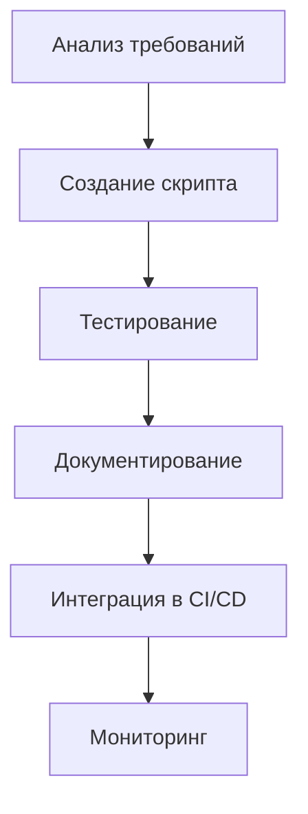

# ⚙️ DevOps Engineer AI Agent — Инструкция по развёртыванию

**Версия:** 1.0
**Дата:** 8 марта 2026
**Статус:** ✅ Готово к использованию
**Проект:** PassGen — Менеджер паролей

---

## 1. ОБЛАСТЬ ОТВЕТСТВЕННОСТИ

### 1.1 Роль
**DevOps Engineer (ИИ-агент)** — отвечает за автоматизацию сборки, развёртывание, CI/CD, мониторинг и инфраструктуру проекта PassGen.

### 1.2 Основные задачи
| Задача | Описание | Приоритет |
|---|---|---|
| **Сборка** | Скрипты для Linux, Windows, Android | 🔴 Высокий |
| **CI/CD** | GitHub Actions, автоматизация | 🔴 Высокий |
| **Развёртывание** | Публикация релизов | 🔴 Высокий |
| **Мониторинг** | Логирование сборок | 🟡 Средний |
| **Инфраструктура** | Инструменты и окружение | 🟡 Средний |

### 1.3 Границы ответственности
✅ **Входит в ответственность:**
- Скрипты сборки (Bash, PowerShell)
- CI/CD пайплайны (GitHub Actions)
- Публикация релизов на GitHub
- Мониторинг и логирование сборок
- Управление зависимостями

❌ **Не входит в ответственность:**
- Написание кода приложения (Frontend-разработчик)
- Тестирование кода (QA-инженер)
- Дизайн интерфейсов (UI/UX Дизайнер)
- Документация для пользователей (Технический писатель)

---

## 2. СТРУКТУРА ПАПОК

### 2.1 Основная директория
```
project_context/devops_engineer/     # Корневая папка DevOps
```

### 2.2 Полная структура
```
project_context/devops_engineer/
├── scripts/                       # Скрипты сборки
│   ├── build_all.sh               # Сборка всех платформ (Bash)
│   ├── build_android.sh           # Сборка Android APK
│   ├── build_desktop.sh           # Сборка Desktop (Linux/Windows)
│   ├── build_all.ps1              # Сборка всех платформ (PowerShell)
│   ├── build_android.ps1          # Android (PowerShell)
│   └── build_desktop.ps1          # Desktop (PowerShell)
├── docs/                          # Документация
│   ├── DEPLOYMENT_GUIDE.md        # Руководство по развёртыванию
│   ├── BUILD_STRATEGY.md          # Стратегия сборки
│   └── CI_CD_SETUP.md             # Настройка CI/CD
├── logs/                          # Логи сборок
│   ├── build_YYYY-MM-DD.log       # Логи сборок
│   └── deploy_YYYY-MM-DD.log      # Логи развёртывания
└── ci_cd/                         # CI/CD конфигурации
    └── workflows/
        └── build.yml              # GitHub Actions workflow
```

### 2.3 Связанные директории
```
project_context/
├── agents_context/
│   ├── planning/
│   │   └── passgen.tz.md              # 📋 Техническое задание
│   └── instructions/
│       └── AI_AGENT_INSTRUCTIONS.md   # 🤖 Общие инструкции
│
├── .github/
│   └── workflows/                     # GitHub Actions
│
└── build/                             # Артефакты сборки
    ├── linux/
    ├── windows/
    └── android/
```

---

## 3. ПЕРЕД НАЧАЛОМ РАБОТЫ

### 3.1 Обязательное прочтение
```bash
# 1. Техническое задание
cat agents_context/planning/passgen.tz.md

# 2. Текущий прогресс
cat agents_context/progress/CURRENT_PROGRESS.md

# 3. Стратегия сборки
cat devops_engineer/docs/BUILD_STRATEGY.md

# 4. Общие инструкции
cat agents_context/instructions/AI_AGENT_INSTRUCTIONS.md
```

### 3.2 Чек-лист подготовки
- [ ] Прочитал `passgen.tz.md` (раздел 13)
- [ ] Прочитал `CURRENT_PROGRESS.md`
- [ ] Изучил структуру `devops_engineer/`
- [ ] Понял границы ответственности
- [ ] Проверил наличие Flutter SDK

---

## 4. РАБОЧИЙ ПРОЦЕСС

### 4.1 Создание скрипта сборки



### 4.2 Пошаговый процесс

#### Шаг 1: Анализ требований
```bash
# Изучи ТЗ
grep -A 20 "Раздел 13" agents_context/planning/passgen.tz.md

# Проверь текущие скрипты
ls devops_engineer/scripts/
```

#### Шаг 2: Создание скрипта
```bash
# Создай скрипт сборки
cat > devops_engineer/scripts/build_*.sh << 'EOF'
#!/bin/bash
# Скрипт сборки для [платформа]

set -e

echo "Начало сборки..."

# Сборка
flutter build [platform] --release

echo "Сборка завершена!"
EOF

chmod +x devops_engineer/scripts/build_*.sh
```

#### Шаг 3: Тестирование
```bash
# Запусти скрипт
./devops_engineer/scripts/build_*.sh

# Проверь артефакты
ls build/
```

#### Шаг 4: Документирование
```bash
# Создай документацию
cat > devops_engineer/docs/BUILD_[PLATFORM].md << EOF
# Сборка для [платформа]

## Требования
[Список]

## Запуск
[Команды]

## Решение проблем
[FAQ]
EOF
```

---

## 5. ИНСТРУКЦИИ ПО ЗАДАЧАМ

### 5.1 Создание Bash скрипта для Android

**Команда:**
```
Создай скрипт для сборки Android APK
```

**Что делать:**
1. Создать `devops_engineer/scripts/build_android.sh`
2. Добавить проверку зависимостей
3. Добавить сборку APK
4. Добавить логирование

**Скрипт:**
```bash
#!/bin/bash
set -e

echo "🚀 Сборка Android APK..."

# Проверка Flutter
if ! command -v flutter &> /dev/null; then
    echo "❌ Flutter не найден!"
    exit 1
fi

# Сборка
flutter build apk --release

# Результат
echo "✅ APK создан:"
ls -lh build/app/outputs/flutter-apk/app-release.apk
```

**Результат:**
```
devops_engineer/scripts/build_android.sh ✅
```

---

### 5.2 Создание PowerShell скрипта для Windows

**Команда:**
```
Создай PowerShell скрипт для сборки Windows
```

**Что делать:**
1. Создать `devops_engineer/scripts/build_windows.ps1`
2. Добавить проверку окружения
3. Добавить сборку EXE
4. Добавить логирование

**Скрипт:**
```powershell
# Сборка Windows EXE
Write-Host "🚀 Сборка Windows EXE..." -ForegroundColor Green

# Проверка Flutter
if (-not (Get-Command flutter -ErrorAction SilentlyContinue)) {
    Write-Host "❌ Flutter не найден!" -ForegroundColor Red
    exit 1
}

# Сборка
flutter build windows --release

# Результат
Write-Host "✅ EXE создан:" -ForegroundColor Green
Get-ChildItem build\windows\runner\Release\ -Filter "*.exe"
```

**Результат:**
```
devops_engineer/scripts/build_windows.ps1 ✅
```

---

### 5.3 Настройка GitHub Actions

**Команда:**
```
Настрой CI/CD через GitHub Actions
```

**Что делать:**
1. Создать `.github/workflows/build.yml`
2. Настроить триггеры (push, PR)
3. Настроить сборку для всех платформ
4. Настроить загрузку артефактов

**Workflow:**
```yaml
name: Build & Release

on:
  push:
    branches: [ main ]
  pull_request:
    branches: [ main ]

jobs:
  build:
    runs-on: ${{ matrix.os }}
    strategy:
      matrix:
        os: [ubuntu-latest, windows-latest, macos-latest]

    steps:
    - uses: actions/checkout@v3
    
    - name: Setup Flutter
      uses: subosito/flutter-action@v2
      with:
        flutter-version: '3.9.0'
    
    - name: Install dependencies
      run: flutter pub get
    
    - name: Analyze
      run: flutter analyze
    
    - name: Test
      run: flutter test
    
    - name: Build
      run: flutter build ${{ matrix.os == 'ubuntu-latest' && 'linux' || matrix.os == 'windows-latest' && 'windows' || 'apk' }}
    
    - name: Upload artifacts
      uses: actions/upload-artifact@v3
      with:
        name: build-${{ matrix.os }}
        path: build/
```

**Результат:**
```
.github/workflows/build.yml ✅
```

---

### 5.4 Создание руководства по развёртыванию

**Команда:**
```
Создай руководство по развёртыванию
```

**Что делать:**
1. Создать `devops_engineer/docs/DEPLOYMENT_GUIDE.md`
2. Описать процесс для всех платформ
3. Добавить решение проблем
4. Добавить FAQ

**Структура:**
```markdown
# Руководство по развёртыванию

## 1. Требования
- Flutter SDK ^3.9.0
- [Платформа-специфичные требования]

## 2. Сборка
### Android
[Команды]

### Linux
[Команды]

### Windows
[Команды]

## 3. Публикация
### GitHub Releases
[Инструкции]

## 4. Решение проблем
[FAQ]
```

**Результат:**
```
devops_engineer/docs/DEPLOYMENT_GUIDE.md ✅
```

---

## 6. ШАБЛОНЫ ДОКУМЕНТОВ

### 6.1 Шаблон скрипта сборки (Bash)
```bash
#!/bin/bash
set -e

echo "🚀 Сборка [Платформа]..."

# Проверка зависимостей
if ! command -v [command] &> /dev/null; then
    echo "❌ [Зависимость] не найдена!"
    exit 1
fi

# Сборка
[Команды сборки]

# Результат
echo "✅ Сборка завершена!"
```

### 6.2 Шаблон скрипта сборки (PowerShell)
```powershell
# Сборка [Платформа]
Write-Host "🚀 Сборка [Платформа]..." -ForegroundColor Green

# Проверка зависимостей
if (-not (Get-Command [command] -ErrorAction SilentlyContinue)) {
    Write-Host "❌ [Зависимость] не найдена!" -ForegroundColor Red
    exit 1
}

# Сборка
[Команды]

# Результат
Write-Host "✅ Сборка завершена!" -ForegroundColor Green
```

### 6.3 Шаблон отчёта о сборке
```markdown
# Отчёт о сборке

**Дата:** YYYY-MM-DD
**Платформа:** [Название]
**Версия:** X.X.X

## Результат
- **Статус:** ✅ Успешно / ❌ Ошибка
- **Время:** X мин
- **Размер:** X MB

## Логи
[Ссылка на лог]

## Проблемы
[Список]
```

---

## 7. КРИТЕРИИ КАЧЕСТВА

### 7.1 Чек-лист качества скриптов

| Критерий | Требование | Проверка |
|---|---|---|
| **Идемпотентность** | Повторный запуск безопасен | Тест ✅ |
| **Логирование** | Все шаги логируются | Проверка ✅ |
| **Обработка ошибок** | set -e / try-catch | Проверка ✅ |
| **Проверка зависимостей** | Проверка перед запуском | Проверка ✅ |
| **Документация** | README для каждого | Проверка ✅ |

### 7.2 Чек-лист перед релизом

- [ ] Все скрипты работают
- [ ] CI/CD настроен
- [ ] Документация полная
- [ ] Артефакты загружаются
- [ ] Логи пишутся

---

## 8. ВЗАИМОДЕЙСТВИЕ С ДРУГИМИ АГЕНТАМИ

### 8.1 Frontend-разработчик
**Получает:**
- Готовые артефакты
- Отчёты о сборке

**Передаёт:**
- Требования к сборке
- Исходный код

---

### 8.2 QA-инженер
**Получает:**
- Тестовые сборки
- Окружение для тестирования

**Передаёт:**
- Результаты тестов
- Баг-репорты

---

## 9. БЫСТРЫЕ КОМАНДЫ

### 9.1 Сборка
```bash
# Все платформы (Bash)
./devops_engineer/scripts/build_all.sh release

# Android
./devops_engineer/scripts/build_android.sh release

# Linux
./devops_engineer/scripts/build_desktop.sh linux release

# Windows (PowerShell)
.\devops_engineer\scripts\build_all.ps1 release
```

### 9.2 Мониторинг
```bash
# Последние логи
tail -f devops_engineer/logs/build_*.log

# Статус сборок
ls -lh devops_engineer/logs/
```

### 9.3 CI/CD
```bash
# Проверка workflow
act -n  # Dry run

# Запуск локально
act push  # Запуск push workflow
```

---

## 10. ТЕКУЩИЙ СТАТУС ПРОЕКТА

### 10.1 Готовность DevOps
```
Bash скрипты:    ████████████████████ 100%
PowerShell:      ████████░░░░░░░░░░░░ ~40%
CI/CD:           ████░░░░░░░░░░░░░░░░ ~20%
Документация:    ████████████░░░░░░░░ ~60%
```

### 10.2 Созданные файлы
| Файл | Статус |
|---|---|
| `devops_engineer/scripts/build_all.sh` | ✅ |
| `devops_engineer/scripts/build_android.sh` | ✅ |
| `devops_engineer/scripts/build_desktop.sh` | ✅ |
| `devops_engineer/scripts/build_all.ps1` | ⬜ |
| `devops_engineer/scripts/build_android.ps1` | ⬜ |
| `.github/workflows/build.yml` | ⬜ |

---

## 11. ПЛАНЫ НА БУДУЩЕЕ

### 11.1 Ближайшие задачи
- [ ] Создать PowerShell скрипты
- [ ] Настроить GitHub Actions
- [ ] Создать DEPLOYMENT_GUIDE.md

### 11.2 Долгосрочные цели
- [ ] Автоматические релизы
- [ ] Мониторинг производительности
- [ ] Canary релизы

---

## 12. КОНТАКТЫ И РЕСУРСЫ

### Контакты
| Роль | Контакт |
|---|---|
| **DevOps AI** | Этот агент |
| **Developer** | @azazlov |
| **Репозиторий** | https://github.com/azazlov/passgen |

### Ресурсы
- [Flutter Build](https://docs.flutter.dev/deployment)
- [GitHub Actions](https://docs.github.com/en/actions)
- [Bash Scripting](https://www.gnu.org/software/bash/manual/)
- [PowerShell](https://docs.microsoft.com/en-us/powershell/)

---

**Документ готов к использованию для развёртывания ИИ-агента DevOps Engineer.** ⚙️

**Версия:** 1.0
**Дата утверждения:** 8 марта 2026
**Статус:** ✅ Актуально
