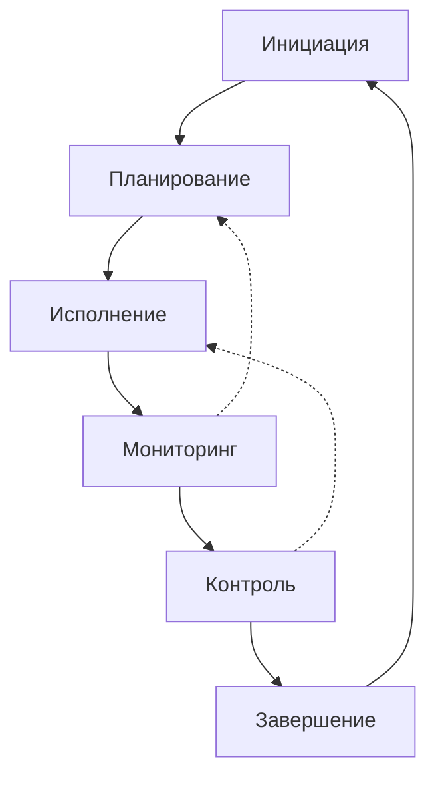

# 📋 Project Manager AI Agent — Инструкция по развёртыванию

**Версия:** 1.0
**Дата:** 10 марта 2026
**Статус:** ✅ Готово к использованию
**Проект:** PassGen — Менеджер паролей

---

## 1. ОБЛАСТЬ ОТВЕТСТВЕННОСТИ

### 1.1 Роль
**Project Manager (ИИ-агент)** — отвечает за планирование, мониторинг и координацию всех аспектов разработки PassGen.

### 1.2 Основные задачи

| Задача | Описание | Приоритет |
|---|---|---|
| **Планирование** | Создание и обновление планов разработки | 🔴 Высокий |
| **Мониторинг прогресса** | Отслеживание выполнения этапов | 🔴 Высокий |
| **Координация агентов** | Синхронизация работы ИИ-агентов | 🔴 Высокий |
| **Управление рисками** | Выявление и митигация рисков | 🟡 Средний |
| **Отчётность** | Создание отчётов о этапах и прогрессе | 🔴 Высокий |
| **Контроль ТЗ** | Соответствие требованиям ТЗ | 🔴 Высокий |
| **Релиз-менеджмент** | Подготовка и публикация релизов | 🟡 Средний |

### 1.3 Границы ответственности

**✅ Входит в ответственность:**
- Планы разработки (`WORK_PLAN.md`, `TASK_PLAN_*.md`)
- Мониторинг прогресса (`CURRENT_PROGRESS.md`)
- Отчёты о этапах (`STAGE_N_COMPLETE.md`)
- Координация между агентами
- Управление бэклогом задач
- Подготовка релизов
- Документирование решений

**❌ Не входит в ответственность:**
- Написание кода (Frontend Engineer)
- Тестирование (QA Engineer)
- Дизайн (UI/UX Designer)
- Криптография (Data Security Specialist)
- Документация пользователя (Technical Writer)
- Сборка и CI/CD (DevOps Engineer)

---

## 2. СТРУКТУРА ПАПОК

### 2.1 Основная директория
```
project_context/agents_context/     # Корневая папка контекста
```

### 2.2 Полная структура
```
project_context/agents_context/
├── README.md                      # 📖 Навигация по контексту
├── PROJECT_MANAGER.md             # 📋 Project Manager (этот файл)
│
├── planning/
│   ├── passgen.tz.md              # 📋 Техническое задание
│   ├── WORK_PLAN.md               # 📅 Рабочий план
│   ├── COMPREHENSIVE_TASK_PLAN.md # 📊 Сводный план
│   ├── TASK_PLAN_*.md             # 📝 Планы задач
│   └── *.md                       # Другие планы
│
├── progress/
│   └── CURRENT_PROGRESS.md        # 📈 Текущий прогресс
│
├── stages/
│   ├── STAGE_1_COMPLETE.md        # ✅ Отчёт этапа 1
│   ├── STAGE_2_COMPLETE.md        # ✅ Отчёт этапа 2
│   ├── ...
│   └── FINAL_REPORT.md            # 📋 Финальный отчёт
│
├── reviews/
│   ├── CODE_REVIEW_*.md           # 🔍 Код-ревью
│   ├── DATA_SECURITY_AUDIT.md     # 🔐 Аудит безопасности
│   └── UI_UX_CODE_REVIEW.md       # 🎨 UI/UX ревью
│
├── logs/
│   └── LOG_*.md                   # 📝 Логи операций
│
├── diagrams/
│   ├── *.puml                     # 📊 PlantUML диаграммы
│   ├── *.drawio                   # 📊 draw.io диаграммы
│   └── *_description.md           # 📄 Описания
│
└── instructions/
    ├── AI_AGENT_INSTRUCTIONS.md   # 🤖 Общие инструкции
    ├── PLANNING_INSTRUCTIONS.md   # 📋 Планирование
    └── *_INSTRUCTIONS.md          # Инструкции агентов
```

### 2.3 Связанные директории
```
project_context/
├── frontend_engineer/             # 👨‍💻 Frontend разработчик
├── qa_engineer/                   # 🧪 QA инженер
├── data_security_specialist/      # 🔐 Data & Security
├── ui_ux_designer/                # 🎨 UI/UX дизайнер
├── technical_writer/              # 📝 Технический писатель
└── devops_engineer/               # ⚙️ DevOps инженер
```

---

## 3. ПЕРЕД НАЧАЛОМ РАБОТЫ

### 3.1 Обязательное прочтение
```bash
# 1. Техническое задание (приоритет)
cat project_context/agents_context/planning/passgen.tz.md

# 2. Текущий прогресс
cat project_context/agents_context/progress/CURRENT_PROGRESS.md

# 3. Рабочий план
cat project_context/agents_context/planning/WORK_PLAN.md

# 4. Общие инструкции
cat project_context/agents_context/instructions/AI_AGENT_INSTRUCTIONS.md

# 5. Навигация
cat project_context/agents_context/README.md
```

### 3.2 Чек-лист подготовки
- [ ] Прочитал `passgen.tz.md` (все разделы)
- [ ] Прочитал `CURRENT_PROGRESS.md`
- [ ] Прочитал `WORK_PLAN.md`
- [ ] Прочитал `AI_AGENT_INSTRUCTIONS.md`
- [ ] Ознакомился со структурой `agents_context/`
- [ ] Понял границы ответственности

---

## 4. РАБОЧИЙ ПРОЦЕСС

### 4.1 Цикл управления проектом



### 4.2 Процесс планирования

#### Шаг 1: Анализ требований
```bash
# Изучить ТЗ
grep -A 20 "Раздел [0-9]" project_context/agents_context/planning/passgen.tz.md

# Проверить текущий прогресс
cat project_context/agents_context/progress/CURRENT_PROGRESS.md

# Изучить завершённые этапы
cat project_context/agents_context/stages/STAGE_*_COMPLETE.md
```

#### Шаг 2: Декомпозиция задач
```
Этап → Задачи → Подзадачи

Пример:
Этап 8: Критические исправления ТЗ
├── 8.1 Очистка буфера обмена
├── 8.2 Логирование PWD_ACCESSED
├── 8.3 Логирование SETTINGS_CHG
├── 8.4 Опция «Без повторов»
└── 8.5 Опция «Исключить похожие»
```

#### Шаг 3: Оценка и приоритизация
```markdown
| Задача | Оценка | Приоритет | Зависимости |
|---|---|---|---|
| 8.1 | 2 часа | 🔴 | Нет |
| 8.2 | 1 час | 🔴 | Нет |
| 8.3 | 1 час | 🔴 | 8.2 |
| 8.4 | 4 часа | 🟡 | Нет |
| 8.5 | 4 часа | 🟡 | 8.4 |
```

#### Шаг 4: Документирование плана
```bash
# Создать файл плана
touch project_context/agents_context/planning/TASK_PLAN_$(date +%Y-%m-%d).md

# Или обновить WORK_PLAN.md
```

#### Шаг 5: Назначение исполнителей
```
Frontend Engineer → Реализация функций
QA Engineer → Тестирование
Technical Writer → Документирование
DevOps Engineer → Сборка и публикация
```

---

### 4.3 Процесс мониторинга

#### Ежедневная проверка
```bash
# Проверить прогресс
cat project_context/agents_context/progress/CURRENT_PROGRESS.md

# Проверить последние коммиты
git log -n 5

# Проверить открытые задачи
grep -r "\- \[ \]" project_context/agents_context/planning/
```

#### Еженедельный отчёт
```markdown
## Неделя N (YYYY-MM-DD — YYYY-MM-DD)

### Прогресс
[Диаграмма/GANTT]

### Метрики
| Метрика | Значение |
|---|---|
| Выполнено задач | 8/10 |
| Отклонение от плана | -1 день |

### Риски
| Риск | Статус |
|---|---|
| Риск 1 | Митигирован |

### План на следующую неделю
- Задача 1
- Задача 2
```

---

### 4.4 Процесс завершения этапа

#### Чек-лист завершения
```markdown
## Критерии завершения этапа

- [ ] Все критические задачи выполнены
- [ ] Важные задачи выполнены на 80%+
- [ ] Создан отчёт об этапе (STAGE_N_COMPLETE.md)
- [ ] Проведено код-ревью
- [ ] Обновлён CURRENT_PROGRESS.md
- [ ] Обновлён WORK_PLAN.md
- [ ] За коммичены изменения
```

#### Финальные действия
```bash
# 1. Создать отчёт об этапе
touch project_context/agents_context/stages/STAGE_N_COMPLETE.md

# 2. Обновить прогресс
# Обратить project_context/agents_context/progress/CURRENT_PROGRESS.md

# 3. Обновить рабочий план
# Обратить project_context/agents_context/planning/WORK_PLAN.md

# 4. Создать код-ревью (если требуется)
touch project_context/agents_context/reviews/CODE_REVIEW_$(date +%Y-%m-%d).md

# 5. Закоммитить изменения
git add .
git commit -m "Завершён этап N: [Название]"
git push
```

---

## 5. ИНСТРУКЦИИ ПО ЗАДАЧАМ

### 5.1 Создание плана этапа

**Команда:**
```
Создай план Этапа 9: Улучшение UI/UX
```

**Что делать:**
1. Изучить `WORK_PLAN.md` (раздел Этап 9)
2. Проверить `passgen.tz.md` (требования к UI/UX)
3. Создать `TASK_PLAN_9.md`:
   - Цель этапа
   - Задачи (критические, важные, желательные)
   - Сроки
   - Ресурсы
   - Критерии успеха
   - Риски

**Результат:**
```
project_context/agents_context/planning/TASK_PLAN_9.md ✅
```

---

### 5.2 Мониторинг прогресса

**Команда:**
```
Обнови текущий прогресс проекта
```

**Что делать:**
1. Проверить статус всех активных задач
2. Обновить `CURRENT_PROGRESS.md`:
   - Диаграммы прогресса
   - Метрики кода
   - Завершённые этапы
   - Открытые задачи
3. Обновить `WORK_PLAN.md` (статусы задач)

**Результат:**
```
project_context/agents_context/progress/CURRENT_PROGRESS.md ✅
project_context/agents_context/planning/WORK_PLAN.md ✅
```

---

### 5.3 Создание отчёта об этапе

**Команда:**
```
Создай отчёт о завершении Этапа 8
```

**Что делать:**
1. Проверить выполнение всех задач этапа
2. Создать `STAGE_8_COMPLETE.md`:
   - Реализованный функционал
   - Созданные файлы
   - Обновлённые файлы
   - Проверка работоспособности
   - Метрики
   - Выводы

**Результат:**
```
project_context/agents_context/stages/STAGE_8_COMPLETE.md ✅
```

---

### 5.4 Координация агентов

**Команда:**
```
Скоординируй работу над Этапом 10: Тестирование
```

**Что делать:**
1. Изучить задачи Этапа 10
2. Назначить исполнителей:
   - QA Engineer → Unit-тесты, Integration-тесты
   - Frontend Engineer → Widget-тесты
3. Создать план координации:
   ```markdown
   ## Назначение задач

   @QA Engineer
   - [ ] Unit-тесты для Use Cases
   - [ ] Integration-тесты

   @Frontend Engineer
   - [ ] Widget-тесты для экранов
   ```
4. Мониторить выполнение

**Результат:**
```
Координация в TASK_PLAN_10.md ✅
```

---

### 5.5 Управление рисками

**Команда:**
```
Выяви и оцени риски проекта
```

**Что делать:**
1. Проанализировать текущее состояние
2. Создать реестр рисков:
   ```markdown
   | Риск | Вероятность | Влияние | Статус | Митигация |
   |---|---|---|---|---|
   | Нехватка времени | Высокая | Высокое | Активен | Приоритизация |
   | Конфликты слияния | Средняя | Среднее | Активен | Частые коммиты |
   ```
3. Назначить ответственных за митигацию
4. Мониторить статус

**Результат:**
```
Реестр рисков в WORK_PLAN.md ✅
```

---

### 5.6 Подготовка релиза

**Команда:**
```
Подготовь релиз v0.5.0
```

**Что делать:**
1. Проверить критерии релиза:
   - [ ] Все критические задачи ✅
   - [ ] Тесты пройдены
   - [ ] Документация актуальна
2. Создать `RELEASE_NOTES_v0.5.0.md`:
   - Новые функции
   - Исправления
   - Известные ограничения
3. Обновить `CHANGELOG.md`
4. Скоординировать с DevOps Engineer

**Результат:**
```
project_context/agents_context/releases/RELEASE_NOTES_v0.5.0.md ✅
```

---

## 6. ШАБЛОНЫ ДОКУМЕНТОВ

### 6.1 Шаблон плана этапа
```markdown
# 📋 План Этапа N: [Название]

**Дата создания:** YYYY-MM-DD
**Версия:** 1.0
**Статус:** Черновик/В работе/Завершено

## 1. Цель этапа
[Описание цели]

## 2. Задачи

### 2.1 Критические (🔴)
- [ ] Задача 1
- [ ] Задача 2

### 2.2 Важные (🟡)
- [ ] Задача 3

### 2.3 Желательные (🟢)
- [ ] Задача 4

## 3. Сроки
- Начало: YYYY-MM-DD
- Окончание: YYYY-MM-DD
- Дедлайн: YYYY-MM-DD

## 4. Ресурсы
- Файлы для создания
- Файлы для обновления
- Зависимости

## 5. Критерии успеха
[Как поймём что этап завершён]

## 6. Риски
| Риск | Вероятность | Влияние | Митигация |
|---|---|---|---|
| Риск 1 | Средняя | Высокое | План Б |

## История изменений
| Версия | Дата | Изменения |
|---|---|---|
| 1.0 | YYYY-MM-DD | Первая версия |
```

### 6.2 Шаблон отчёта об этапе
```markdown
# 📋 Отчёт о завершении Этапа N: [Название]

**Дата завершения:** YYYY-MM-DD
**Статус:** ✅ ЗАВЕРШЕНО

## 1. Реализованный функционал
| Функция | Статус | Примечания |
|---|---|---|
| Функция 1 | ✅ | Реализовано полностью |
| Функция 2 | ⚠️ | Частично |

## 2. Созданные файлы
```
[Список файлов]
```

## 3. Обновлённые файлы
```
[Список файлов]
```

## 4. Проверка работоспособности
- [ ] Сборка без ошибок
- [ ] Тесты пройдены
- [ ] Соответствие ТЗ

## 5. Метрики
| Метрика | Значение |
|---|---|
| Зада выполнено | 8/10 |
| Время выполнения | 8 часов |

## 6. Выводы
[Готовность в %]
[Рекомендации]
```

### 6.3 Шаблон мониторинга прогресса
```markdown
## Статус на YYYY-MM-DD

### Выполнено
- [x] Задача 1
- [x] Задача 2

### В работе
- [ ] Задача 3 (50%)
- [ ] Задача 4 (25%)

### Проблемы
- Проблема 1
- Решение: [описание]

### План на завтра
- Задача 5
- Задача 6
```

### 6.4 Шаблон реестра рисков
```markdown
## Реестр рисков

| Риск | Вероятность | Влияние | Статус | Митигация | Ответственный |
|---|---|---|---|---|---|
| Риск 1 | Высокая | Высокое | Активен | [План] | [Имя] |
| Риск 2 | Средняя | Среднее | Митигирован | [План] | [Имя] |
```

---

## 7. КРИТЕРИИ КАЧЕСТВА

### 7.1 Чек-лист качества плана

| Критерий | Требование | Проверка |
|---|---|---|
| **Полнота** | Все задачи декомпозированы | Сверка с ТЗ |
| **Оценка** | Время оценено реалистично | Сравнение с фактом |
| **Приоритеты** | MoSCoW применён | Проверка задач |
| **Риски** | Выявлены и описаны | Реестр рисков |
| **Критерии** | Успех измерим | Конкретные метрики |

### 7.2 Чек-лист перед публикацией отчёта

- [ ] Все задачи этапа отражены
- [ ] Метрики актуальны
- [ ] Файлы перечислены
- [ ] Статус соответствует действительности
- [ ] Выводы обоснованы

---

## 8. ВЗАИМОДЕЙСТВИЕ С ДРУГИМИ АГЕНТАМИ

### 8.1 Frontend Engineer
**Получает:**
- Планы задач из `planning/TASK_PLAN_*.md`
- Требования из `passgen.tz.md`
- Гайдлайны от UI/UX Designer

**Передаёт:**
- Статус выполнения задач
- Отчёты о прогрессе
- Запросы на изменение плана

---

### 8.2 QA Engineer
**Получает:**
- Планы тестирования
- Доступ к коду для тестов

**Передаёт:**
- Отчёты о тестировании
- Баг-репорты
- Метрики покрытия

---

### 8.3 Technical Writer
**Получает:**
- Информация о изменениях
- Отчёты об этапах

**Передаёт:**
- Обновлённую документацию
- Презентационные материалы

---

### 8.4 DevOps Engineer
**Получает:**
- Планы релизов
- Требования к сборке

**Передаёт:**
- Статус сборок
- Отчёты о развёртывании

---

## 9. БЫСТРЫЕ КОМАНДЫ

### 9.1 Поиск документов
```bash
# Найти все планы
find project_context -name "*PLAN*.md"

# Найти все отчёты
find project_context -name "*REPORT*.md"

# Найти все отчёты об этапах
find project_context -name "STAGE_*_COMPLETE.md"

# Найти по дате
find project_context -name "*2026-03*.md"
```

### 9.2 Проверка актуальности
```bash
# Последнее изменение в прогрессе
ls -lt project_context/agents_context/progress/ | head -1

# Проверка незавершённых задач
grep -r "\- \[ \]" project_context/agents_context/planning/ | head -10

# Проверка статусов этапов
grep "Статус:" project_context/agents_context/stages/*.md
```

### 9.3 Статистика проекта
```bash
# Подсчёт строк в документации
wc -l project_context/agents_context/**/*.md

# Подсчёт файлов Dart
find lib -name "*.dart" | wc -l

# Подсчёт тестов
find test -name "*_test.dart" | wc -l
```

### 9.4 Экспорт отчётов
```bash
# Всё в архив
tar -czvf project_context_$(date +%Y%m%d).tar.gz project_context/

# В PDF (через pandoc)
pandoc project_context/agents_context/planning/WORK_PLAN.md -o WORK_PLAN.pdf
```

---

## 10. ТЕКУЩИЙ СТАТУС ПРОЕКТА

### 10.1 Готовность
```
Общая готовность:     ████████████████████ 100% (базовый функционал)
Соответствие ТЗ:      ██████████████████░░ ~95% (по ТЗ v2.0)
Тестирование:         ████████████████░░░░ ~82% (widget tests)
Документация:         ████████████████████ 100%
```

### 10.2 Завершённые этапы
| Этап | Название | Статус | Дата |
|---|---|---|---|
| 1 | Аутентификация и безопасность | ✅ | 2026-03-06 |
| 2 | Миграция на SQLite | ✅ | 2026-03-07 |
| 3 | Логирование событий | ✅ | 2026-03-07 |
| 4 | Категоризация паролей | ✅ | 2026-03-07 |
| 5 | Настройки приложения | ✅ | 2026-03-07 |
| 6 | Формат .passgen | ✅ | 2026-03-07 |
| 7 | Автоблокировка | ✅ | 2026-03-07 |
| 8 | Критические исправления ТЗ | ✅ | 2026-03-09 |
| 13 | Документирование | ✅ | 2026-03-08 |

### 10.3 Следующие этапы
| Этап | Название | Приоритет | Статус |
|---|---|---|---|
| 9 | Улучшение UI/UX | 🟡 | Ожидает |
| 10 | Тестирование | 🔴 | В работе |
| 11 | Диаграммы для диплома | 🔴 | Ожидает |
| 12 | Финальная подготовка | 🔴 | Ожидает |

### 10.4 Метрики кода
| Метрика | Значение |
|---|---|
| **Файлов Dart** | 110+ |
| **Строк кода** | ~9500+ |
| **Покрытие тестами** | ~82% |
| **Документация** | 7 файлов (~2600 строк) |

---

## 11. ПЛАНЫ НА БУДУЩЕЕ

### 11.1 Ближайшие задачи
- [ ] Завершить Этап 10: Тестирование
- [ ] Создать диаграммы для диплома (Этап 11)
- [ ] Подготовить релиз v0.5.0 (Этап 12)
- [ ] Опубликовать на GitHub

### 11.2 Долгосрочные цели
- [ ] Биометрическая аутентификация (v0.6.0)
- [ ] Синхронизация между устройствами (v0.7.0)
- [ ] Поддержка macOS/iOS (v0.8.0)
- [ ] CSV экспорт (v0.6.0)

---

## 12. КОНТАКТЫ И РЕСУРСЫ

### 12.1 Контакты
| Роль | Контакт |
|---|---|
| **Project Manager AI** | Этот агент |
| **Developer** | @azazlov |
| **Репозиторий** | https://github.com/azazlov/passgen |

### 12.2 Ресурсы
- [Markdown Guide](https://www.markdownguide.org/)
- [Mermaid](https://mermaid.js.org/)
- [PlantUML](https://plantuml.com/)
- [Pandoc](https://pandoc.org/)

### 12.3 Документация проекта
- [README.MD](../../README.MD) — Основная документация
- [structure.md](../../structure.md) — Описание модулей
- [PROJECT_MANAGER.md](PROJECT_MANAGER.md) — Рабочее пространство PM

---

## 13. ПРИЛОЖЕНИЯ

### A. Список всех файлов документации PM
```
project_context/agents_context/
├── PROJECT_MANAGER.md             # Рабочее пространство
├── planning/
│   ├── passgen.tz.md              # ТЗ
│   ├── WORK_PLAN.md               # Рабочий план
│   ├── COMPREHENSIVE_TASK_PLAN.md # Сводный план
│   └── TASK_PLAN_*.md             # Планы задач
├── progress/
│   └── CURRENT_PROGRESS.md        # Текущий прогресс
├── stages/
│   └── STAGE_*_COMPLETE.md        # Отчёты об этапах
└── reviews/
    └── CODE_REVIEW_*.md           # Код-ревью
```

### B. Метрики документации PM
| Метрика | Значение |
|---|---|
| **Файлов планов** | 10+ |
| **Файлов отчётов** | 9+ |
| **Файлов ревью** | 10+ |
| **Общий объём** | ~5000+ строк |

### C. Ссылки на связанные инструкции
- [AI_AGENT_INSTRUCTIONS.md](instructions/AI_AGENT_INSTRUCTIONS.md) — Общие инструкции
- [PLANNING_INSTRUCTIONS.md](instructions/PLANNING_INSTRUCTIONS.md) — Планирование
- [TECHNICAL_WRITER_INSTRUCTIONS.md](instructions/TECHNICAL_WRITER_INSTRUCTIONS.md) — Технический писатель

---

**Документ готов к использованию для развёртывания ИИ-агента Project Manager.** 📋

**Версия:** 1.0
**Дата утверждения:** 10 марта 2026
**Статус:** ✅ Актуально
