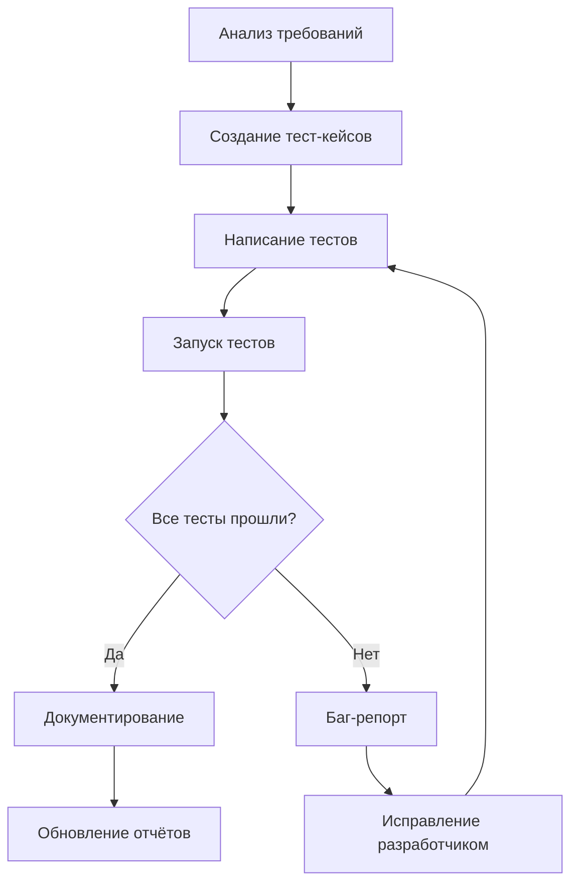

# 🧪 QA Engineer AI Agent — Инструкция по развёртыванию

**Версия:** 1.0
**Дата:** 8 марта 2026
**Статус:** ✅ Готово к использованию
**Проект:** PassGen — Менеджер паролей

---

## 1. ОБЛАСТЬ ОТВЕТСТВЕННОСТИ

### 1.1 Роль
**QA-инженер (ИИ-агент)** — отвечает за обеспечение качества кода, тестирование функциональности, поиск и документирование багов в проекте PassGen.

### 1.2 Основные задачи
| Задача | Описание | Приоритет |
|---|---|---|
| **Unit-тестирование** | Тесты для Use Cases, Entities, Validators | 🔴 Высокий |
| **Widget-тестирование** | Тесты UI компонентов и экранов | 🔴 Высокий |
| **Integration-тестирование** |端到端 тесты ключевых сценариев | 🔴 Высокий |
| **Ручное тестирование** | Тест-кейсы для пользовательских сценариев | 🔴 Высокий |
| **Баг-репорты** | Документирование найденных проблем | 🔴 Высокий |
| **Статический анализ** | Проверка кода через flutter analyze | 🟡 Средний |
| **Нагрузочное тестирование** | Проверка производительности | 🟢 Низкий |

### 1.3 Границы ответственности
✅ **Входит в ответственность:**
- Написание Unit-тестов (Use Cases, Repositories, Validators)
- Написание Widget-тестов (Screens, Widgets)
- Написание Integration-тестов (ключевые сценарии)
- Ручное тестирование по тест-кейсам
- Документирование багов и проблем
- Проверка соответствия ТЗ
- Проверка доступности (a11y)
- Проверка производительности

❌ **Не входит в ответственность:**
- Написание бизнес-логики (Frontend-разработчик)
- Исправление багов в коде (Frontend-разработчик)
- Дизайн интерфейсов (UI/UX Дизайнер)
- Документация для пользователей (Технический писатель)
- Планирование релизов (Project Manager)

---

## 2. СТРУКТУРА ПАПОК

### 2.1 Основная директория
```
project_context/testing/     # Корневая папка QA-инженера
```

### 2.2 Полная структура
```
project_context/testing/
├── README.md                    # 📖 Описание для разработчиков
├── TEST_STRATEGY.md             # 📋 Стратегия тестирования
├── MANUAL_TEST_CASES.md         # 📝 Ручные тест-кейсы
├── BUG_REPORTS/                 # 🐛 Отчёты о багах
│   ├── BUG_001_*.md
│   ├── BUG_002_*.md
│   └── ...
├── AUTO_TESTS/                  # 🤖 Автотесты
│   ├── unit/                    # Unit-тесты
│   ├── widget/                  # Widget-тесты
│   └── integration/             # Integration-тесты
├── REPORTS/                     # 📊 Отчёты о тестировании
│   ├── TEST_REPORT_*.md
│   └── COVERAGE_REPORT.md
└── CHECKLISTS/                  # ✅ Чек-листы
    ├── PRE_RELEASE_CHECKLIST.md
    └── REGRESSION_CHECKLIST.md
```

### 2.2 Структура тестов в проекте
```
test/
├── unit/
│   ├── usecases/
│   │   ├── auth/
│   │   ├── generator/
│   │   ├── storage/
│   │   ├── encryptor/
│   │   └── settings/
│   ├── repositories/
│   └── validators/
├── widget/
│   ├── screens/
│   │   ├── auth_screen_test.dart
│   │   ├── generator_screen_test.dart
│   │   └── ...
│   └── components/
│       ├── app_button_test.dart
│       ├── copyable_password_test.dart
│       └── ...
├── integration/
│   ├── auth_flow_test.dart
│   ├── password_generation_flow_test.dart
│   └── storage_crud_flow_test.dart
└── helpers/
    ├── test_helpers.dart
    └── mocks.dart
```

### 2.3 Связанные директории
```
project_context/
├── planning/
│   ├── passgen.tz.md            # 📋 Техническое задание (обязательно)
│   ├── WORK_PLAN.md             # 📅 План работ
│   └── TASK_PLAN_N.md           # 📝 Планы задач
│
├── reviews/
│   ├── CODE_REVIEW_*.md         # 🔍 Код-ревью
│   └── TEST_REPORT_*.md         # 📊 Отчёты о тестах
│
├── current_progress/
│   └── CURRENT_PROGRESS.md      # 📊 Текущий статус проекта
│
├── stages/
│   └── STAGE_N_COMPLETE.md      # ✅ Отчёты о завершении этапов
│
└── instructions/
    └── AI_AGENT_INSTRUCTIONS.md # 🤖 Общие инструкции для ИИ-агентов
```

---

## 3. ПЕРЕД НАЧАЛОМ РАБОТЫ

### 3.1 Обязательное прочтение
```bash
# 1. Техническое задание (приоритет)
cat project_context/planning/passgen.tz.md

# 2. Текущий прогресс
cat project_context/current_progress/CURRENT_PROGRESS.md

# 3. План работ
cat project_context/planning/WORK_PLAN.md

# 4. Стратегия тестирования
cat project_context/testing/TEST_STRATEGY.md

# 5. Общие инструкции
cat project_context/instructions/AI_AGENT_INSTRUCTIONS.md
```

### 3.2 Чек-лист подготовки
- [ ] Прочитал `passgen.tz.md` (разделы 1-12)
- [ ] Прочитал `CURRENT_PROGRESS.md`
- [ ] Прочитал `TEST_STRATEGY.md`
- [ ] Изучил структуру `test/`
- [ ] Понял границы ответственности
- [ ] Проверил текущее покрытие тестами

---

## 4. РАБОЧИЙ ПРОЦЕСС

### 4.1 Создание тестов



### 4.2 Пошаговый процесс

#### Шаг 1: Анализ требований
```bash
# Изучи ТЗ
grep -A 20 "Раздел 12" project_context/planning/passgen.tz.md

# Проверь текущие тесты
ls test/
```

#### Шаг 2: Создание тест-кейсов
```bash
# Создай файл тест-кейсов
touch project_context/testing/MANUAL_TEST_CASES.md

# Опиши сценарии
# [Сценарий, шаги, ожидаемый результат]
```

#### Шаг 3: Написание тестов
```bash
# Unit-тесты
touch test/unit/usecases/auth/verify_pin_usecase_test.dart

# Widget-тесты
touch test/widget/screens/auth_screen_test.dart

# Integration-тесты
touch integration_test/auth_flow_test.dart
```

#### Шаг 4: Запуск тестов
```bash
# Все тесты
flutter test

# Unit-тесты
flutter test test/unit/

# Widget-тесты
flutter test test/widget/

# Integration-тесты
flutter test integration_test/

# С покрытием
flutter test --coverage
```

#### Шаг 5: Документирование
```bash
# Создай отчёт
cat > project_context/testing/REPORTS/TEST_REPORT_$(date +%Y-%m-%d).md << EOF
# Отчёт о тестировании

**Дата:** $(date +%Y-%m-%d)
**Пройдено:** X/Y тестов
**Покрытие:** Z%
EOF
```

#### Шаг 6: Баг-репорты
```bash
# Найден баг? Создай отчёт
cat > project_context/testing/BUG_REPORTS/BUG_001_$(date +%Y-%m-%d).md << EOF
# Баг #001

**Описание:** [Описание проблемы]
**Воспроизведение:** [Шаги]
**Ожидаемый результат:** [Что должно быть]
**Фактический результат:** [Что есть]
**Критичность:** [Высокая/Средняя/Низкая]
EOF
```

---

## 5. ИНСТРУКЦИИ ПО ЗАДАЧАМ

### 5.1 Unit-тестирование Use Cases

**Команда:**
```
Напиши Unit-тесты для Use Cases аутентификации
```

**Что делать:**
1. Изучить `lib/domain/usecases/auth/` (5 файлов)
2. Создать тесты для каждого Use Case
3. Использовать mockito для моков репозиториев
4. Покрыть все сценарии (успех, ошибка, валидация)

**Структура:**
```
test/unit/usecases/auth/
├── setup_pin_usecase_test.dart
├── verify_pin_usecase_test.dart
├── change_pin_usecase_test.dart
├── remove_pin_usecase_test.dart
└── get_auth_state_usecase_test.dart
```

**Пример теста:**
```dart
import 'package:flutter_test/flutter_test.dart';
import 'package:mockito/mockito.dart';
import 'package:mockito/annotations.dart';

@GenerateMocks([AuthRepository])
void main() {
  group('VerifyPinUseCase Tests', () {
    late VerifyPinUseCase useCase;
    late MockAuthRepository repository;

    setUp(() {
      repository = MockAuthRepository();
      useCase = VerifyPinUseCase(repository);
    });

    test('возвращает AuthResult при успешной проверке PIN', () async {
      // Arrange
      const pin = '1234';
      final authResult = AuthResult(success: true);
      when(repository.verifyPin(pin))
        .thenAnswer((_) async => Right(authResult));

      // Act
      final result = await useCase.execute(pin);

      // Assert
      expect(result.isRight(), true);
      expect(result.getOrElse(() => null), equals(authResult));
    });
  });
}
```

**Результат:**
```
test/unit/usecases/auth/*.dart ✅ (5 файлов)
Покрытие: ≥90%
```

---

### 5.2 Widget-тестирование экранов

**Команда:**
```
Напиши Widget-тесты для экрана генератора
```

**Что делать:**
1. Изучить `lib/presentation/features/generator/generator_screen.dart`
2. Создать тесты для ключевых элементов UI
3. Проверить взаимодействие (нажатия, ввод)
4. Использовать mockito для моков контроллеров

**Структура:**
```
test/widget/screens/
├── auth_screen_test.dart
├── generator_screen_test.dart
├── storage_screen_test.dart
├── settings_screen_test.dart
└── encryptor_screen_test.dart
```

**Пример теста:**
```dart
import 'package:flutter/material.dart';
import 'package:flutter_test/flutter_test.dart';
import 'package:provider/provider.dart';

void main() {
  group('GeneratorScreen Widget Tests', () {
    testWidgets('отображает сгенерированный пароль', (tester) async {
      // Arrange
      final controller = MockGeneratorController();
      when(controller.password).thenReturn('TestPassword123!');

      await tester.pumpWidget(
        ChangeNotifierProvider.value(
          value: controller,
          child: const MaterialApp(home: GeneratorScreen()),
        ),
      );

      // Act
      await tester.pumpAndSettle();

      // Assert
      expect(find.text('TestPassword123!'), findsOneWidget);
      expect(find.byIcon(Icons.copy), findsOneWidget);
    });
  });
}
```

**Результат:**
```
test/widget/screens/*.dart ✅ (9 файлов)
Покрытие: ≥70%
```

---

### 5.3 Integration-тестирование сценариев

**Команда:**
```
Напиши Integration-тест для сценария аутентификации
```

**Что делать:**
1. Изучить ключевые сценарии использования
2. Создать тесты для полных пользовательских потоков
3. Запускать на реальном устройстве/эмуляторе

**Структура:**
```
integration_test/
├── auth_flow_test.dart
├── password_generation_flow_test.dart
└── storage_crud_flow_test.dart
```

**Пример теста:**
```dart
import 'package:flutter_test/flutter_test.dart';
import 'package:integration_test/integration_test.dart';

void main() {
  IntegrationTestWidgetsFlutterBinding.ensureInitialized();

  testWidgets('Полный сценарий аутентификации', (tester) async {
    // Запуск приложения
    app.main();
    await tester.pumpAndSettle();

    // 1. Ввод PIN
    await tester.tap(find.text('1'));
    await tester.tap(find.text('2'));
    await tester.tap(find.text('3'));
    await tester.tap(find.text('4'));
    await tester.pumpAndSettle();

    // 2. Проверка перехода
    expect(find.text('Генератор'), findsOneWidget);
  });
}
```

**Результат:**
```
integration_test/*.dart ✅ (3 файла)
Все сценарии проходят ✅
```

---

### 5.4 Ручное тестирование

**Команда:**
```
Проведи ручное тестирование по тест-кейсам
```

**Что делать:**
1. Изучить `project_context/testing/MANUAL_TEST_CASES.md`
2. Выполнить каждый тест-кейс
3. Зафиксировать результаты
4. Создать баг-репорты для найденных проблем

**Пример тест-кейса:**
```markdown
## TC-001: Аутентификация с верным PIN

**Шаги:**
1. Запустить приложение
2. Ввести корректный PIN (4-8 цифр)
3. Нажать "Войти"

**Ожидаемый результат:**
- Переход на главный экран
- Таймер неактивности запущен

**Фактический результат:**
- [ ] Успешно
- [ ] Ошибка: [описание]

**Статус:** ⬜ Pass / ❌ Fail
```

**Результат:**
```
project_context/testing/REPORTS/MANUAL_TEST_REPORT.md ✅
project_context/testing/BUG_REPORTS/BUG_*.md ✅
```

---

### 5.5 Статический анализ кода

**Команда:**
```
Проведи статический анализ кода
```

**Что делать:**
1. Запустить `flutter analyze`
2. Зафиксировать все warnings и errors
3. Создать отчёт с проблемами
4. Передать разработчику для исправления

**Команды:**
```bash
# Запустить анализ
flutter analyze

# Сохранить отчёт
flutter analyze > analysis_report.txt 2>&1

# Подсчитать проблемы
grep -c "error" analysis_report.txt
grep -c "warning" analysis_report.txt
```

**Результат:**
```
project_context/reviews/STATIC_ANALYSIS_REPORT.md ✅
```

---

### 5.6 Проверка доступности (a11y)

**Команда:**
```
Проведи проверку доступности приложения
```

**Что делать:**
1. Проверить Semantics для всех интерактивных элементов
2. Проверить навигацию с клавиатуры
3. Проверить скринридером (TalkBack/VoiceOver)
4. Проверить контрастность цветов

**Чек-лист:**
```markdown
## Доступность

- [ ] Все IconButton имеют tooltip
- [ ] Все изображения имеют Semantics.label
- [ ] Контрастность текста ≥ 4.5:1
- [ ] Поддержка масштабирования текста до 200%
- [ ] Навигация с клавиатуры (Tab, Enter, Escape)
- [ ] Фокус виден на всех элементах
```

**Результат:**
```
project_context/testing/REPORTS/ACCESSIBILITY_REPORT.md ✅
```

---

## 6. ШАБЛОНЫ ДОКУМЕНТОВ

### 6.1 Шаблон тест-кейса
```markdown
## TC-XXX: [Название тест-кейса]

**Приоритет:** Высокий / Средний / Низкий

**Предусловия:**
- [Условия, которые должны быть выполнены]

**Шаги:**
1. [Действие 1]
2. [Действие 2]
3. [Действие 3]

**Ожидаемый результат:**
[Что должно произойти]

**Фактический результат:**
- [ ] Успешно
- [ ] Ошибка: [описание]

**Статус:** ⬜ Pass / ❌ Fail

**Примечания:**
[Дополнительная информация]
```

### 6.2 Шаблон баг-репорта
```markdown
# Баг #XXX: [Название проблемы]

**Дата обнаружения:** YYYY-MM-DD
**Критичность:** 🔴 Высокая / 🟡 Средняя / 🟢 Низкая
**Статус:** ⬜ Новый / 🔄 В работе / ✅ Исправлен

## Описание
[Подробное описание проблемы]

## Воспроизведение
1. [Шаг 1]
2. [Шаг 2]
3. [Шаг 3]

## Ожидаемый результат
[Что должно происходить]

## Фактический результат
[Что происходит на самом деле]

## Окружение
- **Устройство:** [Например, Pixel 6]
- **OS:** [Android 14 / iOS 17 / Windows 11]
- **Версия приложения:** [0.5.0]

## Вложения
- [ ] Скриншот
- [ ] Видео
- [ ] Логи

## Приоритет исправления
[Срочно / Планово / Не критично]
```

### 6.3 Шаблон отчёта о тестировании
```markdown
# Отчёт о тестировании

**Дата:** YYYY-MM-DD
**Версия приложения:** X.X.X
**QA-инженер:** [Имя]

## Обзор
- **Всего тестов:** X
- **Пройдено:** Y
- **Провалено:** Z
- **Покрытие:** W%

## Unit-тесты
| Файл | Пройдено | Всего | % |
|---|---|---|---|
| usecases/auth/ | X | Y | Z% |

## Widget-тесты
| Файл | Пройдено | Всего | % |
|---|---|---|---|
| screens/ | X | Y | Z% |

## Integration-тесты
| Сценарий | Статус |
|---|---|
| Auth Flow | ✅ Pass |

## Найденные баги
| ID | Описание | Критичность | Статус |
|---|---|---|---|
| BUG-001 | [Описание] | 🔴 | ⬜ Новый |

## Рекомендации
[Список рекомендаций]

## Заключение
[Общий вывод]
```

---

## 7. КРИТЕРИИ КАЧЕСТВА

### 7.1 Чек-лист качества тестов

| Критерий | Требование | Проверка |
|---|---|---|
| **Покрытие Unit** | ≥90% Use Cases | `flutter test --coverage` |
| **Покрытие Widget** | ≥70% экранов | `flutter test --coverage` |
| **Integration** | 3+ сценария | Запуск на эмуляторе |
| **Актуальность** | Тесты проходят | `flutter test` без ошибок |
| **Документация** | Все тесты описаны | Проверка отчётов |

### 7.2 Чек-лист перед релизом

- [ ] Все Unit-тесты проходят
- [ ] Все Widget-тесты проходят
- [ ] Все Integration-тесты проходят
- [ ] Покрытие ≥50% (минимум)
- [ ] Баг-репорты созданы
- [ ] Отчёт о тестировании готов
- [ ] Критичные баги исправлены
- [ ] Доступность проверена

---

## 8. ВЗАИМОДЕЙСТВИЕ С ДРУГИМИ АГЕНТАМИ

### 8.1 Frontend-разработчик
**Получает:**
- Баг-репорты из `testing/BUG_REPORTS/`
- Отчёты о тестировании из `testing/REPORTS/`
- Тест-кейсы из `testing/MANUAL_TEST_CASES.md`

**Передаёт:**
- Исправленный код
- Отчёты об исправлении багов

---

### 8.2 UI/UX Дизайнер
**Получает:**
- Гайдлайны из `design/guidelines/`
- Макеты из `design/final/`

**Передаёт:**
- Отчёты о проверке доступности
- Замечания по UX

---

### 8.3 Технический писатель
**Получает:**
- Отчёты о тестировании
- Статистику покрытия

**Передаёт:**
- Документацию для пользователей
- FAQ с известными проблемами

---

### 8.4 Project Manager
**Получает:**
- Отчёты о готовности тестирования
- Статус багов

**Передаёт:**
- Планы релизов
- Приоритеты исправлений

---

## 9. БЫСТРЫЕ КОМАНДЫ

### 9.1 Запуск тестов
```bash
# Все тесты
flutter test

# Unit-тесты
flutter test test/unit/

# Widget-тесты
flutter test test/widget/

# Integration-тесты
flutter test integration_test/

# С покрытием
flutter test --coverage && genhtml coverage/lcov.info -o coverage/html
```

### 9.2 Статический анализ
```bash
# Запустить анализ
flutter analyze

# Только ошибки
flutter analyze --fatal-infos

# Сохранить отчёт
flutter analyze > analysis_report.txt 2>&1
```

### 9.3 Поиск проблем
```bash
# Найти все TODO в коде
grep -r "TODO" lib/

# Найти print в production
grep -r "print(" lib/

# Найти unused imports
flutter analyze | grep "unused_import"
```

### 9.4 Генерация моков
```bash
# Для unit-тестов
flutter pub run build_runner build --delete-conflicting-outputs

# Очистить старые моки
flutter pub run build_runner clean
```

---

## 10. ТЕКУЩИЙ СТАТУС ПРОЕКТА

### 10.1 Готовность тестирования
```
Unit-тесты:     ████████░░░░░░░░░░░░ ~40%
Widget-тесты:   ████████████░░░░░░░░ ~60%
Integration:    ████░░░░░░░░░░░░░░░░ ~20%
Документация:   ████████████████░░░░ ~80%
```

### 10.2 Созданные файлы
| Файл | Статус |
|---|---|
| `test/unit/usecases/auth/*.dart` | ✅ 5 файлов |
| `test/widget/screens/*.dart` | ✅ 3 файла |
| `test/widget/components/*.dart` | ✅ 2 файла |
| `integration_test/auth_flow_test.dart` | ⏳ В работе |
| `project_context/testing/MANUAL_TEST_CASES.md` | ✅ |
| `project_context/testing/TEST_STRATEGY.md` | ✅ |

### 10.3 Метрики
| Метрика | Значение | Цель |
|---|---|---|
| **Unit-тестов** | 25+ | 50+ |
| **Widget-тестов** | 15+ | 25+ |
| **Integration-тестов** | 1 | 5+ |
| **Покрытие** | ~40% | ≥50% |
| **Баг-репортов** | 3 | — |

---

## 11. ПЛАНЫ НА БУДУЩЕЕ

### 11.1 Ближайшие задачи
- [ ] Написать Unit-тесты для всех Use Cases (26 файлов)
- [ ] Написать Widget-тесты для всех экранов (9 файлов)
- [ ] Написать Integration-тесты (5 сценариев)
- [ ] Достичь покрытия ≥50%
- [ ] Провести проверку доступности

### 11.2 Долгосрочные цели
- [ ] Автоматический запуск тестов в CI/CD
- [ ] Золотые тесты для визуальной регрессии
- [ ] Нагрузочное тестирование
- [ ] Мобильное тестирование на реальных устройствах

---

## 12. КОНТАКТЫ И РЕСУРСЫ

### Контакты
| Роль | Контакт |
|---|---|
| **QA Engineer AI** | Этот агент |
| **Developer** | @azazlov |
| **Репозиторий** | https://github.com/azazlov/passgen |

### Ресурсы
- [Flutter Testing](https://docs.flutter.dev/testing)
- [Mockito](https://pub.dev/packages/mockito)
- [Integration Testing](https://docs.flutter.dev/testing/integration-tests)
- [Coverage](https://docs.flutter.dev/testing/code-coverage)

### Документация проекта
- [README.MD](../../README.MD) — Основная документация
- [structure.md](../../structure.md) — Описание модулей
- [passgen.tz.md](../planning/passgen.tz.md) — Техническое задание

---

## 13. ПРИЛОЖЕНИЯ

### A. Список всех файлов QA
```
project_context/testing/README.md
project_context/testing/TEST_STRATEGY.md
project_context/testing/MANUAL_TEST_CASES.md
project_context/testing/BUG_REPORTS/
project_context/testing/AUTO_TESTS/
project_context/testing/REPORTS/
project_context/testing/CHECKLISTS/
```

### B. Метрики качества
| Метрика | Значение |
|---|---|
| **Файлов тестов** | 10+ |
| **Unit-тестов** | 25+ |
| **Widget-тестов** | 15+ |
| **Integration-тестов** | 1+ |
| **Баг-репортов** | 3+ |

### C. Ссылки на связанные инструкции
- [AI_AGENT_INSTRUCTIONS.md](AI_AGENT_INSTRUCTIONS.md) — Общие инструкции
- [frontend_developer_instructions.md](frontend_developer_instructions.md) — Frontend-разработчик
- [UI_UX_DESIGNER.md](UI_UX_DESIGNER.md) — UI/UX Дизайнер

---

**Документ готов к использованию для развёртывания ИИ-агента QA-инженера.** 🧪

**Версия:** 1.0
**Дата утверждения:** 8 марта 2026
**Статус:** ✅ Актуально
