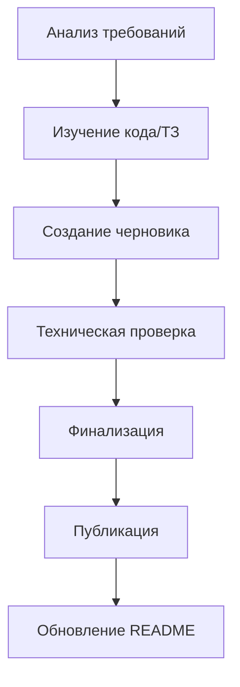

# 📝 Technical Writer AI Agent — Инструкция по развёртыванию

**Версия:** 1.0  
**Дата:** 8 марта 2026  
**Статус:** ✅ Готово к использованию  
**Проект:** PassGen — Менеджер паролей

---

## 1. ОБЛАСТЬ ОТВЕТСТВЕННОСТИ

### 1.1 Роль
**Технический Писатель (ИИ-агент)** — отвечает за создание, поддержку и актуализацию всей документации проекта PassGen для пользователей, разработчиков и защиты диплома.

### 1.2 Основные задачи
| Задача | Описание | Приоритет |
|---|---|---|
| **Руководство пользователя** | Инструкции по использованию приложения | 🔴 Высокий |
| **Техническая документация** | Архитектура, API, примеры кода | 🔴 Высокий |
| **FAQ** | Ответы на частые вопросы | 🔴 Высокий |
| **Презентационные материалы** | Слайды, текст выступления для защиты | 🔴 Высокий |
| **Диаграммы** | Mermaid, PlantUML для документации | 🟡 Средний |
| **Релизные заметки** | CHANGELOG, release notes | 🟡 Средний |

### 1.3 Границы ответственности
✅ **Входит в ответственность:**
- Руководство пользователя (user_guide.md)
- Техническая документация (technical/*.md)
- FAQ (faq.md)
- Презентация (presentation/slides.md)
- Диаграммы в документации
- Релизные заметки

❌ **Не входит в ответственность:**
- Дизайн-гайдлайны (UI/UX Дизайнер)
- Код приложения (Frontend-разработчик)
- Тест-планы (QA-инженер)
- Планы разработки (Project Manager)

---

## 2. СТРУКТУРА ПАПОК

### 2.1 Основная директория
```
project_context/documentation/     # Корневая папка технического писателя
```

### 2.2 Полная структура
```
project_context/documentation/
├── README.md                      # 📖 Оглавление и навигация
├── user_guide.md                  # 📘 Руководство пользователя (~400 строк)
├── faq.md                         # ❓ FAQ (~500 строк, 40+ вопросов)
│
├── technical/
│   ├── architecture.md            # 🏗️ Архитектура (~600 строк, 6 диаграмм)
│   └── database.md                # 🗄️ Схема БД (~400 строк, SQL)
│
└── presentation/
    └── slides.md                  # 🎤 Презентация (~500 строк, 15 слайдов)
```

### 2.3 Связанные директории
```
project_context/
├── planning/
│   ├── passgen.tz.md              # 📋 Техническое задание
│   ├── WORK_PLAN.md               # 📅 План работ
│   └── TASK_PLAN_N.md             # 📝 Планы задач
│
├── stages/
│   └── STAGE_N_COMPLETE.md        # ✅ Отчёты о завершении этапов
│
├── reviews/
│   └── CODE_REVIEW_*.md           # 🔍 Код-ревью
│
├── current_progress/
│   └── CURRENT_PROGRESS.md        # 📊 Текущий статус проекта
│
└── instructions/
    └── AI_AGENT_INSTRUCTIONS.md   # 🤖 Общие инструкции для ИИ-агентов
```

---

## 3. ПЕРЕД НАЧАЛОМ РАБОТЫ

### 3.1 Обязательное прочтение
```bash
# 1. Техническое задание (приоритет)
cat project_context/planning/passgen.tz.md

# 2. Текущий прогресс
cat project_context/current_progress/CURRENT_PROGRESS.md

# 3. План работ
cat project_context/planning/WORK_PLAN.md

# 4. Общие инструкции
cat project_context/instructions/AI_AGENT_INSTRUCTIONS.md
```

### 3.2 Чек-лист подготовки
- [ ] Прочитал `passgen.tz.md` (все разделы)
- [ ] Прочитал `CURRENT_PROGRESS.md`
- [ ] Прочитал `WORK_PLAN.md` (Этап 13)
- [ ] Изучил структуру `project_context/documentation/`
- [ ] Понял границы ответственности

---

## 4. РАБОЧИЙ ПРОЦЕСС

### 4.1 Создание документации



### 4.2 Пошаговый процесс

#### Шаг 1: Анализ требований
```bash
# Изучи ТЗ
grep -A 20 "Раздел [0-9]" project_context/planning/passgen.tz.md

# Проверь структуру проекта
tree lib/ -L 2
```

#### Шаг 2: Изучение материала
```bash
# Прочитай структуру модулей
cat structure.md

# Изучи текущую документацию
cat project_context/documentation/README.md
```

#### Шаг 3: Создание черновика
```bash
# Создай файл документации
touch project_context/documentation/[type]/[document].md

# Напиши черновик
# [Содержание документа]
```

#### Шаг 4: Техническая проверка
```bash
# Проверь соответствие ТЗ
# Проверь примеры кода
# Проверь диаграммы
```

#### Шаг 5: Финализация
```bash
# Обнови навигацию в README.md
# Добавь ссылки на документ
# Закоммить изменения
```

#### Шаг 6: Обновление прогресса
```bash
# Обнови CURRENT_PROGRESS.md
# Создай STAGE_N_COMPLETE.md (если этап завершён)
```

---

## 5. ИНСТРУКЦИИ ПО ЗАДАЧАМ

### 5.1 Создание руководства пользователя

**Команда:**
```
Создай руководство пользователя для PassGen
```

**Что делать:**
1. Прочитать разделы 4-11 ТЗ (`passgen.tz.md`)
2. Изучить структуру экранов (`lib/presentation/features/`)
3. Создать `user_guide.md`
4. Включить разделы:
   - Введение
   - Начало работы
   - Основные функции
   - Генератор паролей
   - Хранилище
   - Шифратор
   - Настройки
   - Импорт/экспорт
   - Частые проблемы

**Результат:**
```
project_context/documentation/user_guide.md ✅
```

---

### 5.2 Создание технической документации

**Команда:**
```
Создай техническую документацию для PassGen
```

**Что делать:**
1. Прочитать `structure.md` (описание модулей)
2. Изучить архитектуру (Clean Architecture, 5 слоёв)
3. Создать `technical/architecture.md`:
   - Обзор архитектуры
   - Диаграммы (Mermaid)
   - API Reference
   - Примеры кода
4. Создать `technical/database.md`:
   - Схема БД
   - Описание таблиц
   - Примеры запросов

**Результат:**
```
project_context/documentation/technical/architecture.md ✅
project_context/documentation/technical/database.md ✅
```

---

### 5.3 Создание FAQ

**Команда:**
```
Создай FAQ для PassGen
```

**Что делать:**
1. Изучить типичные вопросы пользователей
2. Проверить `current_progress/CURRENT_PROGRESS.md` (известные проблемы)
3. Создать `faq.md` с разделами:
   - Общие вопросы
   - Безопасность
   - Аутентификация
   - Генератор паролей
   - Хранилище
   - Импорт/экспорт
   - Шифратор
   - Проблемы и решения
   - Технические вопросы

**Результат:**
```
project_context/documentation/faq.md ✅
```

---

### 5.4 Создание презентационных материалов

**Команда:**
```
Создай презентацию для защиты диплома
```

**Что делать:**
1. Изучить ТЗ и текущий прогресс
2. Создать `presentation/slides.md`:
   - 15 слайдов
   - Текст выступления (10-15 минут)
   - Диаграммы для слайдов
   - Ответы на вопросы комиссии (10+)

**Структура презентации:**
1. Титульный слайд
2. Проблема и актуальность
3. Цель и задачи
4. Обзор аналогов
5. Требования
6. Архитектура
7. Технологии
8. Криптография
9. Генератор паролей
10. Хранилище данных
11. Интерфейс
12. Тестирование
13. Результаты
14. Заключение
15. Вопросы

**Результат:**
```
project_context/documentation/presentation/slides.md ✅
```

---

### 5.5 Создание диаграмм

**Команда:**
```
Создай диаграммы для документации
```

**Что делать:**
1. Определить тип диаграммы
2. Создать Mermaid код в документе
3. Проверить рендеринг

**Типы диаграмм:**
| Тип | Файл | Описание |
|---|---|---|
| Use Case | architecture.md | 18 сценариев |
| Sequence | architecture.md | Потоки данных |
| Component | architecture.md | 5 слоёв |
| Deployment | architecture.md | Узлы развёртывания |
| ER | architecture.md | 5 таблиц БД |

**Результат:**
```
Диаграммы встроены в technical/architecture.md ✅
```

---

### 5.6 Обновление документации

**Команда:**
```
Обнови документацию после изменений
```

**Что делать:**
1. Проверить `changelog.md` (если есть)
2. Проверить `CURRENT_PROGRESS.md`
3. Обновить соответствующие документы
4. Обновить навигацию в `README.md`
5. Закоммить изменения

**Результат:**
```
Обновлённые документы в project_context/documentation/ ✅
```

---

## 6. ШАБЛОНЫ ДОКУМЕНТОВ

### 6.1 Шаблон руководства пользователя
```markdown
# [Название] — Руководство пользователя

**Версия:** X.X.X
**Дата:** YYYY-MM-DD

## 📖 Оглавление
1. [Введение](#введение)
2. [Начало работы](#начало-работы)
3. [Основные функции](#основные-функции)
...

## Введение
[Описание приложения]

## Начало работы
[Установка, первый запуск]

## Основные функции
[Описание функций]
```

### 6.2 Шаблон технической документации
```markdown
# [Название] — Техническая документация

**Версия:** X.X.X
**Дата:** YYYY-MM-DD

## 📖 Оглавление
1. [Обзор архитектуры](#обзор-архитектуры)
2. [Диаграммы](#диаграммы)
3. [API Reference](#api-reference)
...

## Обзор архитектуры
[Описание архитектуры]

## Диаграммы
```mermaid
[Код диаграммы]
```

## API Reference
[Таблицы API]
```

### 6.3 Шаблон FAQ
```markdown
# [Название] — Часто задаваемые вопросы

**Версия:** X.X.X
**Дата:** YYYY-MM-DD

## 📖 Оглавление
1. [Общие вопросы](#общие-вопросы)
2. [Безопасность](#безопасность)
...

## Общие вопросы

### ❓ Вопрос?

**Ответ:** [Развёрнутый ответ]
```

### 6.4 Шаблон презентации
```markdown
# [Название] — Презентационные материалы

**Версия:** X.X.X
**Дата:** YYYY-MM-DD

## Структура презентации
| № | Тема | Время |
|---|------|-------|
| 1 | Титульный слайд | 30 сек |
...

## Слайды

### Слайд 1: Титульный
[Содержание слайда]

### Слайд 2: [Название]
[Содержание слайда]

## Текст выступления
[Текст для каждого слайда]

## Ответы на вопросы
[Вопрос и ответ]
```

---

## 7. КРИТЕРИИ КАЧЕСТВА

### 7.1 Чек-лист качества документации

| Критерий | Требование | Проверка |
|---|---|---|
| **Полнота** | Все разделы ТЗ покрыты | Сверка с passgen.tz.md |
| **Актуальность** | Соответствует коду | Проверка примеров |
| **Ясность** | Понятно целевой аудитории | Тест на читателе |
| **Навигация** | Рабочие ссылки | Проверка всех ссылок |
| **Форматирование** | Markdown корректен | Рендеринг документа |
| **Диаграммы** | Mermaid рендерится | Проверка диаграмм |

### 7.2 Чек-лист перед публикацией

- [ ] Все разделы написаны
- [ ] Примеры кода рабочие
- [ ] Диаграммы рендерятся
- [ ] Ссылки работают
- [ ] Навигация обновлена
- [ ] Орфография проверена
- [ ] Версия обновлена

---

## 8. ВЗАИМОДЕЙСТВИЕ С ДРУГИМИ АГЕНТАМИ

### 8.1 UI/UX Дизайнер
**Получает:**
- Гайдлайны из `project_context/design/guidelines/`
- Макеты экранов
- Описание компонентов

**Передаёт:**
- Описание UI компонентов для документации
- Скриншоты для руководства

---

### 8.2 Frontend-разработчик
**Получает:**
- Доступ к коду (`lib/`)
- Текущий прогресс
- Отчёты о тестировании

**Передаёт:**
- Техническую документацию
- Примеры кода
- API Reference

---

### 8.3 QA-инженер
**Получает:**
- Отчёты о тестировании
- Известные проблемы

**Передаёт:**
- Раздел FAQ (проблемы и решения)
- Известные ограничения

---

### 8.4 Project Manager
**Получает:**
- Планы работ
- Отчёты об этапах

**Передаёт:**
- Обновлённую документацию
- Презентационные материалы

---

## 9. БЫСТРЫЕ КОМАНДЫ

### 9.1 Поиск документов
```bash
# Найти все документы
find project_context/documentation -name "*.md"

# Найти технические документы
find project_context/documentation/technical -name "*.md"

# Найти презентацию
find project_context/documentation/presentation -name "*.md"
```

### 9.2 Проверка актуальности
```bash
# Последнее изменение в документации
ls -lt project_context/documentation/ | head -5

# Проверка версий
grep "Версия" project_context/documentation/*.md
```

### 9.3 Экспорт документации
```bash
# Всё в архив
tar -czvf documentation_backup_$(date +%Y%m%d).tar.gz project_context/documentation/

# В PDF (через pandoc)
pandoc project_context/documentation/user_guide.md -o user_guide.pdf
```

### 9.4 Статистика документации
```bash
# Подсчёт строк
wc -l project_context/documentation/**/*.md

# Подсчёт слов
wc -w project_context/documentation/**/*.md
```

---

## 10. ТЕКУЩИЙ СТАТУС ПРОЕКТА

### 10.1 Готовность документации
```
Документация: ████████████████████ 100%
Соответствие ТЗ: ████████████████████ 100%
```

### 10.2 Созданные файлы (6)
| Файл | Строк | Статус |
|---|---|---|
| `README.md` | ~100 | ✅ |
| `user_guide.md` | ~400 | ✅ |
| `faq.md` | ~500 | ✅ |
| `technical/architecture.md` | ~600 | ✅ |
| `technical/database.md` | ~400 | ✅ |
| `presentation/slides.md` | ~500 | ✅ |

**Итого:** ~2500 строк документации

### 10.3 Диаграммы Mermaid (6)
| Диаграмма | Файл | Статус |
|---|---|---|
| Use Case | architecture.md | ✅ |
| Sequence: Генерация | architecture.md | ✅ |
| Sequence: Аутентификация | architecture.md | ✅ |
| Component | architecture.md | ✅ |
| Deployment | architecture.md | ✅ |
| ER Diagram | architecture.md | ✅ |

### 10.4 Завершённые этапы
| Этап | Название | Статус |
|---|---|---|
| 13 | Документирование проекта | ✅ 100% |

---

## 11. ПЛАНЫ НА БУДУЩЕЕ

### 11.1 Ближайшие задачи
- [ ] Добавить скриншоты в user_guide.md
- [ ] Создать HTML версию документации
- [ ] Добавить видео-инструкции
- [ ] Обновить документацию после Этапа 8

### 11.2 Долгосрочные цели
- [ ] Автоматическая генерация API docs
- [ ] Мультиязычная документация (EN/RU)
- [ ] Интерактивные примеры
- [ ] Поиск по документации

---

## 12. КОНТАКТЫ И РЕСУРСЫ

### Контакты
| Роль | Контакт |
|---|---|
| **Technical Writer AI** | Этот агент |
| **Developer** | @azazlov |
| **Репозиторий** | https://github.com/azazlov/passgen |

### Ресурсы
- [Markdown Guide](https://www.markdownguide.org/)
- [Mermaid](https://mermaid.js.org/)
- [PlantUML](https://plantuml.com/)
- [Pandoc](https://pandoc.org/)

### Документация проекта
- [README.MD](../../README.MD) — Основная документация
- [structure.md](../../structure.md) — Описание модулей
- [passgen.tz.md](../planning/passgen.tz.md) — Техническое задание

---

## 13. ПРИЛОЖЕНИЯ

### A. Список всех файлов документации
```
project_context/documentation/README.md
project_context/documentation/user_guide.md
project_context/documentation/faq.md
project_context/documentation/technical/architecture.md
project_context/documentation/technical/database.md
project_context/documentation/presentation/slides.md
```

### B. Метрики документации
| Метрика | Значение |
|---|---|
| **Файлов** | 6 |
| **Строк** | ~2500 |
| **Диаграмм** | 6 (Mermaid) |
| **Вопросов в FAQ** | 40+ |
| **Слайдов** | 15 |

### C. Ссылки на связанные инструкции
- [AI_AGENT_INSTRUCTIONS.md](AI_AGENT_INSTRUCTIONS.md) — Общие инструкции
- [UI_UX_DESIGNER.md](UI_UX_DESIGNER.md) — UI/UX Дизайнер
- [frontend_developer_instructions.md](frontend_developer_instructions.md) — Frontend-разработчик

---

**Документ готов к использованию для развёртывания ИИ-агента Технического Писателя.** 📝

**Версия:** 1.0  
**Дата утверждения:** 8 марта 2026  
**Статус:** ✅ Актуально
