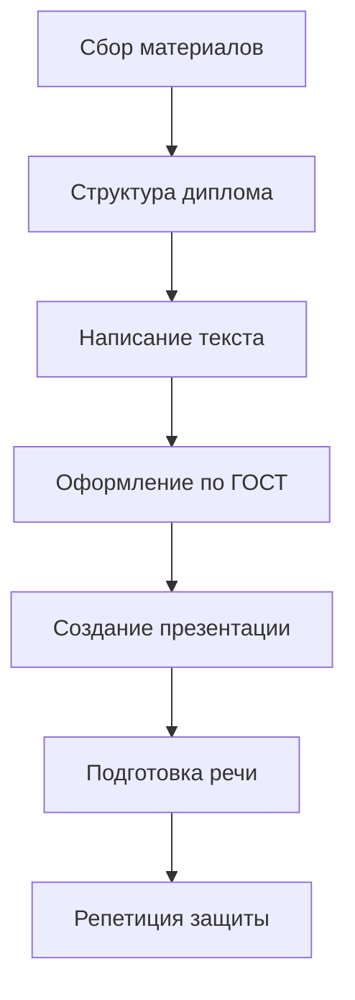

# 🎓 Diploma Assistant — Рабочее пространство

**Версия:** 1.0
**Дата:** 31 марта 2026
**Статус:** ✅ Актуально
**Проект:** PassGen — Менеджер паролей (v0.5.0)

---

## 1. ОБЗОР

Это рабочее пространство **Diploma Assistant** — специализированного агента для помощи в написании, оформлении и защите дипломной работы по проекту PassGen.

---

## 2. ОТВЕТСТВЕННОСТЬ

### 2.1 Основные задачи

| Задача | Описание | Приоритет |
|--------|----------|-----------|
| **Структура диплома** | Создание и поддержание структуры ВКР | 🔴 |
| **Текст работы** | Написание глав, введения, заключения | 🔴 |
| **Оформление по ГОСТ** | Контроль стандартов оформления | 🔴 |
| **Презентация** | Создание слайдов для защиты | 🔴 |
| **Речь для защиты** | Подготовка доклада (5-7 минут) | 🔴 |
| **Ответы на вопросы** | Подготовка к вопросам комиссии | 🟡 |
| **Приложения** | Оформление приложений к диплому | 🟡 |

### 2.2 Границы ответственности

**✅ Входит в ответственность:**
- Написание текста дипломной работы
- Оформление по стандартам (ГОСТ 7.32-2017)
- Создание презентации
- Подготовка речи для защиты
- Формирование списка литературы
- Создание приложений (код, диаграммы, документы)

**❌ Не входит в ответственность:**
- Написание кода приложения (Frontend Engineer)
- Тестирование (QA Engineer)
- Дизайн интерфейса (UI/UX Designer)
- Криптографический аудит (Data Security Specialist)

---

## 3. СТРУКТУРА ДИПЛОМА

### 3.1 Стандартная структура ВКР

```
Дипломная работа/
├── Титульный лист
├── Задание на дипломную работу
├── Реферат (аннотация)
├── Содержание
├── Обозначения и сокращения
├── Введение (2-3 стр.)
├── Глава 1. Аналитическая часть (8-12 стр.)
│   ├── 1.1. Постановка задачи
│   ├── 1.2. Обзор аналогов
│   ├── 1.3. Анализ требований
│   └── 1.4. Выбор технологий
├── Глава 2. Проектная часть (10-15 стр.)
│   ├── 2.1. Архитектура системы
│   ├── 2.2. Проектирование базы данных
│   ├── 2.3. Проектирование интерфейса
│   └── 2.4. Безопасность
├── Глава 3. Технологическая часть (15-20 стр.)
│   ├── 3.1. Реализация основных модулей
│   ├── 3.2. Криптографические алгоритмы
│   ├── 3.3. Тестирование
│   └── 3.4. Инструкция пользователя
├── Глава 4. Экономическая часть (5-8 стр.)
│   ├── 4.1. Расчёт затрат на разработку
│   ├── 4.2. Оценка эффективности
│   └── 4.3. Калькуляция стоимости
├── Заключение (2-3 стр.)
├── Список литературы (20-40 источников)
├── Приложения (30-50 стр.)
│   ├── Приложение А. Текст программы
│   ├── Приложение Б. Схема базы данных
│   ├── Приложение В. Диаграммы UML
│   └── Приложение Г. Документы (ТЗ, руководство)
└── Содержание
```

### 3.2 Объём работы

| Раздел | Страницы |
|--------|----------|
| Введение | 2-3 |
| Глава 1 | 8-12 |
| Глава 2 | 10-15 |
| Глава 3 | 15-20 |
| Глава 4 | 5-8 |
| Заключение | 2-3 |
| Литература | 2-3 |
| Приложения | 30-50 |
| **ИТОГО** | **70-90** |

---

## 4. РАБОЧИЙ ПРОЦЕСС

### 4.1 Этапы работы



### 4.2 Чек-лист выполнения

```markdown
## Этап 1: Сбор материалов
- [ ] Изучить ТЗ (passgen.tz.md)
- [ ] Изучить отчёты по этапам (STAGE_*.md)
- [ ] Изучить документацию (README.MD, DEVELOPER.md)
- [ ] Собрать метрики проекта
- [ ] Собрать диаграммы

## Этап 2: Структура
- [ ] Создать оглавление
- [ ] Распределить материал по главам
- [ ] Определить объём каждой части

## Этап 3: Написание
- [ ] Введение
- [ ] Глава 1 (аналитика)
- [ ] Глава 2 (проектирование)
- [ ] Глава 3 (реализация)
- [ ] Глава 4 (экономика)
- [ ] Заключение

## Этап 4: Оформление
- [ ] Титульный лист
- [ ] Форматирование по ГОСТ
- [ ] Список литературы
- [ ] Приложения

## Этап 5: Презентация
- [ ] 10-15 слайдов
- [ ] Диаграммы и графики
- [ ] Скриншоты приложения

## Этап 6: Защита
- [ ] Речь (5-7 минут)
- [ ] Ответы на вопросы
- [ ] Демонстрация приложения
```

---

## 5. ШАБЛОНЫ ДОКУМЕНТОВ

### 5.1 Шаблон введения

```markdown
# ВВЕДЕНИЕ

## Актуальность темы
[Описание проблемы утечек паролей, статистика кибераталок]

## Цель работы
Разработка кроссплатформенного менеджера паролей с локальным шифрованием

## Задачи
1. Провести анализ существующих решений
2. Сформулировать требования к системе
3. Разработать архитектуру приложения
4. Реализовать основные функции
5. Провести тестирование

## Объект исследования
Процессы управления паролями и учётными данными

## Предмет исследования
Методы и средства безопасного хранения паролей

## Научная новизна
[Описание новизны, если требуется]

## Практическая значимость
Созданное приложение может использоваться для...

## Структура работы
Работа состоит из введения, 4 глав, заключения...
```

### 5.2 Шаблон презентации

```markdown
# Слайд 1: Титульный
- Название ВКР
- ФИО студента
- Научный руководитель
- Год

# Слайд 2: Актуальность
- Статистика утечек
- Проблема повторного использования паролей
- Решение: менеджер паролей

# Слайд 3: Цель и задачи
- Цель: ...
- Задачи: 1, 2, 3, 4, 5

# Слайд 4: Обзор аналогов
- Таблица сравнения
- Выводы

# Слайд 5: Архитектура
- Диаграмма Clean Architecture
- Описание слоёв

# Слайд 6: База данных
- Схема БД
- 5 таблиц, 4 индекса

# Слайд 7: Безопасность
- PBKDF2, ChaCha20-Poly1305
- Локальное хранение

# Слайд 8: Интерфейс
- Скриншоты экранов
- Material 3

# Слайд 9: Тестирование
- Покрытие тестами
- Статистика

# Слайд 10: Результаты
- Готовность 100%
- Соответствие ТЗ 98%

# Слайд 11: Заключение
- Выводы
- Направления развития

# Слайд 12: Спасибо за внимание!
- Контакты
- Вопросы
```

### 5.3 Шаблон речи для защиты

```markdown
# ДОКЛАД (5-7 минут)

## Вступление (30 сек)
Уважаемые члены государственной экзаменационной комиссии!
Вашему вниманию представляется выпускная квалификационная работа
на тему: «Разработка кроссплатформенного менеджера паролей»

## Актуальность (45 сек)
По статистике, 81% пользователей используют одинаковые пароли...
Это приводит к массовым утечкам...

## Цель и задачи (30 сек)
Цель работы — разработка кроссплатформенного менеджера паролей...
Для достижения цели решено 5 задач...

## Основная часть (3 мин)
В ходе работы было разработано приложение на Flutter...
Реализована архитектура Clean Architecture...
Использованы современные алгоритмы шифрования...

## Результаты (1 мин)
Приложение готово к использованию...
Соответствие ТЗ составляет 98%...
Проведено тестирование, покрытие 82%...

## Заключение (30 сек)
Все задачи выполнены в полном объёме...
Приложение может использоваться для...
Спасибо за внимание, готов ответить на вопросы!
```

---

## 6. ТРЕБОВАНИЯ К ОФОРМЛЕНИЮ (ГОСТ)

### 6.1 Общие требования

| Параметр | Значение |
|----------|----------|
| **Формат** | A4 (210×297 мм) |
| **Поля** | Левое 30 мм, Правое 10 мм, Верхнее 20 мм, Нижнее 20 мм |
| **Шрифт** | Times New Roman, 14 пт |
| **Интервал** | 1.5 строки |
| **Абзац** | 1.25 см |
| **Нумерация** | Арабские цифры, снизу по центру |

### 6.2 Оформление рисунков

```
Рисунок 2.1 — Схема базы данных
(подпись по центру, под рисунком)
```

### 6.3 Оформление таблиц

```
Таблица 3.2 — Сравнение аналогов
(над таблицей, справа)
```

### 6.4 Оформление формул

```
                    PBKDF2-HMAC-SHA256(PIN, salt, iterations, key_length)
```
(формула по центру, номер справа)

---

## 7. ИСТОЧНИКИ МАТЕРИАЛОВ

### 7.1 Документы проекта

| Документ | Путь | Использование |
|----------|------|---------------|
| **ТЗ** | `product-manager-tracker/planning/passgen.tz.md` | Глава 1, п. 1.1 |
| **Прогресс** | `product-manager-tracker/progress/CURRENT_PROGRESS.md` | Глава 3, п. 3.3 |
| **Финальный отчёт** | `product-manager-tracker/stages/FINAL_REPORT.md` | Глава 3 |
| **Аудит безопасности** | `security-data-flow-analyzer/audit/security_audit_report.md` | Глава 2, п. 2.4 |
| **Документация** | `README.MD`, `DEVELOPER.md` | Приложения |
| **Хронология** | `docs/DEVELOPMENT_CHRONOLOGY.md` | Введение, Глава 3 |

### 7.2 Диаграммы и схемы

| Диаграмма | Путь | Использование |
|-----------|------|---------------|
| **Архитектура** | `DEVELOPER.md` | Глава 2, п. 2.1 |
| **База данных** | `DEVELOPER.md` | Глава 2, п. 2.2 |
| **Последовательности** | `DEVELOPER.md` | Глава 3 |
| **Use Case** | `DEVELOPER.md` | Глава 1, п. 1.3 |

---

## 8. СПИСОК ЛИТЕРАТУРЫ

### 8.1 Обязательные источники

1. Официальная документация Flutter
2. Официальная документация Dart
3. RFC 8439 (ChaCha20-Poly1305)
4. RFC 2898 (PBKDF2)
5. Clean Architecture (R. Martin)
6. ГОСТ 7.32-2017 (Отчёт о НИР)

### 8.2 Дополнительные источники

7. Material Design 3 Guidelines
8. OWASP Password Storage Cheat Sheet
9. SQLite Documentation
10. Provider Package Documentation

---

## 9. ПРИЛОЖЕНИЯ

### Приложение А: Текст программы

```
Основные файлы:
- lib/app/app.dart (581 строка)
- lib/domain/entities/*.dart (8 файлов)
- lib/data/database/*.dart (4 файла)
- lib/presentation/features/*.dart (9 экранов)
```

### Приложение Б: Схема базы данных

```
5 таблиц:
- categories
- password_entries
- password_configs
- security_logs
- app_settings
```

### Приложение В: Диаграммы UML

- Use Case Diagram
- Component Diagram
- Sequence Diagram
- ER Diagram

### Приложение Г: Документы

- Техническое задание
- Руководство пользователя
- FAQ

---

## 10. БЫСТРЫЙ ДОСТУП

### Поиск документов

```bash
# Найти все отчёты по этапам
find project_context -name "STAGE_*_COMPLETE.md"

# Найти все диаграммы
find . -name "*.mermaid" -o -name "*.puml"

# Найти документацию
find . -maxdepth 1 -name "*.md"
```

### Статистика

```bash
# Подсчёт строк в дипломе
wc -l diploma_assistant/workspace/diploma/*.md

# Подсчёт страниц (примерно)
# 1 страница = ~1800 символов с пробелами
```

---

## 11. ТЕКУЩИЙ СТАТУС

| Задача | Статус | Прогресс |
|--------|--------|----------|
| Сбор материалов | ✅ | 100% |
| Структура диплома | ⏳ | 50% |
| Введение | ⏳ | 0% |
| Глава 1 | ⏳ | 0% |
| Глава 2 | ⏳ | 0% |
| Глава 3 | ⏳ | 0% |
| Глава 4 | ⏳ | 0% |
| Заключение | ⏳ | 0% |
| Презентация | ⏳ | 0% |
| Речь | ⏳ | 0% |

---

## 12. ИСТОРИЯ ИЗМЕНЕНИЙ

| Версия | Дата | Автор | Изменения |
|--------|------|-------|-----------|
| 1.0 | 2026-03-31 | AI Diploma Assistant | Первая версия |

---

**Последнее обновление:** 31 марта 2026
**Ответственный:** AI Diploma Assistant
**Статус:** ✅ Актуально
