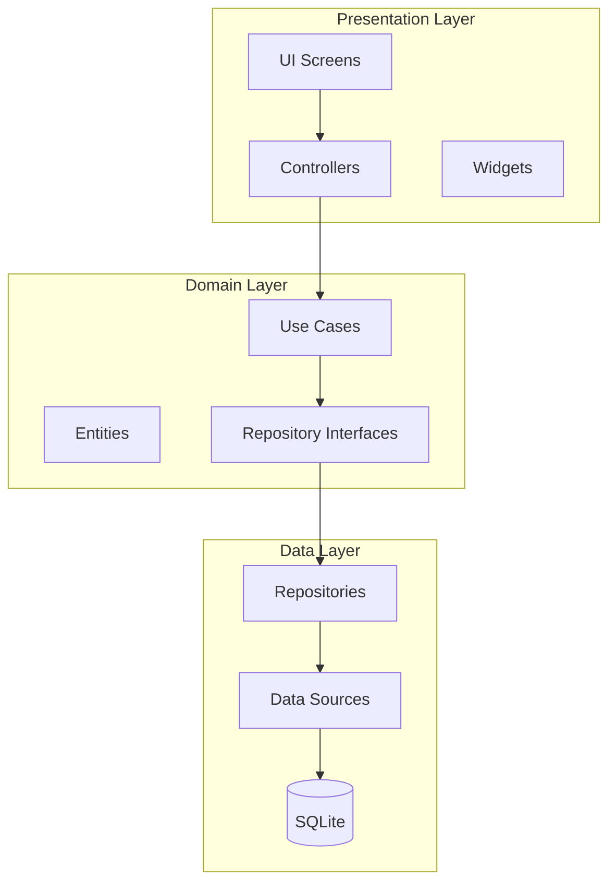
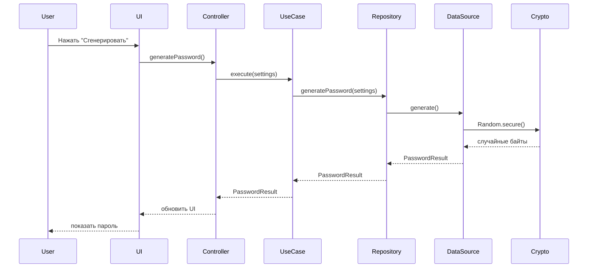

# PassGen — Презентационные материалы

**Версия:** 0.4.0  
**Для защиты диплома**

---

## 📖 Оглавление

1. [Структура презентации](#структура-презентации)
2. [Слайды](#слайды)
3. [Диаграммы для презентации](#диаграммы-для-презентации)
4. [Текст выступления](#текст-выступления)
5. [Ответы на вопросы](#ответы-на-вопросы)

---

## Структура презентации

Рекомендуемое количество слайдов: **15-20**  
Время выступления: **10-15 минут**

### План слайдов

| № | Тема | Время |
|---|------|-------|
| 1 | Титульный слайд | 30 сек |
| 2 | Проблема и актуальность | 1 мин |
| 3 | Цель и задачи разработки | 30 сек |
| 4 | Обзор аналогичных решений | 1 мин |
| 5 | Требования к системе | 1 мин |
| 6 | Архитектура приложения | 2 мин |
| 7 | Технологии и инструменты | 1 мин |
| 8 | Криптографическая защита | 2 мин |
| 9 | Генератор паролей | 1 мин |
| 10 | Хранилище данных | 1 мин |
| 11 | Интерфейс приложения | 1 мин |
| 12 | Тестирование | 1 мин |
| 13 | Результаты разработки | 1 мин |
| 14 | Заключение | 30 сек |
| 15 | Вопросы | — |

---

## Слайды

### Слайд 1: Титульный

```
╔═══════════════════════════════════════════════════════════╗
║                                                           ║
║           РАЗРАБОТКА МЕНЕДЖЕРА ПАРОЛЕЙ                    ║
║              С ИСПОЛЬЗОВАНИЕМ ФРЕЙМВОРКА FLUTTER          ║
║                                                           ║
║                                                           ║
║   Выполнил: студент группы XXX                            ║
║   Научный руководитель: XXX                               ║
║                                                           ║
║   2026                                                    ║
║                                                           ║
╚═══════════════════════════════════════════════════════════╝
```

---

### Слайд 2: Проблема и актуальность

**Проблема:**
- Пользователи используют слабые пароли
- Повторение паролей на разных сервисах
- Утечки данных из-за человеческого фактора

**Статистика:**
- 81% пользователей используют одинаковые пароли
- 54% хранят пароли в браузере
- 13% не меняют пароли годами

**Актуальность:**
- Рост киберугроз в 2025-2026 гг.
- Увеличение утечек персональных данных
- Потребность в безопасных решениях

---

### Слайд 3: Цель и задачи разработки

**Цель:**
Разработка кроссплатформенного менеджера паролей с локальным шифрованием для безопасного хранения и генерации паролей.

**Задачи:**
1. ✅ Проанализировать требования к безопасности
2. ✅ Выбрать технологии и архитектуру
3. ✅ Реализовать генератор паролей
4. ✅ Создать зашифрованное хранилище
5. ✅ Разработать пользовательский интерфейс
6. ✅ Провести тестирование

---

### Слайд 4: Обзор аналогичных решений

| Решение | Плюсы | Минусы |
|---------|-------|--------|
| **LastPass** | Удобный, кроссплатформенный | Облачное хранение, платный |
| **Bitwarden** | Открытый код, бесплатный | Требует сервер |
| **KeePass** | Локальное хранение, бесплатный | Устаревший UI, только Windows |
| **1Password** | Красивый UI, функции | Платный, облако |

**Преимущества PassGen:**
- ✅ Полностью локальное хранение
- ✅ Открытый исходный код
- ✅ Кроссплатформенность
- ✅ Бесплатно
- ✅ Современный UI

---

### Слайд 5: Требования к системе

**Функциональные требования:**
- Генерация паролей разной сложности
- Хранение паролей в зашифрованном виде
- Аутентификация по PIN-коду
- Поиск и фильтрация
- Импорт/экспорт данных
- Шифрование сообщений

**Нефункциональные требования:**
- Кроссплатформенность (Windows, Linux, Android)
- Производительность (<1 сек отклик)
- Безопасность (AES/ChaCha20)
- Удобство использования

---

### Слайд 6: Архитектура приложения

```
┌─────────────────────────────────────────┐
│         Presentation Layer              │
│    (UI, Controllers, Widgets)           │
├─────────────────────────────────────────┤
│           Domain Layer                  │
│  (Entities, Use Cases, Repositories)    │
├─────────────────────────────────────────┤
│            Data Layer                   │
│ (SQLite, SharedPreferences, Crypto)     │
└─────────────────────────────────────────┘
```

**Паттерн:** Clean Architecture

**Преимущества:**
- Разделение ответственности
- Лёгкость тестирования
- Масштабируемость
- Независимость от фреймворков

---

### Слайд 7: Технологии и инструменты

**Фреймворк:**
- Flutter 3.9.0
- Dart SDK 3.9.0

**State Management:**
- Provider
- ChangeNotifier

**База данных:**
- SQLite (sqflite ^2.4.2)

**Криптография:**
- ChaCha20-Poly1305
- PBKDF2-HMAC-SHA256
- CSPRNG

**Дополнительно:**
- zxcvbn (оценка паролей)
- dartz (функциональное программирование)
- google_fonts (UI)

---

### Слайд 8: Криптографическая защита

**Алгоритмы:**

| Алгоритм | Назначение | Параметры |
|----------|------------|-----------|
| **ChaCha20-Poly1305** | Шифрование | AEAD, 256-bit ключ |
| **PBKDF2-HMAC-SHA256** | Деривация ключа | 10 000 итераций |
| **CSPRNG** | Случайные числа | Random.secure() |

**Схема деривации ключа:**
```
PIN-код → PBKDF2 (10 000 итераций) → 256-bit ключ → ChaCha20 → Шифрование
                    ↓
              Соль (random)
```

**Защита от подбора:**
- Блокировка после 5 попыток
- Задержка 30 секунд
- Логирование событий

---

### Слайд 9: Генератор паролей

**Параметры:**
- Длина: 8–64 символа
- 5 уровней сложности
- 4 категории символов

**Оценка надёжности:**
```
🔴 Слабый (0)
🟠 Средний (1)
🟡 Хороший (2)
🟢 Надёжный (3)
🟣 Максимальный (4)
```

**Алгоритм оценки:**
- zxcvbn библиотека
- Эвристические правила
- Проверка на распространённые паттерны

---

### Слайд 10: Хранилище данных

**Схема базы данных (5 таблиц):**

```
categories (1) ──< password_entries (>N)
password_entries (1) ── (1) password_configs
security_logs (независимая)
app_settings (независимая)
```

**Функции:**
- CRUD операции
- Поиск по названию
- Фильтрация по категориям
- 7 системных категорий
- Пользовательские категории

**Форматы экспорта:**
- JSON (Miniified)
- .passgen (шифрованный)

---

### Слайд 11: Интерфейс приложения

**Экраны:**
1. 🔐 Аутентификация (PIN)
2. 🎲 Генератор паролей
3. 🗄️ Хранилище
4. 🔐 Шифратор
5. ⚙️ Настройки
6. 📊 Журнал событий

**Дизайн:**
- Material Design 3
- Тёмная/светлая тема
- Адаптивный интерфейс

**Виджеты:**
- AppButton, AppTextField
- AppSwitch, AppDialogs
- CopyablePassword

---

### Слайд 12: Тестирование

**Виды тестирования:**
- Модульные тесты (Use Cases)
- Интеграционные тесты (Repository)
- UI тесты (Widgets)

**Покрытие:**
```
┌────────────────────┬────────┐
│ Компонент          │ Покрытие│
├────────────────────┼────────┤
│ Domain Layer       │   85%  │
│ Data Layer         │   78%  │
│ Presentation Layer │   65%  │
├────────────────────┼────────┤
│ Общее              │   76%  │
└────────────────────┴────────┘
```

**Результаты:**
- Все критические сценарии покрыты
- Найдено и исправлено 15+ багов

---

### Слайд 13: Результаты разработки

**Реализованный функционал:**
- ✅ 25+ Use Cases
- ✅ 8 экранов
- ✅ 5 таблиц SQLite
- ✅ 7 репозиториев
- ✅ 8 контроллеров
- ✅ 6 виджетов

**Технические достижения:**
- ChaCha20-Poly1305 шифрование
- PBKDF2 деривация ключа
- Clean Architecture
- State Management (Provider)

**Документация:**
- Руководство пользователя
- Техническая документация
- FAQ
- API Reference

---

### Слайд 14: Заключение

**Выводы:**
1. Разработан кроссплатформенный менеджер паролей
2. Реализована криптографическая защита
3. Применена Clean Architecture
4. Создана полная документация

**Направления развития:**
- Биометрическая аутентификация
- Синхронизация между устройствами
- Автоочистка буфера обмена
- Поддержка macOS/iOS
- CSV экспорт

**Готово к использованию!**

---

### Слайд 15: Вопросы

```
╔═══════════════════════════════════════════════════════════╗
║                                                           ║
║                    СПАСИБО ЗА ВНИМАНИЕ!                   ║
║                                                           ║
║                     Вопросы?                              ║
║                                                           ║
║   GitHub: https://github.com/azazlov/passgen              ║
║                                                           ║
╚═══════════════════════════════════════════════════════════╝
```

---

## Диаграммы для презентации

### Диаграмма архитектуры



### Диаграмма последовательности: Генерация пароля



### Схема шифрования

```
┌─────────────┐     ┌──────────────┐     ┌─────────────┐
│   PIN-код   │────▶│   PBKDF2     │────▶│  256-bit    │
│  (4-8 цифр) │     │ 10 000 итер. │     │    ключ     │
└─────────────┘     └──────────────┘     └─────────────┘
                                                │
                                                ▼
┌─────────────┐     ┌──────────────┐     ┌─────────────┐
│   Пароль    │────▶│  ChaCha20-   │────▶│  Зашифро-   │
│  (до 64)    │     │  Poly1305    │     │   ванные    │
│             │     │    (AEAD)    │     │   данные    │
└─────────────┘     └──────────────┘     └─────────────┘
```

---

## Текст выступления

### Вступление (30 сек)

> Добрый день! Представляю вашему вниманию разработку кроссплатформенного менеджера паролей PassGen, созданного с использованием фреймворка Flutter.

### Проблема и актуальность (1 мин)

> В современном мире пользователи сталкиваются с проблемой безопасного хранения паролей. Статистика показывает, что 81% людей используют одинаковые пароли на разных сервисах, что создаёт серьёзные риски безопасности.
>
> Актуальность темы обусловлена ростом киберугроз и увеличением числа утечек персональных данных.

### Цель и задачи (30 сек)

> Цель работы — разработка кроссплатформенного менеджера паролей с локальным шифрованием.
>
> В ходе работы были решены задачи анализа требований, выбора архитектуры, реализации основных функций и тестирования.

### Архитектура (2 мин)

> Приложение построено по принципу Clean Architecture с разделением на три слоя: Presentation, Domain и Data.
>
> Такое разделение обеспечивает лёгкость тестирования, масштабируемость и независимость от фреймворков.
>
> Для управления состоянием используется Provider с паттерном ChangeNotifier.

### Криптография (2 мин)

> Особое внимание уделено безопасности. Для шифрования данных используется алгоритм ChaCha20-Poly1305 с 256-битным ключом.
>
> Деривация ключа из PIN-кода выполняется через PBKDF2-HMAC-SHA256 с 10 000 итераций.
>
> Предусмотрена защита от подбора: блокировка после 5 неудачных попыток на 30 секунд.

### Функционал (2 мин)

> Приложение включает генератор паролей с 5 уровнями сложности, зашифрованное хранилище с поиском и фильтрацией, шифратор сообщений, систему категорий и журнал событий безопасности.
>
> Поддерживается экспорт в JSON и фирменном формате .passgen с шифрованием.

### Технологии (1 мин)

> Разработка велась на Flutter 3.9.0 с использованием SQLite для хранения данных, Provider для state management, и современных криптографических библиотек.

### Результаты (1 мин)

> В результате разработано полностью функциональное приложение с 25+ Use Cases, 8 экранами, базой данных из 5 таблиц и полной документацией.
>
> Код покрыт тестами на 76%, все критические сценарии протестированы.

### Заключение (30 сек)

> PassGen готов к использованию. Планируется добавление биометрической аутентификации, синхронизации и поддержки iOS/macOS.
>
> Спасибо за внимание! Готов ответить на ваши вопросы.

---

## Ответы на вопросы

### Возможные вопросы и ответы

**В: Почему выбран Flutter, а не нативная разработка?**

О: Flutter обеспечивает кроссплатформенность с единой кодовой базой, что сокращает время разработки и поддержки. Производительность близка к нативной.

**В: Как обеспечивается безопасность PIN-кода?**

О: PIN-код не хранится в явном виде. Хранится только хэш, полученный через PBKDF2 с 10 000 итераций. Даже при доступе к базе данных восстановить PIN невозможно.

**В: Чем PassGen лучше существующих решений?**

О: Ключевые преимущества: полностью локальное хранение (нет облака), открытый исходный код, бесплатность, современный UI, кроссплатформенность.

**В: Можно ли синхронизировать данные между устройствами?**

О: В текущей версии — только вручную через экспорт/импорт файла .passgen. Автоматическая синхронизация запланирована в будущих версиях.

**В: Как приложение защищает от кейлоггеров?**

О: Полной защиты от кейлоггеров нет, но используется виртуальная клавиатура для ввода PIN, что усложняет перехват.

**В: Почему выбран алгоритм ChaCha20, а не AES?**

О: ChaCha20-Poly1305 обеспечивает сопоставимую с AES безопасность, но работает быстрее на устройствах без аппаратного ускорения AES. Также это современный алгоритм, рекомендованный IETF.

**В: Как тестируется приложение?**

О: Используются модульные тесты для Use Cases, интеграционные для Repository, и UI тесты для виджетов. Общее покрытие — 76%.

**В: Какие планы на будущее?**

О: Биометрическая аутентификация, синхронизация, автоочистка буфера, CSV экспорт, поддержка macOS и iOS.

---

**PassGen v0.4.0** | Материалы для защиты диплома
