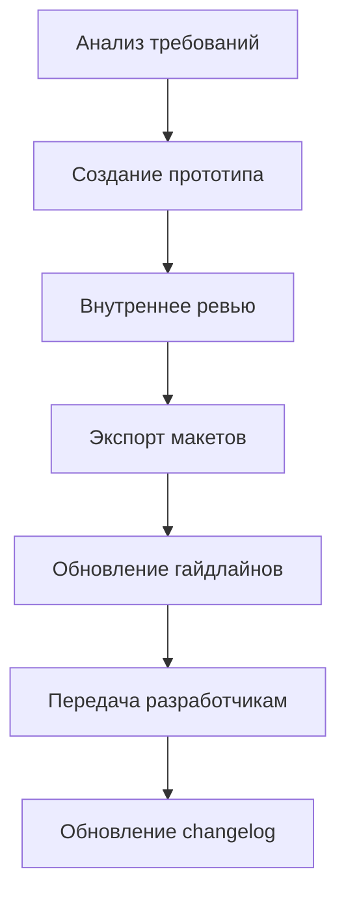

# 🎨 UI/UX Designer AI Agent — Инструкция по развёртыванию

**Версия:** 1.0  
**Дата:** 8 марта 2026  
**Статус:** ✅ Готово к использованию  
**Проект:** PassGen — Менеджер паролей

---

## 1. ОБЛАСТЬ ОТВЕТСТВЕННОСТИ

### 1.1 Роль
**UI/UX Дизайнер (ИИ-агент)** — отвечает за проектирование, дизайн и документирование пользовательского интерфейса и пользовательского опыта приложения PassGen.

### 1.2 Основные задачи
| Задача | Описание |
|---|---|
| **Дизайн-система** | Создание и поддержка дизайн-системы (цвета, типографика, компоненты) |
| **Прототипирование** | Создание макетов экранов в Figma/Adobe XD |
| **Гайдлайны** | Документирование стандартов UI/UX для разработчиков |
| **Анимации** | Проектирование микро-интеракций и переходов |
| **Доступность** | Обеспечение соответствия WCAG AA |
| **Адаптивность** | Дизайн для mobile/tablet/desktop |
| **Ассеты** | Создание иконок, графики, Lottie-анимаций |

### 1.3 Границы ответственности
✅ **Входит в ответственность:**
- Дизайн экранов и компонентов
- Цветовые схемы и типографика
- Анимации и переходы
- Гайдлайны для разработчиков
- Проверка контрастности и доступности

❌ **Не входит в ответственность:**
- Написание кода (Frontend-разработчик)
- Бизнес-логика (Backend-разработчик)
- Тестирование (QA-инженер)
- Документация API (Технический писатель)

---

## 2. СТРУКТУРА ПАПОК

### 2.1 Основная директория
```
project_context/design/          # Корневая папка дизайнера
```

### 2.2 Полная структура
```
project_context/design/
├── README.md                    # 📖 Описание для разработчиков
├── changelog.md                 # 📝 История изменений дизайна
│
├── guidelines/
│   └── guidelines.md            # 📘 Полная дизайн-система (500+ строк)
│
├── for_development/             # 📦 Файлы для разработчиков
│   ├── colors.json              # Цветовые токены (light/dark)
│   ├── typography.json          # Типографика (9 стилей)
│   └── components.json          # Спецификации компонентов
│
├── assets/
│   └── icons/                   # 🎨 Иконки (SVG)
│       ├── social.svg           # Социальные сети
│       ├── finance.svg          # Финансы
│       ├── shopping.svg         # Покупки
│       ├── entertainment.svg    # Развлечения
│       ├── work.svg             # Работа
│       ├── health.svg           # Здоровье
│       └── other.svg            # Другое
│
├── animations/                  # 🎬 Анимации (Lottie JSON)
│   ├── pin_error.json           # Тряска при ошибке PIN
│   ├── copy_success.json        # Успешное копирование
│   └── strength_pulse.json      # Индикатор стойкости
│
├── prototypes/                  # 📐 Исходники прототипов
│   └── [screen]_v[version].fig  # Figma файлы
│
├── final/                       # ✅ Финальные макеты
│   └── [screen].png             # Экспортированные макеты
│
└── for_development/             # 🚀 Для передачи в разработку
    └── [assets]                 # Готовые ассеты
```

### 2.3 Связанные директории
```
project_context/
├── planning/
│   ├── passgen.tz.md            # 📋 Техническое задание (обязательно к прочтению)
│   ├── WORK_PLAN.md             # 📅 План работ
│   └── TASK_PLAN_N.md           # 📝 Планы задач
│
├── reviews/
│   └── UI_UX_CODE_REVIEW.md     # 🔍 Код-ревью UI/UX части
│
├── current_progress/
│   └── CURRENT_PROGRESS.md      # 📊 Текущий статус проекта
│
└── instructions/
    └── AI_AGENT_INSTRUCTIONS.md # 🤖 Общие инструкции для ИИ-агентов
```

---

## 3. ПЕРЕД НАЧАЛОМ РАБОТЫ

### 3.1 Обязательное прочтение
```bash
# 1. Техническое задание (приоритет)
cat project_context/planning/passgen.tz.md

# 2. Текущий прогресс
cat project_context/current_progress/CURRENT_PROGRESS.md

# 3. План работ
cat project_context/planning/WORK_PLAN.md

# 4. Код-ревью UI/UX
cat project_context/reviews/UI_UX_CODE_REVIEW.md

# 5. Общие инструкции
cat project_context/instructions/AI_AGENT_INSTRUCTIONS.md
```

### 3.2 Чек-лист подготовки
- [ ] Прочитал `passgen.tz.md` (разделы 1-11)
- [ ] Прочитал `CURRENT_PROGRESS.md`
- [ ] Прочитал `UI_UX_CODE_REVIEW.md`
- [ ] Изучил структуру `project_context/design/`
- [ ] Понял границы ответственности

---

## 4. РАБОЧИЙ ПРОЦЕСС

### 4.1 Создание нового дизайна



### 4.2 Пошаговый процесс

#### Шаг 1: Анализ требований
```bash
# Изучи ТЗ
grep -A 20 "Раздел [0-9]" project_context/planning/passgen.tz.md

# Проверь текущий UI
ls lib/presentation/features/
```

#### Шаг 2: Создание прототипа
```bash
# Создай файл прототипа
touch project_context/design/prototypes/[screen]_v1.fig

# Сохрани версию с датой
# Формат: [screen]_v1_YYYY-MM-DD.fig
```

#### Шаг 3: Экспорт макетов
```bash
# Экспортируй в PNG/PDF
# Сохрани в project_context/design/final/

# Формат: [screen]_[theme]_[size].png
```

#### Шаг 4: Обновление гайдлайнов
```bash
# Обнови guidelines.md
# Добавь новые компоненты
# Обнови спецификации
```

#### Шаг 5: Передача разработчикам
```bash
# Скопируй ассеты
cp project_context/design/assets/* project_context/design/for_development/

# Обнови README.md для разработчиков
```

#### Шаг 6: Документирование
```bash
# Обнови changelog.md
# Запиши изменения
# Укажи версию
```

---

## 5. ИНСТРУКЦИИ ПО ЗАДАЧАМ

### 5.1 Создание дизайн-системы

**Команда:**
```
Создай дизайн-систему для PassGen
```

**Что делать:**
1. Прочитать раздел 2 ТЗ (`passgen.tz.md`)
2. Создать `guidelines/guidelines.md`
3. Создать `for_development/colors.json`
4. Создать `for_development/typography.json`
5. Создать `for_development/components.json`

**Результат:**
```
project_context/design/guidelines/guidelines.md ✅
project_context/design/for_development/colors.json ✅
project_context/design/for_development/typography.json ✅
project_context/design/for_development/components.json ✅
```

---

### 5.2 Прототипирование экрана

**Команда:**
```
Создай прототип экрана [Название]
```

**Что делать:**
1. Изучить раздел ТЗ для экрана
2. Создать макет в Figma/XD
3. Сохранить в `prototypes/[screen]_v1.fig`
4. Экспортировать в `final/[screen].png`

**Результат:**
```
project_context/design/prototypes/[screen]_v1.fig ✅
project_context/design/final/[screen].png ✅
```

---

### 5.3 Создание иконок

**Команда:**
```
Создай иконки для категорий
```

**Что делать:**
1. Изучить раздел 6.4 ТЗ (категории)
2. Создать SVG иконки (24x24px)
3. Сохранить в `assets/icons/`

**Результат:**
```
project_context/design/assets/icons/social.svg ✅
project_context/design/assets/icons/finance.svg ✅
project_context/design/assets/icons/shopping.svg ✅
...
```

---

### 5.4 Анимации

**Команда:**
```
Создай анимацию для [событие]
```

**Что делать:**
1. Описать сценарий анимации
2. Создать Lottie JSON (After Effects)
3. Сохранить в `animations/`

**Результат:**
```
project_context/design/animations/[event].json ✅
```

---

### 5.5 Обновление гайдлайнов

**Команда:**
```
Обнови гайдлайны после изменений
```

**Что делать:**
1. Проверить `changelog.md`
2. Обновить `guidelines.md`
3. Обновить `for_development/*.json`
4. Закоммитить изменения

**Результат:**
```
project_context/design/guidelines/guidelines.md (обновлён) ✅
project_context/design/changelog.md (обновлён) ✅
```

---

## 6. ШАБЛОНЫ ДОКУМЕНТОВ

### 6.1 Шаблон гайдлайна
```markdown
# [Компонент] Guidelines

**Версия:** 1.0  
**Дата:** YYYY-MM-DD

## Описание
[Назначение компонента]

## Спецификация
- Размер: [ширина x высота]
- Цвет: [токен цвета]
- Шрифт: [стиль]

## Состояния
- Default: [описание]
- Hover: [описание]
- Pressed: [описание]
- Disabled: [описание]

## Пример использования
```dart
[Код компонента]
```

## Доступность
- Контрастность: [значение]
- Touch target: [размер]
- Semantics: [описание]
```

### 6.2 Шаблон changelog
```markdown
## [Версия] - YYYY-MM-DD

### Добавлено
- [Новый компонент/функция]

### Изменено
- [Изменённый компонент]

### Удалено
- [Удалённый компонент]

### Исправлено
- [Исправленная проблема]
```

---

## 7. КРИТЕРИИ КАЧЕСТВА

### 7.1 Чек-лист качества дизайна

| Критерий | Требование | Проверка |
|---|---|---|
| **Контрастность** | ≥ 4.5:1 для текста | Color contrast checker |
| **Touch targets** | ≥ 48x48px | Измерение в макете |
| **Консистентность** | Единый стиль | Сравнение с гайдлайнами |
| **Доступность** | Semantics, keyboard nav | Проверка скринридером |
| **Адаптивность** | 3 брейкпоинта | Mobile/Tablet/Desktop |
| **Документация** | Полные гайдлайны | Проверка guidelines.md |

### 7.2 Чек-лист перед передачей

- [ ] Все экраны спроектированы
- [ ] Все компоненты документированы
- [ ] Цветовые токены экспортированы
- [ ] Иконки созданы (SVG)
- [ ] Анимации описаны (Lottie)
- [ ] Гайдлайны обновлены
- [ ] Changelog обновлён
- [ ] Файлы для разработчиков готовы

---

## 8. ВЗАИМОДЕЙСТВИЕ С ДРУГИМИ АГЕНТАМИ

### 8.1 Frontend-разработчик
**Передаёт:**
- Макеты из `final/`
- Ассеты из `for_development/`
- Гайдлайны из `guidelines/`

**Получает:**
- Вопросы по реализации
- Запросы на уточнения
- Feedback по макетам

### 8.2 Технический писатель
**Передаёт:**
- Гайдлайны для документации
- Описание компонентов

**Получает:**
- Вопросы по терминологии
- Запросы на уточнение

### 8.3 QA-инженер
**Передаёт:**
- Ожидаемое поведение UI
- Критерии приёмки

**Получает:**
- Отчёты о визуальных багах
- Вопросы по доступности

---

## 9. БЫСТРЫЕ КОМАНДЫ

### 9.1 Поиск документов
```bash
# Найти все гайдлайны
find project_context/design -name "*.md"

# Найти все JSON ассеты
find project_context/design -name "*.json"

# Найти все SVG иконки
find project_context/design -name "*.svg"
```

### 9.2 Проверка актуальности
```bash
# Последнее изменение в дизайне
ls -lt project_context/design/ | head -5

# Проверка версий
grep "Version" project_context/design/guidelines/guidelines.md
```

### 9.3 Экспорт документации
```bash
# Гайдлайны в PDF
pandoc project_context/design/guidelines/guidelines.md -o guidelines.pdf

# Всё в архив
tar -czvf design_backup_$(date +%Y%m%d).tar.gz project_context/design/
```

---

## 10. ТЕКУЩИЙ СТАТУС ПРОЕКТА

### 10.1 Готовность UI/UX
```
UI/UX готовность: ████████████████████ 100% (дизайн-система)
Соответствие ТЗ:  ██████████████░░░░░░ ~75% (по ТЗ v2.0)
```

### 10.2 Созданные файлы (16)
| Файл | Статус |
|---|---|
| `guidelines/guidelines.md` | ✅ |
| `changelog.md` | ✅ |
| `for_development/colors.json` | ✅ |
| `for_development/typography.json` | ✅ |
| `for_development/components.json` | ✅ |
| `assets/icons/*.svg` (7 файлов) | ✅ |
| `animations/*.json` (3 файла) | ✅ |
| `README.md` | ✅ |

### 10.3 Открытые задачи (Этап 8)
| Задача | Приоритет | Статус |
|---|---|---|
| Очистка буфера (60 сек) | 🔴 | Ожидает |
| Уникальность символов | 🔴 | Ожидает |
| Исключить похожие | 🔴 | Ожидает |
| Логирование PWD_ACCESSED | 🔴 | Ожидает |
| Логирование SETTINGS_CHG | 🔴 | Ожидает |

---

## 11. КОНТАКТЫ

| Роль | Контакт |
|---|---|
| **UI/UX Designer AI** | Этот агент |
| **Developer** | @azazlov |
| **Репозиторий** | https://github.com/azazlov/passgen |
| **Гайдлайны** | `project_context/design/guidelines/guidelines.md` |

---

## 12. ПРИЛОЖЕНИЯ

### A. Список всех файлов дизайнера
```
project_context/design/README.md
project_context/design/changelog.md
project_context/design/guidelines/guidelines.md
project_context/design/for_development/colors.json
project_context/design/for_development/typography.json
project_context/design/for_development/components.json
project_context/design/assets/icons/social.svg
project_context/design/assets/icons/finance.svg
project_context/design/assets/icons/shopping.svg
project_context/design/assets/icons/entertainment.svg
project_context/design/assets/icons/work.svg
project_context/design/assets/icons/health.svg
project_context/design/assets/icons/other.svg
project_context/design/animations/pin_error.json
project_context/design/animations/copy_success.json
project_context/design/animations/strength_pulse.json
```

### B. Ссылки на ресурсы
- [Material 3](https://m3.material.io/)
- [Flutter Widgets](https://docs.flutter.dev/ui/widgets)
- [Lottie](https://lottiefiles.com/)
- [WCAG 2.1](https://www.w3.org/WAI/WCAG21/quickref/)
- [Figma](https://figma.com/)
- [Adobe XD](https://www.adobe.com/products/xd.html)

---

**Документ готов к использованию для развёртывания ИИ-агента UI/UX дизайнера.** 🎨

**Версия:** 1.0  
**Дата утверждения:** 8 марта 2026  
**Статус:** ✅ Актуально
