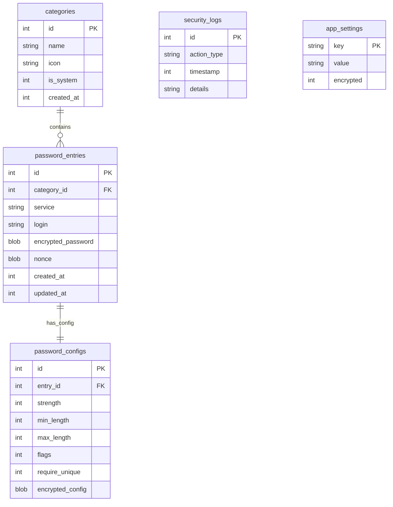

# PassGen — Схема базы данных

**Версия:** 0.5.0
**Последнее обновление:** 10 марта 2026

---

## 📖 Оглавление

1. [Обзор](#обзор)
2. [Схема данных](#схема-данных)
3. [Описание таблиц](#описание-таблиц)
4. [Индексы](#индексы)
5. [Миграции](#миграции)
6. [Примеры запросов](#примеры-запросов)

---

## Обзор

База данных PassGen построена на **SQLite** и состоит из **5 таблиц**:

| Таблица | Записей | Назначение |
|---------|---------|------------|
| `categories` | ~10 | Категории паролей |
| `password_entries` | N | Записи о паролях |
| `password_configs` | N | Конфигурации генерации |
| `security_logs` | N | Журнал событий |
| `app_settings` | ~5 | Настройки приложения |

---

## Схема данных



---

## Описание таблиц

### categories

Категории для классификации паролей.

```sql
CREATE TABLE categories (
  id INTEGER PRIMARY KEY AUTOINCREMENT,
  name TEXT NOT NULL,              -- Название категории
  icon TEXT,                       -- Иконка (Material Icons)
  is_system INTEGER DEFAULT 0,     -- Системная категория (1) или пользовательская (0)
  created_at INTEGER NOT NULL      -- Timestamp создания
);
```

**Системные категории (создаются при инициализации):**

| ID | Название | Иконка |
|----|----------|--------|
| 1 | Интернет | language |
| 2 | Социальные сети | people |
| 3 | Развлечения | entertainment |
| 4 | Работа | work |
| 5 | Финансы | attach_money |
| 6 | Покупки | shopping_cart |
| 7 | Почта | email |

---

### password_entries

Основная таблица для хранения зашифрованных паролей.

```sql
CREATE TABLE password_entries (
  id INTEGER PRIMARY KEY AUTOINCREMENT,
  category_id INTEGER REFERENCES categories(id),
  service TEXT NOT NULL,           -- Название сервиса (например, "Gmail")
  login TEXT,                      -- Логин пользователя
  encrypted_password BLOB NOT NULL,-- Зашифрованный пароль
  nonce BLOB NOT NULL,             -- Уникальный номер для шифрования
  created_at INTEGER NOT NULL,     -- Timestamp создания
  updated_at INTEGER NOT NULL      -- Timestamp последнего обновления
);

CREATE INDEX idx_password_entries_category ON password_entries(category_id);
CREATE INDEX idx_password_entries_service ON password_entries(service);
```

**Поля шифрования:**
- `encrypted_password`: зашифрованный пароль (ChaCha20-Poly1305)
- `nonce`: 12-байтный уникальный номер для каждого шифрования

---

### password_configs

Конфигурации генерации для каждого пароля.

```sql
CREATE TABLE password_configs (
  id INTEGER PRIMARY KEY AUTOINCREMENT,
  entry_id INTEGER UNIQUE REFERENCES password_entries(id),
  strength INTEGER,                -- Уровень сложности (0-4)
  min_length INTEGER,              -- Минимальная длина
  max_length INTEGER,              -- Максимальная длина
  flags INTEGER,                   -- Флаги наборов символов
  require_unique INTEGER DEFAULT 0,-- Требование уникальных символов
  encrypted_config BLOB            -- Зашифрованная конфигурация
);

CREATE INDEX idx_password_configs_entry ON password_configs(entry_id);
```

**Флаги (битовая маска):**
- Бит 0: строчные буквы (a-z)
- Бит 1: заглавные буквы (A-Z)
- Бит 2: цифры (0-9)
- Бит 3: спецсимволы (!@#$%^&*)

**Дополнительные опции (v0.5.0):**
- `require_unique`: требование уникальных символов (без повторов)
- `exclude_similar`: исключение похожих символов (l, 1, I, O, 0)

---

### security_logs

Журнал событий безопасности.

```sql
CREATE TABLE security_logs (
  id INTEGER PRIMARY KEY AUTOINCREMENT,
  action_type TEXT NOT NULL,       -- Тип события
  timestamp INTEGER NOT NULL,      -- Timestamp события
  details TEXT                     -- Дополнительные детали (JSON)
);

CREATE INDEX idx_security_logs_timestamp ON security_logs(timestamp);
CREATE INDEX idx_security_logs_type ON security_logs(action_type);
```

**Типы событий:**

| Тип | Описание |
|-----|----------|
| `AUTH_SUCCESS` | Успешная аутентификация |
| `AUTH_FAIL` | Неудачная попытка входа |
| `LOGOUT` | Выход из приложения |
| `PWD_CREATED` | Создание пароля |
| `PWD_DELETED` | Удаление пароля |
| `PWD_UPDATED` | Обновление пароля |
| `PWD_ACCESSED` | Просмотр пароля (v0.5.0) |
| `EXPORT` | Экспорт данных |
| `IMPORT` | Импорт данных |
| `PIN_CHANGED` | Смена PIN-кода |
| `PIN_REMOVED` | Удаление PIN-кода |
| `SETTINGS_CHG` | Изменение настроек (v0.5.0) |

---

### app_settings

Настройки приложения.

```sql
CREATE TABLE app_settings (
  key TEXT PRIMARY KEY,            -- Ключ настройки
  value TEXT NOT NULL,             -- Значение
  encrypted INTEGER DEFAULT 0      -- Зашифровано (1) или нет (0)
);
```

**Системные настройки:**

| Ключ | Описание |
|------|----------|
| `pin_hash` | Хэш PIN-кода |
| `pin_salt` | Соль для деривации |
| `is_pin_setup` | Установлен ли PIN |
| `last_backup` | Дата последнего бэкапа |
| `theme` | Тема приложения (light/dark) |

---

## Индексы

| Таблица | Индекс | Поля | Назначение |
|---------|--------|------|------------|
| `password_entries` | `idx_password_entries_category` | `category_id` | Поиск по категории |
| `password_entries` | `idx_password_entries_service` | `service` | Поиск по сервису |
| `password_configs` | `idx_password_configs_entry` | `entry_id` | Связь с записью |
| `security_logs` | `idx_security_logs_timestamp` | `timestamp` | Сортировка по времени |
| `security_logs` | `idx_security_logs_type` | `action_type` | Фильтрация по типу |

---

## Миграции

Миграции управляются классом `DatabaseMigrations`.

### Версия 1 (текущая)

```dart
class DatabaseMigrations {
  static const int currentVersion = 1;
  
  static Future<void> migrateToV1(Database db) async {
    // Создание всех таблиц
    await db.execute(CreateTableCategories);
    await db.execute(CreateTablePasswordEntries);
    await db.execute(CreateTablePasswordConfigs);
    await db.execute(CreateTableSecurityLogs);
    await db.execute(CreateTableAppSettings);
    
    // Создание индексов
    await db.execute(CreateIndexPasswordEntriesCategory);
    await db.execute(CreateIndexPasswordEntriesService);
    await db.execute(CreateIndexPasswordConfigsEntry);
    await db.execute(CreateIndexSecurityLogsTimestamp);
    await db.execute(CreateIndexSecurityLogsType);
    
    // Вставка системных категорий
    await _insertSystemCategories(db);
  }
}
```

---

## Примеры запросов

### Получить все пароли категории

```sql
SELECT pe.*, c.name as category_name
FROM password_entries pe
JOIN categories c ON pe.category_id = c.id
WHERE c.id = ?
ORDER BY pe.service ASC;
```

### Поиск паролей по названию сервиса

```sql
SELECT * FROM password_entries
WHERE service LIKE '%?%'
ORDER BY service ASC;
```

### Получить конфигурацию для пароля

```sql
SELECT pc.*
FROM password_configs pc
JOIN password_entries pe ON pc.entry_id = pe.id
WHERE pe.id = ?;
```

### Получить логи за последние 7 дней

```sql
SELECT * FROM security_logs
WHERE timestamp >= (strftime('%s', 'now') - 604800) * 1000
ORDER BY timestamp DESC;
```

### Получить количество событий по типам

```sql
SELECT action_type, COUNT(*) as count
FROM security_logs
GROUP BY action_type
ORDER BY count DESC;
```

### Получить все пользовательские категории

```sql
SELECT * FROM categories
WHERE is_system = 0
ORDER BY name ASC;
```

---

## Транзакции

### Создание пароля с конфигурацией

```dart
await database.transaction((txn) async {
  // Вставка записи пароля
  final entryId = await txn.insert('password_entries', {
    'category_id': categoryId,
    'service': service,
    'login': login,
    'encrypted_password': encryptedPassword,
    'nonce': nonce,
    'created_at': now,
    'updated_at': now,
  });
  
  // Вставка конфигурации
  await txn.insert('password_configs', {
    'entry_id': entryId,
    'strength': strength,
    'min_length': minLength,
    'max_length': maxLength,
    'flags': flags,
    'require_unique': requireUnique ? 1 : 0,
    'encrypted_config': encryptedConfig,
  });
  
  // Логирование события
  await txn.insert('security_logs', {
    'action_type': 'PWD_CREATED',
    'timestamp': now,
    'details': jsonEncode({'entry_id': entryId, 'service': service}),
  });
});
```

---

## Безопасность

### Шифрование данных

Все чувствительные данные шифруются перед записью:

| Поле | Алгоритм | Ключ |
|------|----------|------|
| `encrypted_password` | ChaCha20-Poly1305 | Деривированный из PIN |
| `nonce` | CSPRNG | Случайный для каждой записи |
| `encrypted_config` | ChaCha20-Poly1305 | Деривированный из PIN |

### Целостность данных

- Foreign Keys обеспечивают ссылочную целостность
- Транзакции гарантируют атомарность операций
- Poly1305 MAC tag проверяет целостность зашифрованных данных

---

**PassGen v0.4.0** | [MIT License](../../LICENSE)
